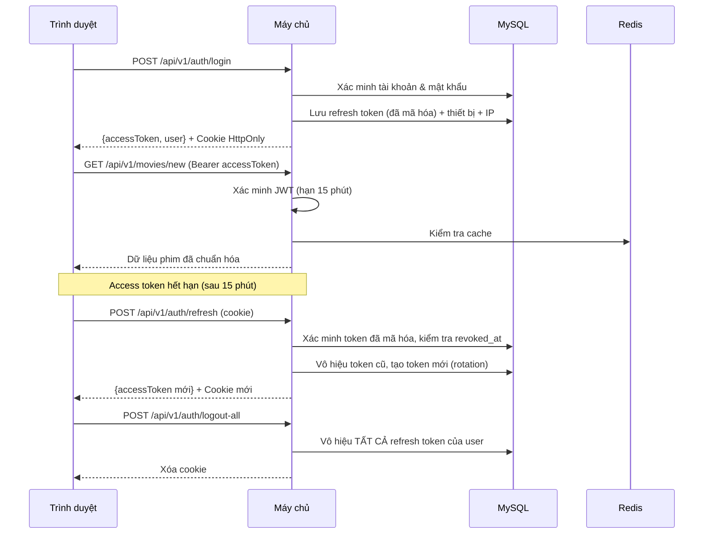
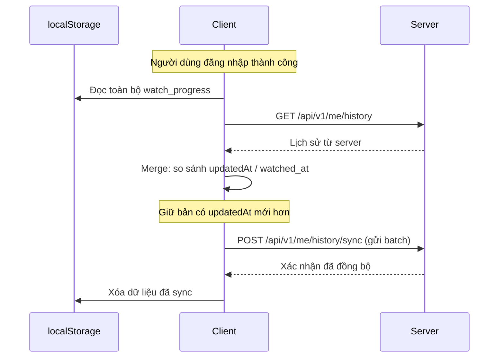

# Anime3D-Chill — Website Xem Phim

Xây dựng website xem phim với giao diện dark theme cao cấp lấy cảm hứng từ RoPhim (cervatto.net/phimmoi), sử dụng API từ phimapi.com (KKPhim), tích hợp Three.js cho banner 3D, và hệ thống quản lý người dùng với JWT + SQL.

---

## Rủi Ro & Giả Định

> [!CAUTION]
> **Phụ thuộc API bên thứ 3**: phimapi.com (KKPhim) có thể thay đổi cấu trúc, giới hạn request, hoặc ngừng hoạt động bất cứ lúc nào. Backend cần lớp **chuẩn hóa response** + cache để giảm phụ thuộc trực tiếp.

> [!WARNING]
> **SEO hạn chế với Vite SPA**: Vite SPA không hỗ trợ SSR mặc định. Sẽ dùng `react-helmet-async` + prerender các trang quan trọng. Nếu SEO là ưu tiên tối đa → cân nhắc chuyển sang Next.js sau này.

> [!WARNING]
> **CORS & Proxy API**: API phimapi.com (KKPhim) không hỗ trợ CORS cho frontend trực tiếp. Backend Node.js sẽ đóng vai trò **proxy** để tránh lỗi CORS.

> [!IMPORTANT]
> **Rủi ro Player**: Luồng M3U8 có thể chết, CORS media lỗi, hoặc thiếu nguồn cho một số tập phim. Player cần có fallback, retry, và xử lý lỗi đầy đủ.

---

## Phân Chia Ưu Tiên

| Mức | Tính năng |
|:---|:---|
| **P0 — MVP** | Trang chủ, Danh sách phim, Chi tiết phim, Trình phát phim, Đăng nhập/Đăng ký, Yêu thích, Lịch sử xem |
| **P1 — Cần thiết** | Tìm kiếm nâng cao, Xem tiếp, Hồ sơ cá nhân, Quản lý người dùng (Admin) |
| **P2 — Tùy chọn** | PWA, Chuyển đổi giao diện sáng/tối, Thông báo, Bình luận/Chat |

---

## Công Nghệ Sử Dụng

### 🎨 Frontend (Giao Diện)

| Thư viện | Phiên bản | Mục đích |
|:---|:---|:---|
| **React** | `^18.3.1` | Framework giao diện chính |
| **Vite** | `^6.2.0` | Công cụ build (nhanh, HMR tốt) |
| **React Router DOM** | `^7.4.0` | Điều hướng phía client |
| **Three.js** | `^0.173.0` | Banner 3D |
| **@react-three/fiber** | `^9.1.0` | Tích hợp Three.js với React |
| **@react-three/drei** | `^10.0.4` | Tiện ích cho R3F |
| **@tanstack/react-query** | `^5.67.2` | Quản lý dữ liệu server (cache, dedupe, refetch) |
| **Zustand** | `^5.0.3` | Quản lý trạng thái client (auth, UI, player) |
| **Swiper** | `^11.2.6` | Thanh trượt phim |
| **HLS.js** | `^1.6.2` | Phát video M3U8 |
| **Axios** | `^1.8.4` | Gọi API HTTP |
| **React Hook Form** | `^7.54.2` | Xác thực biểu mẫu |
| **Framer Motion** | `^12.5.0` | Hiệu ứng chuyển động |
| **React Icons** | `^5.5.0` | Bộ icon |
| **React Hot Toast** | `^2.5.2` | Thông báo toast |
| **react-helmet-async** | `^2.0.5` | Thẻ meta SEO |

### ⚙️ Backend (Máy Chủ)

| Thư viện | Phiên bản | Mục đích |
|:---|:---|:---|
| **Express** | `^4.21.2` | Framework web |
| **Sequelize** | `^6.37.5` | ORM cho SQL |
| **mysql2** | `^3.12.0` | Driver MySQL |
| **ioredis** | `^5.6.0` | Client Redis (cache) |
| **jsonwebtoken** | `^9.0.2` | Tạo/xác minh JWT |
| **bcryptjs** | `^3.0.2` | Mã hóa mật khẩu |
| **cors** | `^2.8.5` | Xử lý CORS |
| **dotenv** | `^16.4.7` | Biến môi trường |
| **helmet** | `^8.0.0` | Bảo mật headers |
| **express-rate-limit** | `^7.5.0` | Giới hạn tần suất request |
| **express-validator** | `^7.2.1` | Xác thực đầu vào |
| **pino** | `^9.6.0` | Ghi log có cấu trúc |
| **pino-pretty** | `^13.0.0` | Log đẹp cho dev |
| **cookie-parser** | `^1.4.7` | Đọc cookie |
| **axios** | `^1.8.4` | Gọi API phim nguồn |
| **uuid** | `^11.1.0` | Tạo ID cho request |
| **node-cron** | `^3.0.3` | Tác vụ định kỳ (cleanup) |
| **nodemon** | `^3.1.9` | Tự khởi động lại khi dev |

### 🧪 Kiểm Thử

| Thư viện | Phiên bản | Mục đích |
|:---|:---|:---|
| **Vitest** | `^3.1.0` | Chạy unit/integration test |
| **Supertest** | `^7.1.0` | Test HTTP (backend) |
| **@testing-library/react** | `^16.3.0` | Test component |
| **Playwright** | `^1.51.0` | Test tự động E2E |

### 🛠️ DevOps

| Công cụ | Phiên bản | Mục đích |
|:---|:---|:---|
| **Turborepo** | `^2.5.0` | Quản lý monorepo |
| **Docker** | mới nhất | Đóng gói ứng dụng |
| **docker-compose** | mới nhất | Môi trường dev cục bộ |

---

## Cấu Trúc Thư Mục

```
E:\workline\anime3d-chill\
├── turbo.json
├── package.json
├── docker-compose.yml
├── .gitignore
├── .env.example
│
├── client/                           # Giao diện React (Vite)
│   ├── package.json
│   ├── vite.config.js
│   ├── Dockerfile
│   ├── index.html
│   ├── public/
│   │   ├── robots.txt
│   │   └── sitemap.xml
│   └── src/
│       ├── main.jsx
│       ├── App.jsx
│       ├── index.css                 # Hệ thống thiết kế
│       ├── api/
│       │   ├── axiosConfig.js        # Interceptors, tự làm mới token
│       │   ├── authApi.js
│       │   ├── movieApi.js
│       │   └── userApi.js
│       ├── components/
│       │   ├── layout/
│       │   │   ├── Header.jsx / .css
│       │   │   ├── Footer.jsx / .css
│       │   │   └── AppLayout.jsx
│       │   ├── movie/
│       │   │   ├── MovieCard.jsx / .css
│       │   │   ├── MovieGrid.jsx
│       │   │   ├── MovieCarousel.jsx
│       │   │   └── MoviePlayer.jsx   # Trình phát HLS
│       │   ├── banner/
│       │   │   └── HeroBanner3D.jsx  # Banner Three.js
│       │   ├── common/
│       │   │   └── ErrorBoundary.jsx  # React Error Boundary
│       │   └── ui/
│       │       ├── SearchBar.jsx
│       │       ├── Pagination.jsx
│       │       ├── Skeleton.jsx
│       │       ├── TopicCard.jsx
│       │       └── ProtectedRoute.jsx
│       ├── pages/
│       │   ├── HomePage.jsx
│       │   ├── MovieDetailPage.jsx
│       │   ├── MoviePlayerPage.jsx
│       │   ├── MovieListPage.jsx
│       │   ├── SearchPage.jsx
│       │   ├── LoginPage.jsx
│       │   ├── RegisterPage.jsx
│       │   ├── ProfilePage.jsx
│       │   └── admin/
│       │       ├── AdminDashboard.jsx
│       │       └── UserManagement.jsx
│       ├── store/
│       │   ├── authStore.js          # Trạng thái xác thực
│       │   ├── playerStore.js        # Trạng thái phát video
│       │   └── uiStore.js            # Giao diện, sidebar, modal
│       ├── hooks/
│       │   ├── useAuth.js
│       │   ├── useMovies.js          # Hook dùng TanStack Query
│       │   └── usePlayer.js
│       ├── services/
│       │   ├── watchProgressService.js # Guest/User lưu tiến trình
│       │   └── guestId.js             # Tạo/quản lý guest session ID
│       └── utils/
│           ├── constants.js
│           └── helpers.js
│
└── server/                           # Backend Node.js (Express)
    ├── package.json
    ├── Dockerfile
    ├── .env.example
    └── src/
        ├── index.js
        ├── config/
        │   ├── database.js
        │   ├── redis.js
        │   └── env.js
        ├── models/
        │   ├── index.js
        │   ├── User.js
        │   ├── Favorite.js
        │   ├── WatchHistory.js
        │   ├── RefreshToken.js
        │   └── MovieView.js              # Analytics lượt xem
        ├── routes/
        │   └── v1/
        │       ├── index.js
        │       ├── authRoutes.js
        │       ├── userRoutes.js
        │       ├── movieRoutes.js
        │       ├── meRoutes.js            # /me/* (favorites, history, profile)
        │       └── healthRoutes.js
        ├── controllers/
        │   ├── authController.js
        │   ├── userController.js
        │   ├── movieController.js
        │   └── meController.js            # favorites + history + profile
        ├── middleware/
        │   ├── auth.js               # Xác thực JWT
        │   ├── authorize.js          # Phân quyền theo role
        │   ├── rateLimiter.js        # Rate limit theo user/IP
        │   ├── validate.js           # Validate đầu vào
        │   ├── requestId.js          # Gắn ID cho mỗi request
        │   └── errorHandler.js       # Xử lý lỗi tập trung
        ├── services/
        │   ├── kkphimService.js      # Proxy + cache + circuit breaker
        │   └── kkphimTransformer.js  # Chuẩn hóa response
        ├── validators/
        │   ├── authValidators.js
        │   ├── movieValidators.js
        │   └── userValidators.js
        ├── jobs/
        │   ├── index.js              # Khởi tạo cron jobs
        │   ├── cleanExpiredTokens.js # Xóa refresh token hết hạn
        │   └── cleanOldHistory.js    # Dọn lịch sử cũ (tùy chọn)
        ├── migrations/               # Sequelize migrations
        ├── seeders/                   # Seed dữ liệu mẫu
        ├── utils/
        │   ├── jwt.js                # Hàm tạo/xác minh token
        │   ├── response.js           # Định dạng response chuẩn
        │   ├── logger.js             # Pino logger
        │   ├── cache.js              # Helper Redis cache
        │   └── featureFlags.js       # Bật/tắt tính năng
        └── tests/
            ├── unit/
            │   ├── auth.test.js
            │   ├── jwt.test.js
            │   └── transformer.test.js
            └── integration/
                ├── auth.routes.test.js
                ├── movie.routes.test.js
                └── favorite.routes.test.js
```

---

## Chi Tiết Các Thành Phần

### 1. Kiến Trúc Xác Thực (JWT)

#### Chiến lược Token

| Token | Thời hạn | Lưu trữ | Định dạng |
|:---|:---|:---|:---|
| **Access Token** | 15 phút | Bộ nhớ client (Zustand) | JWT ký bằng HS256 |
| **Refresh Token** | 30 ngày | Cookie HttpOnly + DB (đã mã hóa) | UUID v4 |

#### Cài đặt Cookie Refresh Token

```js
res.cookie('refreshToken', token, {
  httpOnly: true,                             // Không truy cập được từ JS
  secure: process.env.NODE_ENV === 'production', // HTTPS ở production
  sameSite: 'Lax',                            // Chống CSRF
  maxAge: 30 * 24 * 60 * 60 * 1000,          // 30 ngày
  path: '/api/v1/auth'                        // Chỉ gửi cho route auth
});
```

#### Lưu trữ Refresh Token trong DB

- Lưu dưới dạng **đã mã hóa** (`bcrypt`), không lưu nguyên bản
- Kèm thông tin: `device_info`, `ip_address`, `user_agent`
- **Token rotation**: mỗi lần refresh → tạo token mới, vô hiệu token cũ
- Cột `revoked_at` để vô hiệu mềm

#### Danh sách Endpoint Xác Thực

| Phương thức | Đường dẫn | Cần đăng nhập | Mô tả |
|:---|:---|:---|:---|
| `POST` | `/api/v1/auth/register` | Không | Đăng ký tài khoản mới |
| `POST` | `/api/v1/auth/login` | Không | Đăng nhập → trả access + refresh |
| `POST` | `/api/v1/auth/refresh` | Cookie | Làm mới access token |
| `POST` | `/api/v1/auth/logout` | Có | Đăng xuất (vô hiệu refresh hiện tại) |
| `POST` | `/api/v1/auth/logout-all` | Có | Đăng xuất TẤT CẢ thiết bị |
| `GET`  | `/api/v1/auth/me` | Có | Lấy thông tin người dùng hiện tại |

#### Luồng Xác Thực



#### Phân Quyền Theo Vai Trò

- **Người dùng (user)** → xem phim, yêu thích, lịch sử, hồ sơ
- **Quản trị viên (admin)** → tất cả quyền user + quản lý người dùng (CRUD), xem thống kê

#### Quy Tắc Xác Thực Đầu Vào

| Trường | Quy tắc |
|:---|:---|
| `username` | 3–30 ký tự, chữ cái + số + gạch dưới |
| `email` | Định dạng email hợp lệ |
| `password` | Tối thiểu 8 ký tự, 1 chữ in hoa, 1 số, 1 ký tự đặc biệt |
| `từ khóa tìm kiếm` | Tối đa 100 ký tự, đã làm sạch |
| `slug` | Chữ cái + số + dấu gạch ngang |
| `page` | Số nguyên dương, mặc định 1 |

#### Bảo Mật Nâng Cao

- Giới hạn đăng nhập: tối đa 5 lần / 15 phút mỗi IP
- Khóa tài khoản sau 10 lần đăng nhập thất bại liên tiếp
- Ẩn stack trace ở production
- Danh sách trắng CORS (`CLIENT_URL`)
- Headers bảo mật bằng Helmet
- Kiểm tra phụ thuộc định kỳ

---

### 2. Tầng Cache (Redis)

#### Chiến Lược Cache

| Loại endpoint | Thời gian sống (TTL) | Mẫu cache key |
|:---|:---|:---|
| Trang chủ / phim mới | 5 phút | `movies:new:page:{n}` |
| Chi tiết phim | 30 phút | `movies:detail:{slug}` |
| Thể loại / Quốc gia / Năm | 15 phút | `movies:{type}:{slug}:page:{n}` |
| Tìm kiếm | 3 phút | `movies:search:{keyword}:page:{n}` |
| Danh mục phim | 60 phút | `movies:categories:{slug}` |

#### Cơ Chế Chịu Lỗi

```
┌───────────┐     ┌──────────┐     ┌───────────────┐
│  Client   │────▶│  Server  │────▶│  Redis Cache  │
│           │     │          │     │               │
│           │     │          │  ✗  │               │
│           │     │          │────▶│  phimapi.com  │
│           │     │          │     │  (API nguồn)  │
└───────────┘     └──────────┘     └───────────────┘
```

- **Cache-first**: Kiểm tra Redis → có ? trả về : gọi API nguồn → lưu cache → trả về
- **Stale-while-revalidate**: Trả cache cũ ngay, làm mới ngầm phía sau
- **Retry**: 2 lần với thời gian chờ tăng dần khi API nguồn timeout
- **Circuit breaker**: Sau 5 lần thất bại liên tiếp → ngắt mạch 60 giây → trả cache/fallback
- **Fallback**: Nếu không có cache + API nguồn sập → trả `503` với header retry-after
- **Dự phòng bộ nhớ**: Nếu Redis không khả dụng → dùng `node-cache` trong bộ nhớ cho dev

---

### 3. Chuẩn Hóa Response API

Frontend chỉ nhận dữ liệu đã chuẩn hóa, **không phụ thuộc trực tiếp** vào cấu trúc API nguồn.

#### Phim (Danh Sách)

```json
{
  "id": "string",
  "slug": "string",
  "title": "Tên phim",
  "originalTitle": "Tên gốc",
  "poster": "url ảnh poster",
  "thumb": "url ảnh thu nhỏ",
  "year": 2025,
  "country": ["Hàn Quốc"],
  "genres": ["Hành Động", "Phiêu Lưu"],
  "status": "Đang chiếu",
  "quality": "FHD",
  "language": "Vietsub",
  "totalEpisodes": 16,
  "currentEpisode": "Tập 10",
  "modifiedAt": "2026-03-20T10:15:37.000Z"
}
```

#### Phim (Chi Tiết)

```json
{
  "id": "string",
  "slug": "string",
  "title": "Tên phim",
  "originalTitle": "Tên gốc",
  "poster": "url",
  "thumb": "url",
  "description": "Mô tả nội dung",
  "year": 2025,
  "country": ["Hàn Quốc"],
  "genres": ["Hành Động"],
  "directors": ["Đạo diễn A"],
  "actors": ["Diễn viên B"],
  "status": "Hoàn tất",
  "quality": "FHD",
  "language": "Vietsub",
  "totalEpisodes": 16,
  "currentEpisode": "Full",
  "duration": "120 phút",
  "episodes": [
    {
      "serverName": "Vietsub #1",
      "items": [
        { "name": "Tập 1", "slug": "tap-1", "embedUrl": "url", "m3u8Url": "url" }
      ]
    }
  ]
}
```

#### Phân Trang

```json
{ "currentPage": 1, "totalPages": 100, "totalItems": 2000, "itemsPerPage": 20 }
```

#### Hàm Chuyển Đổi

- `transformMovieListResponse(dữLiệuThô)` → `{ items, pagination }`
- `transformMovieDetailResponse(dữLiệuThô)` → Chi tiết phim chuẩn hóa
- `transformEpisodeResponse(tậpPhimThô)` → Danh sách tập chuẩn hóa

---

### 4. Định Dạng Response Chuẩn

**Thành công:**
```json
{
  "success": true,
  "data": {},
  "meta": { "page": 1, "totalPages": 100 }
}
```

**Lỗi:**
```json
{
  "success": false,
  "message": "Thông tin đăng nhập không hợp lệ",
  "code": "AUTH_INVALID_CREDENTIALS",
  "errors": [
    { "field": "email", "message": "Email là bắt buộc" }
  ]
}
```

**Mã lỗi:** `AUTH_INVALID_CREDENTIALS`, `AUTH_TOKEN_EXPIRED`, `AUTH_UNAUTHORIZED`, `AUTH_FORBIDDEN`, `VALIDATION_ERROR`, `RESOURCE_NOT_FOUND`, `UPSTREAM_ERROR`, `RATE_LIMIT_EXCEEDED`, `INTERNAL_ERROR`

---

### 5. Cơ Sở Dữ Liệu (Schema)

```sql
-- Bảng người dùng
CREATE TABLE users (
  id INT PRIMARY KEY AUTO_INCREMENT,
  username VARCHAR(50) UNIQUE NOT NULL,
  email VARCHAR(100) UNIQUE NOT NULL,
  password VARCHAR(255) NOT NULL,
  role ENUM('user', 'admin') DEFAULT 'user',
  avatar VARCHAR(500) DEFAULT NULL,
  is_active BOOLEAN DEFAULT TRUE,
  login_attempts INT DEFAULT 0,
  locked_until TIMESTAMP NULL,
  last_login_at TIMESTAMP NULL,
  email_verified_at TIMESTAMP NULL,
  deleted_at TIMESTAMP NULL,               -- xóa mềm
  created_at TIMESTAMP DEFAULT CURRENT_TIMESTAMP,
  updated_at TIMESTAMP DEFAULT CURRENT_TIMESTAMP ON UPDATE CURRENT_TIMESTAMP,
  INDEX idx_email (email),
  INDEX idx_username (username)
);

-- Bảng yêu thích
CREATE TABLE favorites (
  id INT PRIMARY KEY AUTO_INCREMENT,
  user_id INT NOT NULL,
  movie_slug VARCHAR(255) NOT NULL,
  movie_name VARCHAR(500) NOT NULL,
  movie_thumb VARCHAR(500),
  created_at TIMESTAMP DEFAULT CURRENT_TIMESTAMP,
  FOREIGN KEY (user_id) REFERENCES users(id) ON DELETE CASCADE,
  UNIQUE KEY unique_favorite (user_id, movie_slug)
);

-- Bảng lịch sử xem (upsert: duy nhất theo user + phim + tập)
CREATE TABLE watch_history (
  id INT PRIMARY KEY AUTO_INCREMENT,
  user_id INT NOT NULL,
  movie_slug VARCHAR(255) NOT NULL,
  movie_name VARCHAR(500) NOT NULL,
  movie_thumb VARCHAR(500),
  episode VARCHAR(50),
  server_name VARCHAR(100),
  duration INT DEFAULT 0,                   -- tổng giây
  last_position_seconds INT DEFAULT 0,      -- vị trí xem tiếp
  watched_at TIMESTAMP DEFAULT CURRENT_TIMESTAMP ON UPDATE CURRENT_TIMESTAMP,
  FOREIGN KEY (user_id) REFERENCES users(id) ON DELETE CASCADE,
  UNIQUE KEY unique_watch (user_id, movie_slug, episode),
  INDEX idx_user_recent (user_id, watched_at DESC)
);

-- Bảng refresh token (đã mã hóa, kèm thông tin thiết bị)
CREATE TABLE refresh_tokens (
  id INT PRIMARY KEY AUTO_INCREMENT,
  user_id INT NOT NULL,
  token_hash VARCHAR(255) NOT NULL,         -- mã hóa bcrypt
  user_agent VARCHAR(500),
  ip_address VARCHAR(45),
  device_info VARCHAR(255),
  expires_at TIMESTAMP NOT NULL,
  revoked_at TIMESTAMP NULL,                -- vô hiệu mềm
  created_at TIMESTAMP DEFAULT CURRENT_TIMESTAMP,
  FOREIGN KEY (user_id) REFERENCES users(id) ON DELETE CASCADE,
  INDEX idx_token_hash (token_hash(64)),
  INDEX idx_user_active (user_id, revoked_at)
);

-- Bảng lượt xem phim (analytics)
CREATE TABLE movie_views (
  id BIGINT PRIMARY KEY AUTO_INCREMENT,
  movie_slug VARCHAR(255) NOT NULL,
  user_id INT NULL,                        -- NULL nếu guest
  session_id VARCHAR(100) NULL,            -- guest session ID
  viewed_at TIMESTAMP DEFAULT CURRENT_TIMESTAMP,
  FOREIGN KEY (user_id) REFERENCES users(id) ON DELETE SET NULL,
  INDEX idx_movie_date (movie_slug, viewed_at),
  INDEX idx_user_date (user_id, viewed_at)
);
```

---

### 6. Cấu Trúc API (Có Phiên Bản)

```
/api/v1/
├── health                          GET     (kiểm tra sức khỏe)
├── ready                           GET     (kiểm tra sẵn sàng)
│
├── auth/
│   ├── register                    POST    Đăng ký
│   ├── login                       POST    Đăng nhập
│   ├── refresh                     POST    Làm mới token
│   ├── logout                      POST    Đăng xuất (cần đăng nhập)
│   ├── logout-all                  POST    Đăng xuất mọi nơi (cần đăng nhập)
│   └── me                          GET     Thông tin tôi (cần đăng nhập)
│
├── movies/
│   ├── new                         GET     ?page=        Phim mới
│   ├── list/:slug                  GET     ?page=        Danh sách theo loại
│   ├── detail/:slug                GET                   Chi tiết phim
│   ├── genre/:slug                 GET     ?page=        Theo thể loại
│   ├── country/:slug               GET     ?page=        Theo quốc gia
│   ├── year/:year                  GET     ?page=        Theo năm
│   └── search                      GET     ?keyword=     Tìm kiếm
│
├── me/
│   ├── profile                     PATCH   Cập nhật hồ sơ (cần đăng nhập)
│   ├── favorites                   GET     Danh sách yêu thích
│   ├── favorites                   POST    Thêm yêu thích
│   ├── favorites/:movieSlug        DELETE  Xóa yêu thích
│   ├── history                     GET     Lịch sử xem
│   ├── history                     POST    Lưu tiến trình xem
│   └── history/sync                POST    Đồng bộ batch từ localStorage
│
└── admin/
    ├── users                       GET     Danh sách người dùng (chỉ admin)
    ├── users/:id                   GET     Chi tiết người dùng
    ├── users/:id                   PATCH   Cập nhật người dùng
    ├── users/:id                   DELETE  Xóa người dùng
    └── stats                       GET     Thống kê tổng quan (chỉ admin)
│
├── movies/
│   └── trending                    GET     Top phim (cache 15 phút, public)
│
├── client-logs                     POST    (tùy chọn) Nhận log lỗi từ frontend
```

---

### 7. Trình Phát Video (Chi Tiết Đầy Đủ)

| Tính năng | Cách triển khai |
|:---|:---|
| **Phát HLS** | `hls.js` chính, fallback HLS gốc trên Safari |
| **Đang tải / Buffer** | Skeleton → spinner → phát. Giao diện thử lại khi bị treo |
| **Xử lý lỗi** | Luồng chết, tập không có nguồn, CORS media lỗi → thông báo thân thiện + nút thử lại |
| **Phím tắt** | `Space` (phát/dừng), `M` (tắt tiếng), `F` (toàn màn hình), `←/→` (±10 giây), `↑/↓` (âm lượng) |
| **Chế độ rạp** | Bật/tắt player rộng, ẩn sidebar, lưu tùy chọn |
| **Nhớ âm lượng** | Lưu vào `localStorage` |
| **Chọn tập** | Lưới/danh sách các tập, đánh dấu tập đang xem |
| **Chọn server** | Dropdown chuyển đổi giữa các nguồn embed/m3u8 |
| **Toàn màn hình** | Sử dụng API Fullscreen gốc |

#### Chiến Lược Lưu Tiến Trình Xem — 2 Chế Độ

> [!IMPORTANT]
> Web phim **không cần đăng nhập vẫn nhớ** được vị trí xem nhờ `localStorage`. Khi đăng nhập, dữ liệu sẽ đồng bộ lên server và merge ngược lại.

**👤 Chế độ Khách (Guest — không đăng nhập):**
- Dùng `localStorage` để lưu lịch sử xem + tiến trình
- Tính năng hoạt động: xem tiếp (continue watching), nhớ tập, nhớ thời gian
- Key pattern: `watch_progress:{movieSlug}:{episode}`

**🔐 Chế độ Người dùng (User — đã đăng nhập):**
- Đồng bộ lên server qua `POST /api/v1/me/history`
- **Khi đăng nhập**: merge dữ liệu localStorage ↔ server (ưu tiên bản mới hơn)
- Sau khi merge xong → xóa localStorage đã sync
- Đồng bộ đa thiết bị

#### Cấu Trúc Dữ Liệu localStorage

```js
// Key: "anime3d_watch_progress"
{
  "tay-co-bac:full": {
    movieSlug: "tay-co-bac",
    movieName: "Tay Cờ Bạc",
    movieThumb: "https://...",
    episode: "full",
    serverName: "Vietsub #1",
    currentTime: 1845,       // giây
    duration: 7200,           // tổng giây
    updatedAt: 1710924000000  // timestamp
  },
  "squid-game-2:tap-3": { ... }
}

// Key: "anime3d_watch_history" 
// Danh sách phim đã xem gần đây (tối đa 50)
[
  { movieSlug, movieName, movieThumb, episode, watchedAt }
]
```

#### Luồng Merge Khi Đăng Nhập



#### Quy Tắc Debounce Lưu Tiến Trình

```js
// services/watchProgressService.js
const SAVE_INTERVAL = 15_000; // 15 giây

function shouldSaveProgress(video) {
  // ✅ Chỉ lưu khi đã xem > 30 giây
  if (video.currentTime <= 30) return false;
  
  // ❌ Không lưu khi video đã kết thúc
  if (video.ended) return false;
  
  return true;
}

// Thời điểm lưu:
// 1. Debounce mỗi 15 giây (nếu shouldSaveProgress = true)
// 2. Khi nhấn pause
// 3. Khi beforeunload (đóng tab/trình duyệt)
// 4. Khi visibilitychange (chuyển tab)
// 5. Khi chuyển tập/chuyển phim
```

#### Xem Tiếp (Continue Watching)

Khi mở trang chi tiết hoặc player:
1. Kiểm tra tiến trình (localStorage hoặc server tùy chế độ)
2. Nếu có vị trí lưu → hiển thị: **"Xem tiếp từ phút X:XX?"**
3. Người dùng chọn: **Xem tiếp** hoặc **Xem từ đầu**
4. Trang chủ hiển thị section **"Đang Xem"** với thanh progress

#### Trạng Thái Player (Zustand — `playerStore`)

```js
{
  isPlaying: false,
  currentTime: 0,
  duration: 0,
  volume: 1,
  isMuted: false,
  isTheaterMode: false,
  isFullscreen: false,
  currentEpisode: null,
  currentServer: null,
  isBuffering: false,
  error: null
}
```

---

### 8. Quản Lý Trạng Thái Frontend

| Store | Công cụ | Phạm vi |
|:---|:---|:---|
| `authStore` | Zustand | Người dùng, token, đăng nhập/đăng xuất |
| `playerStore` | Zustand | Trạng thái phát video, âm lượng, chế độ |
| `uiStore` | Zustand | Giao diện, sidebar, modal |
| Dữ liệu phim | **TanStack Query** | Tất cả gọi API phim (cache, loading, error, refetch, dedupe) |

#### Ví Dụ TanStack Query

```jsx
// hooks/useMovies.js
export const useNewMovies = (page) =>
  useQuery({
    queryKey: ['movies', 'new', page],
    queryFn: () => movieApi.getNew(page),
    staleTime: 5 * 60 * 1000,     // 5 phút
    gcTime: 30 * 60 * 1000,       // 30 phút
  });

export const useMovieDetail = (slug) =>
  useQuery({
    queryKey: ['movie', slug],
    queryFn: () => movieApi.getDetail(slug),
    staleTime: 30 * 60 * 1000,    // 30 phút
    enabled: !!slug,
  });
```

---

### 9. SEO (Vite SPA)

- **react-helmet-async** → thẻ `<title>`, `<meta description>`, Open Graph động theo từng trang
- `robots.txt` + `sitemap.xml` (tĩnh, tạo sẵn)
- URL canonical, ảnh OG lấy từ poster phim
- HTML ngữ nghĩa: `<main>`, `<article>`, `<nav>`, `<section>`, 1 thẻ `<h1>` mỗi trang
- Prerender các trang chính: `/`, `/phim/:slug` (tùy chọn)

---

### 10. Ghi Log & Giám Sát

#### Backend (Pino)

- **ID Request**: UUID gắn vào mỗi request qua middleware → ghi trong toàn bộ xử lý
- **Log có cấu trúc**: Dạng JSON gồm `requestId`, `method`, `url`, `statusCode`, `duration`, `userId`
- **Log sự kiện xác thực**: Đăng nhập thành công/thất bại, làm mới token, đăng xuất
- **Độ trễ API nguồn**: Ghi thời gian phản hồi mỗi lần gọi phimapi.com (KKPhim)
- **Tập trung lỗi**: Xử lý lỗi tập trung ghi đầy đủ stack + context
- **`/api/v1/health`**: Trả `{ status: 'ok', uptime, dbConnection, redisConnection }`
- **`/api/v1/ready`**: Trả trạng thái sẵn sàng dựa trên kết nối DB + Redis
- **Biến `LOG_LEVEL`**: `debug` cho dev, `info` cho production

#### Frontend

- **Error Boundary**: `<ErrorBoundary>` bọc `<App />`, hiển thị fallback UI khi crash
- **Log lỗi player**: Ghi stream chết, buffer stall, CORS fail → gửi về backend `/api/v1/logs` (tùy chọn)
- **Log API fail**: Axios interceptor bắt lỗi → log chi tiết (status, url, message)
- **Production**: Tích hợp **Sentry** (tùy chọn) hoặc endpoint `/api/v1/client-logs`

---

### 11. Banner 3D (Three.js)

- Canvas scene với **các mặt phẳng poster phim** trôi nổi trong không gian 3D
- **Hệ thống hạt** nền (hiệu ứng sao/bokeh)
- Carousel poster tự xoay → click poster để đi đến chi tiết phim
- Lớp phủ thông tin phim: tiêu đề, thể loại, nút phát (HTML phủ lên Canvas)
- Chuyển cảnh camera mượt mà giữa các phim nổi bật
- Hiệu suất: `frameloop="demand"`, tải texture lazy, `Suspense` fallback
- Di động: cảnh đơn giản hóa (ít hạt hơn, poster tĩnh)

---

### 12. Rate Limit Theo User & IP

| Endpoint | Giới hạn | Theo |
|:---|:---|:---|
| `/auth/login` | 5 lần / 15 phút | IP |
| `/auth/register` | 3 lần / 1 giờ | IP |
| `/movies/search` | 30 lần / 1 phút | User (login) hoặc IP (guest) |
| `/me/history/sync` | 10 lần / 5 phút | User |
| Các route khác | 100 lần / 1 phút | IP |

**Cách triển khai:**
- Guest → rate limit theo IP
- User đã đăng nhập → rate limit theo `user_id` (ưu tiên hơn IP)
- Middleware `rateLimiter.js` dùng Redis store để đếm chính xác qua nhiều instance

---

### 13. Idempotency Cho History Sync

`POST /api/v1/me/history/sync` phải **idempotent** — gọi nhiều lần cho kết quả giống nhau.

**Cơ chế:**
- DB constraint `UNIQUE(user_id, movie_slug, episode)` → **upsert** thay vì insert
- Nếu đã tồn tại → cập nhật `last_position_seconds`, `watched_at` (chỉ khi mới hơn)
- Client retry an toàn — không tạo duplicate

```sql
-- Sequelize upsert
INSERT INTO watch_history (user_id, movie_slug, episode, last_position_seconds, watched_at)
VALUES (?, ?, ?, ?, ?)
ON DUPLICATE KEY UPDATE
  last_position_seconds = IF(VALUES(watched_at) > watched_at, VALUES(last_position_seconds), last_position_seconds),
  watched_at = GREATEST(watched_at, VALUES(watched_at));
```

---

### 14. Phân Trang Cho History & Favorites

| Endpoint | Tham số | Mặc định |
|:---|:---|:---|
| `GET /me/history` | `?page=1&limit=20` | page=1, limit=20, max=50 |
| `GET /me/favorites` | `?page=1&limit=20` | page=1, limit=20, max=50 |

**Response bao gồm `meta`:**
```json
{
  "success": true,
  "data": [...],
  "meta": { "page": 1, "limit": 20, "total": 150, "totalPages": 8 }
}
```

---

### 15. Preload & Prefetch Player

| Thời điểm | Hành động |
|:---|:---|
| Vào trang **chi tiết phim** | Prefetch URL m3u8 tập 1 (hoặc tập tiếp theo nếu có history) |
| Đang **xem phim** | Preload tập tiếp theo khi đạt 80% thời lượng |
| Hover vào **MovieCard** | Prefetch ảnh poster (lazy) |

```jsx
// Prefetch m3u8 URL trước khi user nhấn play
useEffect(() => {
  if (nextEpisode?.m3u8Url) {
    const link = document.createElement('link');
    link.rel = 'prefetch';
    link.href = nextEpisode.m3u8Url;
    document.head.appendChild(link);
  }
}, [nextEpisode]);
```

---

### 16. CDN & Proxy Ảnh

**Vấn đề:** Poster/thumb từ `phimimg.com` có thể chậm hoặc không ổn định.

**Giải pháp:**
- Backend proxy ảnh: `GET /api/v1/images/:encodedUrl` → fetch ảnh → trả về với cache headers
- Response headers: `Cache-Control: public, max-age=86400` (24h)
- Hoặc dùng CDN (Cloudflare/BunnyCDN) đặt trước backend
- Frontend dùng `loading="lazy"` + `srcSet` cho responsive images
- Fallback: nếu ảnh lỗi → hiển thị placeholder

---

### 17. Fallback UI Khi API Nguồn Chết

Frontend cần **giao diện thân thiện** khi không thể tải dữ liệu:

| Trường hợp | UI hiển thị |
|:---|:---|
| Danh sách phim lỗi | "Không thể tải danh sách phim" + nút **Thử lại** |
| Chi tiết phim lỗi | "Phim tạm thời không khả dụng" + **Xem phim khác** |
| Player stream chết | "Nguồn phim bị lỗi" + nút **Đổi server** / **Thử lại** |
| Tìm kiếm lỗi | "Không thể tìm kiếm" + gợi ý **duyệt theo thể loại** |
| Toàn bộ upstream chết | Trang chủ hiển thị **phim đã cache** (nếu có) + cảnh báo |

**Triển khai:** Component `<ErrorFallback>` với `onRetry` callback, tích hợp vào TanStack Query `onError`.

---

### 18. Phân Tích Cơ Bản (Analytics)

Không cần phức tạp, nhưng lưu dữ liệu để sau dùng cho **xếp hạng** và **gợi ý phim**:

| Dữ liệu | Nguồn | Lưu trữ |
|:---|:---|:---|
| Lượt xem phim | Đếm khi user vào trang detail | Bảng `movie_views` (movie_slug, count, date) |
| Thời gian xem | Từ watch_history | Tính tổng `last_position_seconds` |
| Top phim tuần/tháng | Aggregate từ `movie_views` | Redis sorted set hoặc query DB |
| Phim xem nhiều nhất | Aggregate | Cache Redis |

**Endpoint:**
- `GET /api/v1/movies/trending` → top phim theo lượt xem (cache 15 phút)
- `GET /api/v1/admin/stats` → thống kê tổng quan (admin only)

**Guest session ID:**
- Guest được gán `session_id` (UUID v4) lưu trong `localStorage`
- Dùng cho: analytics (dedupe lượt xem), merge nhẹ khi đăng ký
- Key: `anime3d_session_id`
- Tạo 1 lần, tồn tại cho đến khi xóa localStorage

```js
// services/guestId.js
export function getGuestSessionId() {
  let id = localStorage.getItem('anime3d_session_id');
  if (!id) {
    id = crypto.randomUUID();
    localStorage.setItem('anime3d_session_id', id);
  }
  return id;
}
```

---

### 19. Tác Vụ Định Kỳ (Cron Jobs)

| Tác vụ | Lịch trình | Mô tả |
|:---|:---|:---|
| Xóa refresh token hết hạn | Mỗi ngày 3:00 sáng | `DELETE FROM refresh_tokens WHERE expires_at < NOW()` |
| Xóa refresh token đã revoke > 7 ngày | Mỗi ngày 3:00 sáng | Dọn token đã vô hiệu |
| Dọn watch_history cũ > 1 năm | Mỗi tuần Chủ nhật | Tùy chọn, giữ DB gọn |
| Cập nhật trending cache | Mỗi 15 phút | Aggregate `movie_views` → Redis sorted set |

```js
// jobs/index.js
const cron = require('node-cron');

cron.schedule('0 3 * * *', cleanExpiredTokens);   // 3:00 mỗi ngày
cron.schedule('*/15 * * * *', updateTrending);     // mỗi 15 phút
```

---

### 20. Migrations & Seed

**Migrations (Sequelize CLI):**
```bash
npx sequelize-cli migration:generate --name create-users
npx sequelize-cli db:migrate          # chạy migration
npx sequelize-cli db:migrate:undo     # rollback
```

**Seeders:**

> [!WARNING]
> Seed credentials **chỉ dùng cho local/dev**. Production **bắt buộc** tạo admin qua env vars hoặc bootstrap script riêng.

| Seeder | Dữ liệu |
|:---|:---|
| Admin account | Đọc từ `SEED_ADMIN_EMAIL` / `SEED_ADMIN_PASSWORD` env vars. Fallback dev: `admin@anime3d.com / Admin@123` |
| Test users | 5 user mẫu cho dev |
| Mock favorites | Dữ liệu yêu thích mẫu |

```bash
npx sequelize-cli seed:generate --name seed-admin
npx sequelize-cli db:seed:all
```

---

### 21. Feature Flags (Bật/Tắt Tính Năng)

Quản lý qua biến môi trường, cho phép bật/tắt nhanh mà không cần deploy lại:

| Flag | Mặc định | Mô tả |
|:---|:---|:---|
| `FEATURE_3D_BANNER` | `true` | Bật/tắt banner Three.js (tắt → fallback ảnh tĩnh) |
| `FEATURE_PRERENDER` | `false` | Bật/tắt prerender SEO |
| `FEATURE_ANALYTICS` | `true` | Bật/tắt tracking lượt xem |
| `FEATURE_IMAGE_PROXY` | `false` | Bật/tắt proxy ảnh qua backend |
| `DEBUG_MODE` | `false` | Bật log chi tiết, dev tools |

```js
// utils/featureFlags.js
const flags = {
  is3DBanner: process.env.FEATURE_3D_BANNER !== 'false',
  isAnalytics: process.env.FEATURE_ANALYTICS !== 'false',
  // ...
};
```

---

### 22. Ngân Sách Hiệu Suất Frontend (Performance Budget)

> [!IMPORTANT]
> Three.js + HLS.js là 2 thư viện nặng. **Bắt buộc** lazy load và code split.

| Chỉ số | Mục tiêu |
|:---|:---|
| Bundle chính (main) | < 300KB gzipped |
| First Contentful Paint | < 1.5s |
| Largest Contentful Paint | < 2.5s |
| Time to Interactive | < 3.0s |

**Chiến lược:**
- **Code split theo route**: `React.lazy()` + `Suspense` cho mỗi page
- **Lazy load Three.js**: Banner 3D chỉ import khi scroll vào viewport
- **Lazy load HLS.js**: Player chỉ import khi vào trang phát
- **Dynamic import**: `import('three')` thay vì import tĩnh
- **Tree shaking**: Chỉ import component cần dùng từ `react-icons`
- **Ảnh**: `loading="lazy"`, WebP format (nếu có), responsive `srcSet`

```jsx
// Lazy load banner 3D
const HeroBanner3D = React.lazy(() => import('./components/banner/HeroBanner3D'));

// Lazy load player
const MoviePlayer = React.lazy(() => import('./components/movie/MoviePlayer'));
```

---

### 23. Error Boundary (React)

Bọc toàn bộ ứng dụng để bắt lỗi render, tránh crash toàn trang:

```jsx
// components/common/ErrorBoundary.jsx
class ErrorBoundary extends React.Component {
  state = { hasError: false, error: null };

  static getDerivedStateFromError(error) {
    return { hasError: true, error };
  }

  componentDidCatch(error, info) {
    // Gửi log lỗi về server (tùy chọn)
    console.error('ErrorBoundary:', error, info);
  }

  render() {
    if (this.state.hasError) {
      return <FallbackUI onReset={() => this.setState({ hasError: false })} />;
    }
    return this.props.children;
  }
}
```

**Áp dụng:**
- `<ErrorBoundary>` bọc `<App />`
- `<ErrorBoundary>` riêng cho `<HeroBanner3D />` (Three.js dễ crash)
- `<ErrorBoundary>` riêng cho `<MoviePlayer />` (HLS dễ lỗi)

---

### 24. Khả Năng Tiếp Cận (Accessibility — A11y)

| Yêu cầu | Triển khai |
|:---|:---|
| Điều hướng bàn phím | Tab qua các phần tử tương tác, Enter/Space kích hoạt |
| `aria-label` player controls | Nút phát, dừng, âm lượng, toàn màn hình có label |
| Tương phản màu | Tỉ lệ tương phản ≥ 4.5:1 cho text thường, ≥ 3:1 cho text lớn |
| Alt text cho ảnh | Poster phim dùng tên phim làm alt text |
| Focus visible | Outline rõ ràng khi focus bằng bàn phím |
| Skip to content | Link ẩn "Chuyển đến nội dung chính" |
| Semantic HTML | `<nav>`, `<main>`, `<button>`, `<dialog>` thay vì `<div>` |

---

### 25. Chiến Lược Mở Rộng (Scaling)

Không cần triển khai ngay, nhưng kiến trúc sẵn sàng:

```
┌─────────┐     ┌───────────┐     ┌────────────┐
│   CDN   │────▶│  Nginx /  │────▶│  Backend   │
│         │     │  LB       │     │ (stateless)│
└─────────┘     └───────────┘     └─────┬──────┘
                                        │
                              ┌─────────┴──────────┐
                              │                    │
                         ┌────▼────┐         ┌─────▼─────┐
                         │  MySQL  │         │   Redis   │
                         │ Primary │         │  Cluster  │
                         │ + Read  │         └───────────┘
                         │ Replica │
                         └─────────┘
```

| Cấp độ | Hành động |
|:---|:---|
| **Cơ bản** | Backend stateless (không lưu session bộ nhớ), JWT + Redis |
| **Trung bình** | DB read replica, Redis cluster, CDN cho ảnh |
| **Nâng cao** | Horizontal scale backend (nhiều instance), load balancer |
| **Tối đa** | Microservices tách riêng auth / movie / player |

**Nguyên tắc hiện tại:** Thiết kế stateless ngay từ đầu → dễ scale sau.

---

## Biến Môi Trường

### Client (`.env`)
```
VITE_API_BASE_URL=http://localhost:5000/api/v1
```

### Server (`.env`)
```
# Ứng dụng
PORT=5000
NODE_ENV=development
CLIENT_URL=http://localhost:5173
LOG_LEVEL=debug

# Cơ sở dữ liệu
DB_HOST=localhost
DB_PORT=3306
DB_NAME=anime3d_chill
DB_USER=root
DB_PASSWORD=password

# JWT
JWT_ACCESS_SECRET=khoa-bi-mat-access
JWT_REFRESH_SECRET=khoa-bi-mat-refresh
JWT_ACCESS_EXPIRES_IN=15m
JWT_REFRESH_EXPIRES_IN=30d

# Redis
REDIS_URL=redis://localhost:6379

# API Nguồn
KKPHIM_API_URL=https://phimapi.com

# Feature Flags
FEATURE_3D_BANNER=true
FEATURE_PRERENDER=false
FEATURE_ANALYTICS=true
FEATURE_IMAGE_PROXY=false
DEBUG_MODE=false
```

---

## Kế Hoạch Triển Khai (Deploy)

| Thành phần | Lựa chọn triển khai |
|:---|:---|
| **Frontend** | Vercel / Netlify / Nginx tĩnh |
| **Backend** | Render / Railway / VPS / Docker |
| **MySQL** | PlanetScale / AWS RDS / VPS |
| **Redis** | Upstash / Redis Cloud / VPS |

#### Docker Compose

```yaml
# docker-compose.yml
services:
  mysql:
    image: mysql:8.0
    ports: ["3306:3306"]
    environment:
      MYSQL_DATABASE: anime3d_chill
      MYSQL_ROOT_PASSWORD: password
    volumes: [mysql_data:/var/lib/mysql]

  redis:
    image: redis:7-alpine
    ports: ["6379:6379"]

  server:
    build: ./server
    ports: ["5000:5000"]
    depends_on: [mysql, redis]
    env_file: ./server/.env

  client:
    build: ./client
    ports: ["5173:5173"]
    depends_on: [server]
```

---

## Kế Hoạch Kiểm Thử

### Kiểm thử đơn vị (Vitest + Supertest)

**Backend:**
- Dịch vụ auth: mã hóa mật khẩu, xác minh đăng nhập, token rotation
- Hàm JWT: tạo, xác minh, giải mã, xử lý hết hạn
- Hàm chuyển đổi: dữ liệu thô KKPhim → định dạng chuẩn hóa
- Tiện ích cache: set/get/xóa
- Validators: tất cả quy tắc xác thực đầu vào

**Frontend:**
- `MovieCard` hiển thị đúng với props
- `Header` điều hướng + responsive
- `ProtectedRoute` chuyển hướng đúng
- `authStore` chuyển đổi trạng thái đúng

### Kiểm thử tích hợp (Supertest)

- Route auth: đăng ký → đăng nhập → refresh → đăng xuất → đăng xuất tất cả
- Route proxy phim: mock API nguồn → xác minh response chuẩn hóa + cache
- Route yêu thích: CRUD với xác thực
- Giới hạn tần suất: xác minh 429 sau ngưỡng

### Kiểm thử E2E (Playwright)

- Luồng xác thực đầy đủ: đăng ký → đăng nhập → trang bảo vệ → đăng xuất
- Duyệt web: trang chủ → click phim → chi tiết → phát tập phim
- Tìm kiếm: nhập từ khóa → kết quả → click phim
- Yêu thích: đăng nhập → thêm yêu thích → xác minh trong danh sách
- Player: phát → dừng → xem tiếp từ vị trí
- Responsive: test ở 375px, 768px, 1280px

---

## Lộ Trình Phát Triển

### Giai đoạn 1 — Nền Tảng (P0)
1. Khởi tạo monorepo + Docker + migrations/seeders
2. Backend: Express, Pino, middleware stack, rate limiter
3. Backend: Mô hình DB, endpoint xác thực, cron jobs
4. Frontend: Vite + routing + hệ thống thiết kế + Error Boundary

### Giai đoạn 2 — Phim Cốt Lõi (P0)
5. Backend: Proxy phim + Redis cache + circuit breaker + transformer
6. Frontend: Trang chủ + MovieCard + MovieGrid + Fallback UI
7. Banner 3D (Three.js) — lazy load + feature flag

### Giai đoạn 3 — Player & Tính Năng Người Dùng (P0)
8. Chi tiết phim + Trình phát (HLS.js + preload/prefetch)
9. Guest mode (localStorage) + User mode (server sync, idempotent)
10. Yêu thích + Lịch sử xem (có phân trang)
11. Tìm kiếm

### Giai đoạn 4 — Hoàn Thiện (P1)
12. Bảng điều khiển admin + quản lý người dùng
13. Trang hồ sơ cá nhân
14. Xem tiếp (Continue Watching)
15. Analytics cơ bản + trending
16. Thẻ meta SEO + A11y

### Giai đoạn 5 — Sẵn Sàng Production (P1–P2)
17. Bộ kiểm thử (Vitest + Supertest + Playwright)
18. Performance budget + code splitting + lazy load
19. CDN / proxy ảnh
20. Feature flags
21. Docker production + scaling strategy
22. Kiểm tra bảo mật

---

## UI Redesign (theo reference webfilm-swart)

Thiết kế sẽ được làm lại theo phong cách Modern Dark Theme với các đặc điểm:

1. **Hệ thống màu & Typography**:
   - Nền: Đen tuyền (`#000000`) hoặc xám cực tối (`#09090b`).
   - Accent: Vàng/Amber (`#EAB308`) dùng cho nút bấm, badge nổi bật, tiêu đề phụ.
   - Font: Sans-serif (Inter/Roboto), sử dụng **In đậm & In nghiêng (Bold Italic)** cho tiêu đề phim lớn để tạo cảm giác điện ảnh.
   - Border radius: Bo góc tròn lớn hơn (`12px-16px`).

2. **Hero Banner (Trang chủ)**:
   - Slider lớn 100% chiều ngang.
   - Gradient đen mờ từ trái và dưới lên để text dễ đọc.
   - Nội dung trái: Tiêu đề lớn (Italic), Badge (Năm, Số tập), Nút "XEM NGAY" (Vàng) & "LƯU LẠI" (Outline).
   - Nội dung phải: Slider phụ dạng thumbnail nhỏ hiển thị các phim trending khác.

3. **Movie Card & Hover Effect**:
   - Mặc định: Poster dọc `aspect-ratio: 2/3`, có số tập.
   - Hiệu ứng Hover: Card **mở rộng theo chiều ngang** sang phải (hoặc trái), hiển thị metadata (IMDb, năm, chất lượng), mô tả ngắn, và nút "XEM NGAY".

4. **Trang Chi Tiết & Player**:
   - Layout chi tiết: Poster mờ làm background, chia 2 cột. Các nút chọn server vuông vức (active màu vàng).
   - **Video Player**: 
     - Có viền bo góc, đổ bóng glow màu xanh mờ (`box-shadow` ambient glow) phía sau player để tạo độ sâu.
     - Layout thu phóng (Theater mode): Nút mở rộng video thu hẹp sidebar bên cạnh, đẩy player to ra giữa màn hình.
