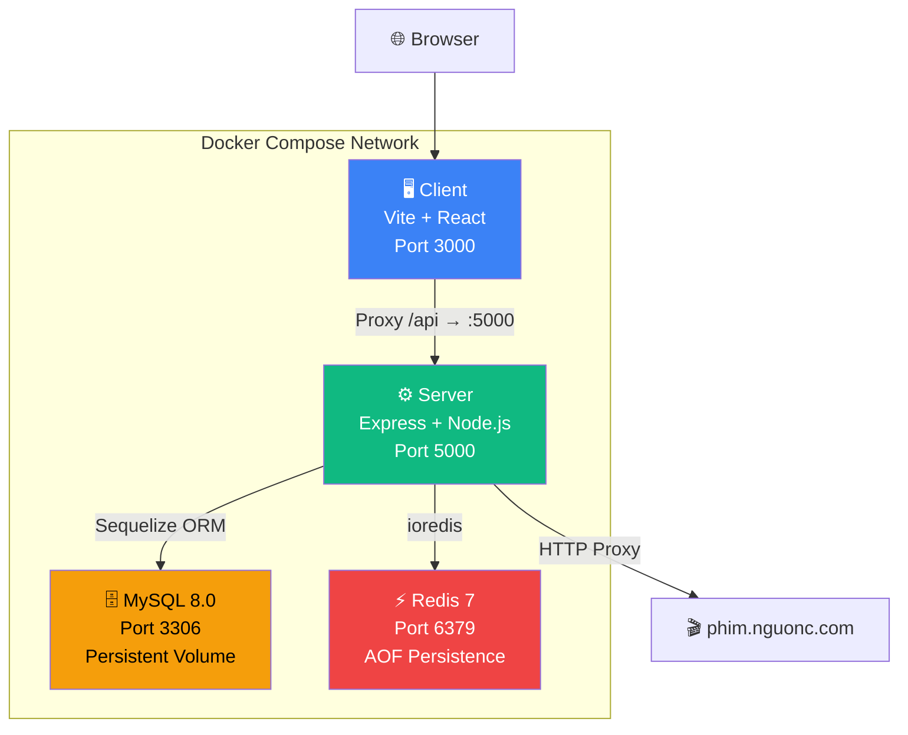
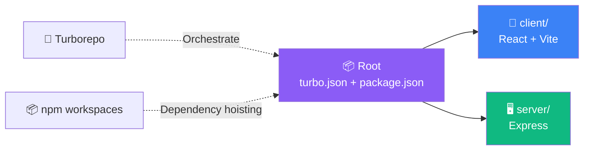
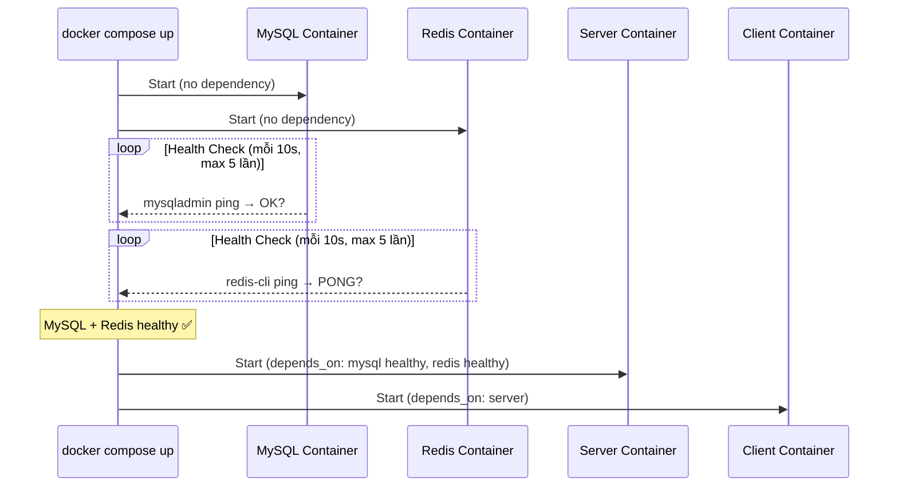
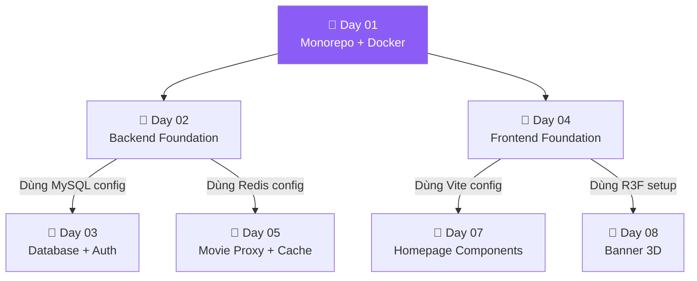

# 📗 Day 01 — Giải Thích Code: Monorepo & Docker Setup

> Tài liệu dành cho **developer** — giải thích kiến trúc, cách code hoạt động, và quyết định thiết kế.

---

## 🏗️ Kiến Trúc Tổng Quan

### Sơ Đồ Services



### Sơ Đồ Monorepo



---

## 📁 Giải Thích Từng File

### Root — Quản Lý Monorepo

#### `package.json` (Root)

```json
{
  "workspaces": ["client", "server"],
  "scripts": {
    "dev": "turbo run dev",
    "build": "turbo run build"
  },
  "devDependencies": {
    "turbo": "^2.5.0"
  },
  "engines": {
    "node": ">=20.0.0"
  }
}
```

**Giải thích**:
- `workspaces`: Khai báo cho npm biết `client/` và `server/` là 2 sub-package. npm sẽ **hoist** (kéo lên) các dependency chung vào `node_modules/` ở root.
- Scripts chỉ delegate qua `turbo run` — Turborepo quyết định chạy song song hay tuần tự.
- `engines` đảm bảo Node.js >= 20 (LTS mới nhất).

#### `turbo.json`

```json
{
  "tasks": {
    "dev": { "persistent": true, "cache": false },
    "build": { "dependsOn": ["^build"], "outputs": ["dist/**"] },
    "lint": {},
    "clean": { "cache": false }
  }
}
```

**Giải thích**:
- `dev` → `persistent: true`: Giữ process chạy liên tục (Vite và nodemon không bao giờ "xong").
- `dev` → `cache: false`: Dev server luôn restart, không cache.
- `build` → `dependsOn: ["^build"]`: Nếu package A phụ thuộc B, build B trước.
- `build` → `outputs: ["dist/**"]`: Turborepo cache thư mục `dist/` để lần build sau nhanh hơn.

#### `.npmrc`

```
legacy-peer-deps=true
```

**Tại sao cần?**
- `@react-three/fiber` v9 khai báo `peerDependencies: { "react": ">=19.0" }`.
- Project dùng React 18.3.1 → npm 10 mặc định **từ chối cài** vì peer dep conflict.
- `legacy-peer-deps=true` bảo npm bỏ qua kiểm tra peer deps (giống npm 6 trở về trước).
- **Rủi ro**: Nếu R3F v9 dùng API chỉ có trong React 19 → runtime error. Thực tế R3F v9 vẫn tương thích React 18 trong hầu hết trường hợp.

> [!IMPORTANT]
> **Phương án thay thế**: Downgrade `@react-three/fiber` về v8 (hỗ trợ React 18 chính thức) hoặc upgrade lên React 19 (rủi ro vì nhiều lib chưa sẵn sàng). Giữ v9 + legacy-peer-deps là cân bằng tốt nhất hiện tại.

---

### Server — Backend Express

#### `server/package.json`

Dependencies chính:

| Package | Mục đích |
|:---|:---|
| `express` | Web framework — xử lý HTTP requests |
| `sequelize` + `mysql2` | ORM — tương tác MySQL bằng JS thay vì SQL thuần |
| `ioredis` | Client Redis — cache, session |
| `jsonwebtoken` + `bcryptjs` | Auth — tạo JWT, hash password |
| `pino` + `pino-pretty` | Logging — structured log JSON (production), log đẹp (dev) |
| `helmet` | Security — set HTTP headers bảo mật |
| `cors` | CORS — cho phép client gọi API cross-origin |
| `nodemon` | Dev tool — tự restart server khi code thay đổi |

#### `server/src/index.js`

```javascript
// Luồng khởi tạo server
const app = express();

// 1. Middleware bảo mật
app.use(helmet());
app.use(cors({ origin: process.env.CLIENT_URL, credentials: true }));

// 2. Parse request body
app.use(express.json({ limit: '10mb' }));
app.use(cookieParser());

// 3. API Routes
app.use('/api/v1/health', healthRoute);
app.use('/api-docs', swaggerUI);

// 4. Error handling (cuối cùng)
app.use(notFoundHandler);     // 404 — route không tồn tại
app.use(globalErrorHandler);  // 500 — lỗi bất kỳ
```

**Logic quan trọng**:
- Middleware chạy **theo thứ tự** — helmet/cors trước, routes ở giữa, error handler cuối.
- `credentials: true` trong CORS cho phép gửi cookie (cần cho refresh token HttpOnly).
- `/api/v1/health` chỉ trả `{ status: "ok" }` — dùng cho Docker health check và monitoring.
- `/api/v1/ready` kiểm tra kết nối thực sự đến MySQL + Redis — phân biệt "server chạy" vs "server sẵn sàng phục vụ".

#### `server/Dockerfile`

```dockerfile
# ── Development Stage ────────────────────────────
FROM node:20-alpine AS dev
WORKDIR /app
COPY package.json ./
RUN npm install
COPY . .
EXPOSE 5000
CMD ["npm", "run", "dev"]     # nodemon — auto restart

# ── Production Stage ─────────────────────────────
FROM node:20-alpine AS production
WORKDIR /app
COPY package.json ./
RUN npm install --omit=dev    # Chỉ prod dependencies
COPY . .
RUN addgroup -g 1001 -S nodejs && adduser -S nodejs -u 1001
USER nodejs                    # Non-root user — bảo mật
HEALTHCHECK ...
CMD ["node", "src/index.js"]  # Chạy trực tiếp, không nodemon
```

**Multi-stage build**:
- `target: dev` trong `docker-compose.yml` → Docker chỉ build đến stage `dev`, bỏ qua `production`.
- Production stage có: non-root user (bảo mật), health check, chỉ install prod deps (nhỏ hơn).

---

### Client — Frontend React + Vite

#### `client/package.json`

Dependencies chính:

| Package | Mục đích |
|:---|:---|
| `react` + `react-dom` | UI framework — render component |
| `react-router-dom` v7 | Routing — điều hướng SPA |
| `@tanstack/react-query` | Server state — cache, refetch, loading/error states |
| `zustand` | Client state — auth, player, UI settings |
| `three` + `@react-three/fiber` + `drei` | 3D graphics — banner phim |
| `framer-motion` | Animation — hiệu ứng chuyển cảnh |
| `swiper` | Carousel — slider phim |
| `hls.js` | Video — phát luồng M3U8 |

#### `client/vite.config.js`

```javascript
export default defineConfig({
  plugins: [react()],
  resolve: {
    alias: {
      '@': path.resolve(__dirname, 'src'),
      '@components': path.resolve(__dirname, 'src/components'),
      // ... các alias khác
    }
  },
  server: {
    port: 3000,
    proxy: {
      '/api': {
        target: 'http://localhost:5000',  // Chuyển tiếp API calls → server
        changeOrigin: true,
      }
    }
  }
});
```

**Giải thích**:
- **Alias paths**: Import `@/components/Header` thay vì `../../components/Header` — sạch hơn, không bị relative path hell.
- **Proxy**: Khi dev, browser gọi `localhost:3000/api/...` → Vite tự chuyển tiếp sang `localhost:5000/api/...`. Giải quyết CORS mà không cần config gì ở server.

#### `client/Dockerfile`

```dockerfile
# ── Development ──
FROM node:20-alpine AS dev
WORKDIR /app
COPY package.json ./
RUN npm install --legacy-peer-deps    # ← QUAN TRỌNG
COPY . .
CMD ["npm", "run", "dev", "--", "--host", "0.0.0.0"]

# ── Production ──
FROM node:20-alpine AS build
COPY package.json ./
RUN npm install --legacy-peer-deps    # ← Cần ở đây nữa
COPY . .
RUN npm run build

FROM nginx:alpine AS production
COPY --from=build /app/dist /usr/share/nginx/html
# Nginx config: SPA fallback → tất cả routes trỏ về index.html
```

**Tại sao `--legacy-peer-deps` ở CẢ 2 stage?**
- Dev stage: dùng khi `docker compose up` ở dev mode.
- Build stage: dùng khi build production image. Nếu thiếu → `npm install` fail → image không build được.

**Tại sao `--host 0.0.0.0` trong CMD?**
- Mặc định Vite chỉ listen `localhost` → container bên ngoài không truy cập được.
- `--host 0.0.0.0` cho phép truy cập từ Docker network (browser → container port mapping).

---

### Docker Compose — Orchestration

#### `docker-compose.yml`



**Các quyết định thiết kế quan trọng**:

1. **`depends_on` + `condition: service_healthy`**: Server KHÔNG start cho đến khi MySQL thực sự sẵn sàng nhận kết nối (không chỉ container running). Tránh lỗi `ECONNREFUSED`.

2. **Volume mount `./server:/app` + `/app/node_modules`**:
   - `./server:/app`: Map source code trên host vào container → thay đổi code, nodemon tự restart.
   - `/app/node_modules`: Tạo anonymous volume để **không** bị host's node_modules đè lên. Node_modules trong container build riêng cho Linux, host là Windows → không dùng chung được.

3. **`restart: unless-stopped`**: Container tự restart nếu crash, trừ khi user chủ động `docker compose stop`.

4. **MySQL `--default-authentication-plugin=mysql_native_password`**: Một số tool/lib cũ chưa hỗ trợ `caching_sha2_password` mặc định của MySQL 8. Dùng `mysql_native_password` để tương thích.

5. **Redis `--appendonly yes`**: Bật AOF (Append Only File) persistence — dữ liệu Redis không mất khi restart. Phù hợp cho cache + session storage.

---

## 🔗 Mối Liên Hệ Với Các Module Khác



- **Day 02** sẽ sử dụng Docker Compose config (MySQL, Redis) từ Day 01.
- **Day 04** sẽ xây dựng trên Vite config và design system CSS từ Day 01.
- **Docker Compose** là nền tảng cho toàn bộ quá trình phát triển — không cần thay đổi cho đến Day 22 (production deploy).

---

## ⚠️ Lưu Ý Quan Trọng

### 1. Peer Dependencies Conflict

| Package | Yêu cầu | Project có |
|:---|:---|:---|
| `@react-three/fiber` v9 | React >= 19 | React 18.3.1 |
| `@react-three/drei` v10 | React >= 19 | React 18.3.1 |

**Giải pháp**: `.npmrc` có `legacy-peer-deps=true` + Dockerfile có `--legacy-peer-deps`.

**Giám sát**: Nếu gặp runtime error liên quan R3F → xem xét downgrade về `@react-three/fiber@8` hoặc upgrade React 19.

### 2. Docker Volume Mount — Windows vs Linux

Container chạy Linux (Alpine). Nếu host là Windows:
- File path separator khác (`\` vs `/`)
- Line endings khác (CRLF vs LF) — có thể gây lỗi trong scripts bash
- `node_modules` compile native modules cho OS khác → PHẢI dùng anonymous volume `/app/node_modules`

### 3. Hot Reload Trong Docker

- **Server (nodemon)**: Hoạt động ngay nhờ volume mount `./server:/app`.
- **Client (Vite HMR)**: Trên Windows với Docker, file watcher có thể chậm hơn native. Nếu HMR không hoạt động → thêm vào `vite.config.js`:

```javascript
server: {
  watch: {
    usePolling: true,    // Fallback cho Docker on Windows
    interval: 1000,
  }
}
```

### 4. Cleanup Docker Resources

Docker tích lũy images/volumes theo thời gian. Định kỳ cleanup:

```bash
docker system prune -a     # Xóa tất cả images không dùng
docker volume prune        # Xóa volumes không dùng
```
