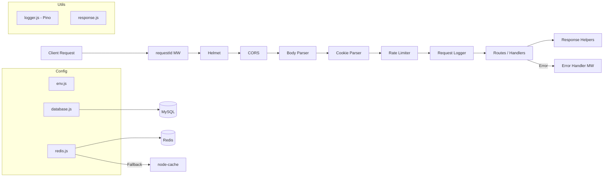

# Ngày 2 — Backend Foundation · Giải Thích Code

> Giải thích kiến trúc và quyết định thiết kế cho backend foundation.

---

## Kiến Trúc Tổng Quan

---

## Giải Thích Từng File

### Config Layer

#### `src/config/env.js`
- **Mục đích**: Single source of truth cho tất cả environment variables
- **Logic chính**: Load `.env` qua `dotenv`, validate biến bắt buộc, export object `env` đã structured
- **Quyết định**: Throw error ngay khi khởi động nếu thiếu biến → fail fast, tránh runtime errors khó debug
- **Biến bắt buộc**: `DB_HOST`, `DB_NAME`, `DB_USER`, `DB_PASSWORD`, `JWT_ACCESS_SECRET`, `JWT_REFRESH_SECRET`

#### `src/config/database.js`
- **Mục đích**: Sequelize instance kết nối MySQL
- **Cấu hình đáng chú ý**:
  - `underscored: true` → tất cả columns dùng snake_case
  - `timezone: '+07:00'` → Vietnam timezone
  - Pool: min 2, max 10, acquire timeout 30s
  - Logging qua Pino (dev only)
- **Export**: `sequelize` instance + `connectDatabase()` function

#### `src/config/redis.js`
- **Mục đích**: ioredis client với fallback `node-cache`
- **Chiến lược**:
  - `lazyConnect: true` → không connect tự động, gọi `connectRedis()` explicit
  - Retry 5 lần với backoff tăng dần (200ms → 2000ms)
  - Sau 5 lần fail → stop retry, dùng `node-cache` in-memory
  - Event listeners: `connect`, `error`, `close` để track trạng thái
- **TẠI SAO fallback node-cache**: Dev có thể không có Redis local; production Redis có thể tạm down → server vẫn phục vụ được (degraded mode)

---

### Middleware Stack

#### `src/middleware/requestId.js`
- Gắn UUID (`uuid` v4) vào `req.id` + response header `X-Request-Id`
- Ưu tiên ID từ proxy/load balancer nếu đã có trong header → trace xuyên suốt hệ thống

#### `src/middleware/rateLimiter.js`
- 2 preset:
  - `generalLimiter`: 100 req / 15 phút per IP
  - `authLimiter`: 5 req / 15 phút per IP (sẽ dùng cho login/register)
- Trả response chuẩn `RATE_LIMIT_EXCEEDED` (429)
- **TẠI SAO không dùng Redis store**: Ở giai đoạn này dùng memory store mặc định đủ tốt. Khi scale nhiều instance sẽ chuyển sang Redis store

#### `src/middleware/errorHandler.js`
- **`AppError` class**: Custom error cho business logic, extend `Error` với `statusCode`, `code`, `errors`, `isOperational`
- **`notFoundHandler`**: Catchall 404 cho routes không match
- **`errorHandler`**: Global error handler (4 params):
  - Log error bằng Pino (error level cho 500+, warn cho 4xx)
  - Handle Sequelize errors (validation, unique constraint, connection)
  - Ẩn stack trace ở production
  - Trả response format chuẩn

#### `src/middleware/validate.js`
- Wrapper cho `express-validator` validation chains
- Chạy từng validation rule tuần tự → break sớm nếu có lỗi
- Format errors: `{ field, message, value }` → trả 422 `VALIDATION_ERROR`

---

### Utils

#### `src/utils/logger.js`
- **Dev**: `pino-pretty` với colorize, timestamp `HH:MM:ss.l`, single line
- **Production**: JSON format (machine-readable) với ISO timestamp
- Custom serializers cho `req`, `res`, `err`
- Level từ env `LOG_LEVEL` (default: `info`)

#### `src/utils/response.js`
- `sendSuccess(res, data, meta, statusCode)` → `{ success: true, data, meta? }`
- `sendError(res, message, code, statusCode, errors)` → `{ success: false, message, code, errors? }`
- Tất cả API endpoints sẽ dùng 2 hàm này để đảm bảo response format nhất quán

---

### `src/index.js` (Refactored)

- **Middleware chain**: requestId → Helmet → CORS → JSON parser → Cookie parser → Rate limiter → Request logger → Routes → 404 → Error handler
- **Request logging**: Log mỗi request khi `finish` với: requestId, method, url, statusCode, duration
- **Health/Ready endpoints**: Kiểm tra thực sự connection tới DB + Redis (thay vì hardcode `not_configured`)
- **Async startup**: `startServer()` kết nối DB + Redis trước khi listen. Nếu fail → warn nhưng vẫn start (graceful degradation)

---

## Mối Liên Hệ Giữa Các Module

| Module | Phụ thuộc | Được sử dụng bởi |
|:---|:---|:---|
| `env.js` | `dotenv` | `database.js`, `redis.js`, `index.js` |
| `logger.js` | `pino` | Tất cả files |
| `response.js` | — | `rateLimiter.js`, `errorHandler.js`, `validate.js`, routes |
| `database.js` | `env.js`, `logger.js` | `index.js`, models (ngày 3) |
| `redis.js` | `env.js`, `logger.js` | `index.js`, cache utils (ngày 5) |
| `errorHandler.js` | `logger.js`, `response.js` | `index.js`, controllers |
| `validate.js` | `response.js` | Route handlers (ngày 3+) |

---

## Lưu Ý Quan Trọng

> [!WARNING]
> `logger.js` được import bởi `database.js` và `redis.js`, nhưng nó đọc `LOG_LEVEL` trực tiếp từ `process.env` (không qua `env.js`) để tránh circular dependency.

> [!TIP]
> Khi thêm routes mới (ngày 3+), chỉ cần import `{ AppError }` từ `errorHandler.js` và throw — error handler sẽ tự bắt và format response.
