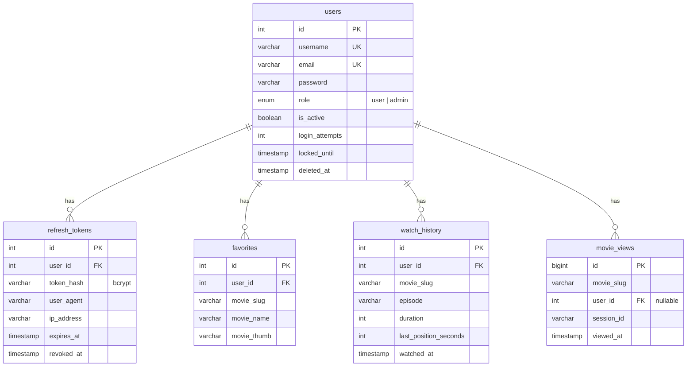
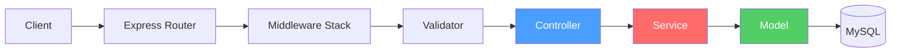
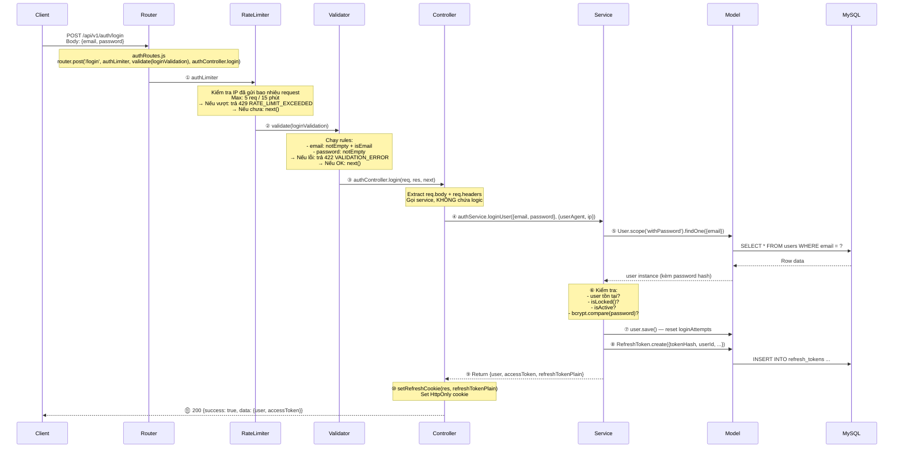
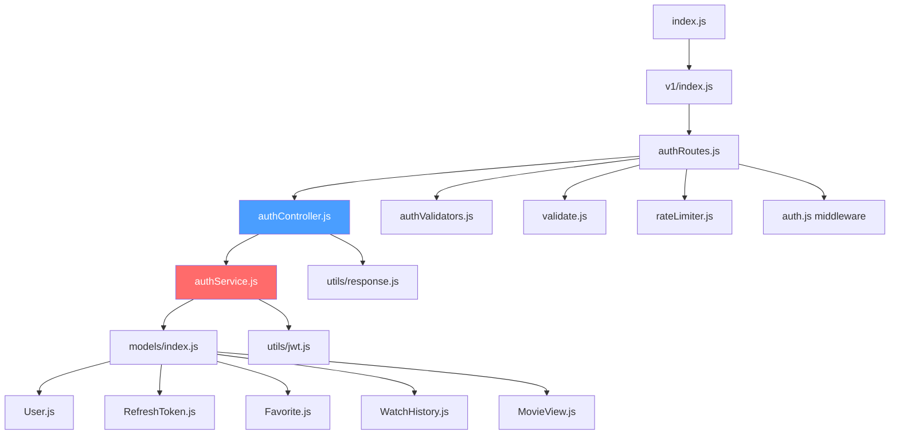

# Ngày 3 — Database Models & Auth Backend · Giải Thích Code

> Giải thích kiến trúc, quyết định thiết kế — tổ chức theo **feature**.

---

## Feature A: Database Models

### Kiến Trúc



### Giải thích từng Model

#### `User.js`
- **Hooks**: `beforeCreate` và `beforeUpdate` tự hash password qua `bcrypt` (salt rounds: 12)
- **Scopes**: `defaultScope` ẩn `password` + `deletedAt`; `withPassword` scope để login
- **Instance methods**: `comparePassword()`, `isLocked()`, `toSafeJSON()`
- **TẠI SAO không dùng `paranoid`**: Dùng `deletedAt` thủ công để linh hoạt hơn — admin có thể query cả deleted users

#### `RefreshToken.js`
- `tokenHash`: Lưu **bcrypt hash** của UUID, không lưu token gốc → bảo mật
- `updatedAt: false`: Token chỉ tạo/revoke, không cần update timestamp
- **TẠI SAO hash token**: Nếu database bị leak, attacker không dùng được refresh token

#### `Favorite.js`
- Unique constraint `(user_id, movie_slug)` → mỗi user chỉ favorite 1 lần mỗi phim
- `updatedAt: false`: Favorite chỉ tạo/xóa

#### `WatchHistory.js`
- Unique constraint `(user_id, movie_slug, episode)` → upsert khi xem lại cùng tập
- `last_position_seconds`: Hỗ trợ "Xem tiếp từ phút X:XX"
- Index `idx_user_recent`: Tối ưu query "lịch sử gần đây"

#### `MovieView.js`
- `user_id` nullable: Guest users ghi nhận qua `session_id`
- `timestamps: false`: Chỉ dùng `viewed_at`
- `BIGINT id`: Analytics table sẽ tăng nhanh

### `models/index.js` — Associations

| Quan hệ | onDelete |
|:---|:---|
| User → RefreshToken (1:N) | CASCADE (xóa user → xóa tokens) |
| User → Favorite (1:N) | CASCADE |
| User → WatchHistory (1:N) | CASCADE |
| User → MovieView (1:N) | SET NULL (giữ analytics khi xóa user) |

### Seeder (`seeders/initialUsers.js`)
- Chạy khi dev + bảng users trống → tạo 1 admin + 2 test users
- Dùng `User.create()` (không `bulkCreate`) để trigger bcrypt hooks
- Password admin từ env `ADMIN_PASSWORD` hoặc default `Admin@123`

---

## Feature B: Auth JWT

### Kiến Trúc 3 Tầng

```
Request → Router → Middleware → Validator → Controller → Service → Model → Database
                                              ↕               ↕
                                        (req/res only)   (business logic)
```



| Tầng | File | Trách nhiệm |
|:---|:---|:---|
| **Router** | `authRoutes.js` | Gắn middleware chain + map URL → controller |
| **Middleware** | `rateLimiter.js`, `auth.js`, `validate.js` | Rate limit, xác thực, validate input |
| **Controller** | `authController.js` | Xử lý `req`/`res`, set cookie, gọi service |
| **Service** | `authService.js` | **Toàn bộ business logic** — không biết req/res |
| **Model** | `User.js`, `RefreshToken.js` | Truy vấn database, hooks (bcrypt) |

---

### Luồng Request Chi Tiết

#### Ví dụ 1: `POST /api/v1/auth/login`



**Đi qua từng bước:**

| Bước | Layer | File | Code | Kết quả |
|:---|:---|:---|:---|:---|
| ① | Middleware | `rateLimiter.js` | `authLimiter` — `rateLimit({max:5, windowMs:15min})` | Pass hoặc 429 |
| ② | Middleware | `validate.js` | `validate(loginValidation)` — chạy `body('email').isEmail()`, `body('password').notEmpty()` | Pass hoặc 422 `{errors: [{field, message}]}` |
| ③ | Controller | `authController.js` | `login(req, res, next)` — extract `req.body`, gọi service | Không chứa logic |
| ④ | Service | `authService.js` | `loginUser({email, password}, meta)` | Business logic |
| ⑤ | Model | `User.js` | `User.scope('withPassword').findOne({email})` — scope `withPassword` bao gồm cột password | User instance hoặc null |
| ⑥ | Service | `authService.js` | `user.isLocked()`, `user.comparePassword()` | Throw AppError nếu fail |
| ⑦ | Model | `User.js` | `user.save({hooks:false})` — `hooks:false` để KHÔNG hash lại password | Update `login_attempts=0`, `last_login_at` |
| ⑧ | Model | `RefreshToken.js` | `RefreshToken.create({tokenHash, userId, ...})` | Lưu bcrypt hash của UUID |
| ⑨ | Service → Ctrl | — | Return `{user, accessToken, refreshTokenPlain}` | Controller nhận kết quả |
| ⑩ | Controller | `authController.js` | `setRefreshCookie(res, token)` → `res.cookie('refreshToken', ...)` | Set HttpOnly cookie |
| ⑪ | Controller | `authController.js` | `sendSuccess(res, {user: user.toSafeJSON(), accessToken})` | JSON response |

---

#### Ví dụ 2: `POST /api/v1/auth/register`

```
Client → Router → authLimiter → validate(registerValidation) → Controller → Service → Model
```

**Bước chi tiết:**

```js
// ① Router (authRoutes.js) — gắn middleware chain
router.post('/register',
  authLimiter,                        // max 5 req/15min
  validate(registerValidation),       // username + email + password rules
  authController.register             // thin controller
);

// ② Validator (authValidators.js) — kiểm tra input
const registerValidation = [
  body('username').trim().isLength({ min: 3, max: 30 })
    .matches(/^[a-zA-Z0-9_]+$/),      // → 422 nếu sai format
  body('email').isEmail(),             // → 422 nếu không phải email
  body('password').isLength({ min: 8 })
    .matches(/[A-Z]/)                  // → 422 nếu thiếu chữ in hoa
    .matches(/[0-9]/)                  // → 422 nếu thiếu số
    .matches(/[!@#$%^&*(),.?":{}|<>]/),// → 422 nếu thiếu ký tự đặc biệt
];

// ③ Controller (authController.js) — CHỈ xử lý req/res
async function register(req, res, next) {
  const { user, accessToken, refreshTokenPlain } = await authService.registerUser(
    req.body,                          // forward body cho service
    { userAgent: req.headers['user-agent'], ipAddress: req.ip }
  );
  setRefreshCookie(res, refreshTokenPlain);  // set cookie
  return sendSuccess(res, { user: user.toSafeJSON(), accessToken }, null, 201);
}

// ④ Service (authService.js) — TOÀN BỘ business logic
async function registerUser({ username, email, password }, meta) {
  // Check duplicate
  const existing = await User.unscoped().findOne({ where: { [Op.or]: [{email}, {username}] }});
  if (existing) throw new AppError('Email đã tồn tại', 409, ...);

  // Tạo user → Model hook tự hash password
  const user = await User.create({ username, email, password });

  // Tạo token pair
  const { accessToken, refreshTokenPlain } = await createTokenPair(user, meta);
  return { user, accessToken, refreshTokenPlain };
}

// ⑤ Model (User.js) — hook tự hash password
User.beforeCreate(async (user) => {
  user.password = await bcrypt.hash(user.password, 12); // 12 salt rounds
});
```

---

#### Ví dụ 3: `GET /api/v1/auth/me` (Protected Route)

```
Client → Router → authenticate middleware → Controller → Response
```

```js
// ① Router — yêu cầu authenticate trước
router.get('/me', authenticate, authController.me);

// ② Middleware (auth.js) — xác thực JWT
async function authenticate(req, res, next) {
  const token = req.headers.authorization?.split(' ')[1];  // Extract Bearer token
  // → Nếu thiếu: 401 AUTH_UNAUTHORIZED

  const decoded = verifyAccessToken(token);
  // → Nếu expired: 401 AUTH_TOKEN_EXPIRED
  // → Nếu invalid: 401 AUTH_UNAUTHORIZED

  const user = await User.findByPk(decoded.id);
  // → Nếu không tìm thấy / inactive: 401 hoặc 403

  req.user = user;  // Attach vào request
  next();           // → Controller
}

// ③ Controller — đơn giản trả về user
async function me(req, res, next) {
  return sendSuccess(res, { user: req.user.toSafeJSON() });
  // Không cần gọi service vì không có business logic
}
```

---

#### Ví dụ 4: `POST /api/v1/auth/refresh` (Token Rotation)

```
Client → Router → Controller → Service → Model
```

Lưu ý: **Không cần `authenticate`** — dùng cookie thay vì Bearer token.

```js
// ① Router — không có authenticate middleware
router.post('/refresh', authController.refresh);

// ② Controller — lấy cookie, gọi service
async function refresh(req, res, next) {
  const { accessToken, refreshTokenPlain } = await authService.refreshTokens(
    req.cookies?.refreshToken,    // đọc từ HttpOnly cookie
    { userAgent, ipAddress }
  );
  setRefreshCookie(res, refreshTokenPlain);  // set cookie MỚI
  return sendSuccess(res, { accessToken });
}

// ③ Service — Token Rotation Logic
async function refreshTokens(refreshTokenPlain, meta) {
  // Tìm tất cả token chưa revoke + chưa expired
  const tokens = await RefreshToken.findAll({ where: { revokedAt: null, expiresAt > now }});
  
  // So sánh bcrypt hash từng token (vì lưu hash, không lưu raw)
  for (const token of tokens) {
    if (await bcrypt.compare(refreshTokenPlain, token.tokenHash)) {
      matchedToken = token;
      break;
    }
  }
  
  // VÔ HIỆU token cũ (rotation)
  matchedToken.revokedAt = new Date();
  await matchedToken.save();
  
  // TẠO token mới
  const { accessToken, refreshTokenPlain: newToken } = await createTokenPair(user, meta);
  return { accessToken, refreshTokenPlain: newToken };
}
```

---

### Tóm tắt: Ai làm gì?

| Layer | LÀM | KHÔNG LÀM |
|:---|:---|:---|
| **Router** | Map URL, gắn middleware chain | Không chứa logic |
| **Middleware** | Rate limit, auth, validate | Không gọi DB trực tiếp (trừ auth lookup user) |
| **Controller** | `req.body` → gọi service → `res.json` + cookie | **Không chứa business logic** |
| **Service** | Check duplicate, compare password, token rotation, lockout | **Không biết `req`/`res`** |
| **Model** | Truy vấn DB, hooks (hash password), instance methods | Không chứa business logic phức tạp |

---

### Giải thích từng File

#### `utils/jwt.js`
- **Access token**: JWT HS256, payload `{id, username, email, role}`, TTL 15 phút
- **Refresh token**: UUID v4 thuần (không phải JWT) → hash bằng bcrypt lưu DB
- **TẠI SAO refresh không dùng JWT**: Refresh token cần revoke được từ server side. UUID + DB lookup cho phép revoke bất kỳ lúc nào

#### `services/authService.js`
- **Chứa toàn bộ business logic**, không biết `req`/`res`
- Nhận plain objects `{email, password}` + meta `{userAgent, ipAddress}`
- Trả về plain objects `{user, accessToken, refreshTokenPlain}`
- **TẠI SAO tách service**: Controller testable riêng (mock service), service testable riêng (mock model). Khi cần thêm logic (email verification, 2FA) chỉ sửa service

#### `middleware/auth.js`
- `authenticate`: Extract Bearer → verify JWT → lookup User → attach `req.user`
- `optionalAuth`: Không throw nếu thiếu token (dùng cho public routes cần biết user)

#### `middleware/authorize.js`
- Factory function `authorize('admin')` → kiểm tra `req.user.role`
- Trả 403 `AUTH_FORBIDDEN` nếu không đủ quyền

#### `validators/authValidators.js`
- `registerValidation`: username (3-30, alphanumeric+underscore), email, password (8+, 1 uppercase, 1 number, 1 special)
- `loginValidation`: email + password (chỉ required, không check format)

---

## Mối Liên Hệ



---

## Lưu Ý Quan Trọng

> [!WARNING]
> `sequelize.sync({ alter: true })` chỉ dùng trong dev. Production PHẢI dùng migrations để tránh mất dữ liệu.

> [!TIP]
> Khi thêm feature mới, follow pattern: **Route → Middleware → Validator → Controller (thin) → Service (logic) → Model**. Controller KHÔNG chứa business logic.

