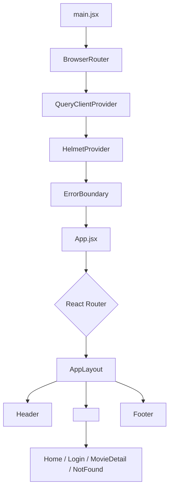
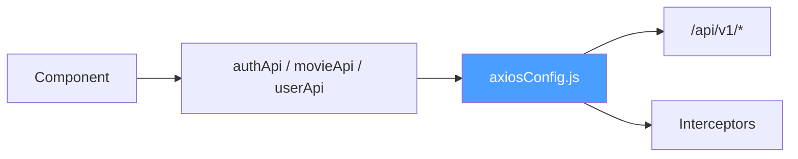
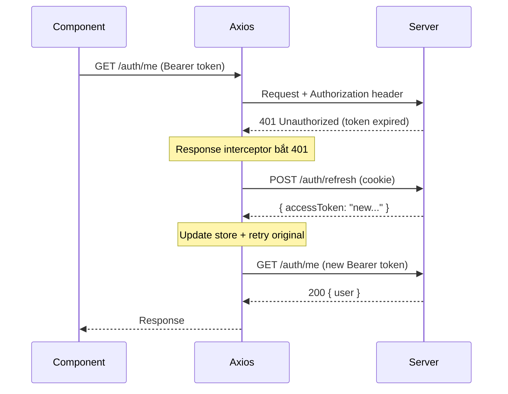
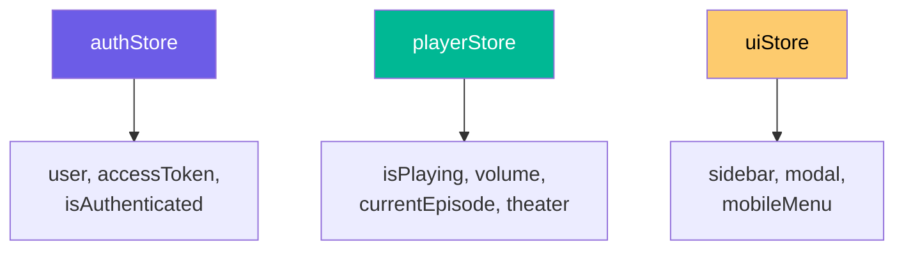
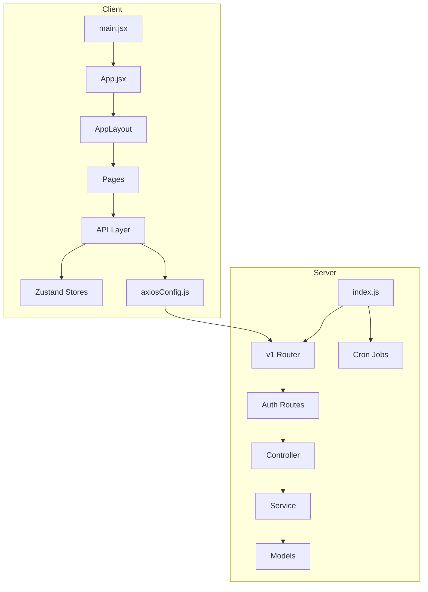

# Ngày 4 — Frontend Foundation · Giải Thích Code

> Giải thích theo **5 features**.

---

## Feature A: Design System (CSS)

### `index.css`

CSS Custom Properties (Design Tokens) cho toàn bộ ứng dụng:

| Token Group | Ví dụ | Mục đích |
|:---|:---|:---|
| `--color-bg-*` | `#0a0a0f`, `#12121a` | Màu nền (dark theme) |
| `--color-accent-*` | `#6c5ce7` | Màu nhấn (purple gradient) |
| `--color-text-*` | `#e8e8f0`, `#a0a0b8` | Màu chữ 3 cấp |
| `--font-size-*` | `xs` → `4xl` | Kích thước chữ |
| `--space-*` | `1` → `16` | Spacing scale |
| `--radius-*` | `sm` → `full` | Border radius |
| `--shadow-*` | `sm`, `glow` | Box shadows |
| `--transition-*` | `fast`, `base`, `slow` | Transition timing |
| `--z-*` | `dropdown` → `toast` | Z-index scale |

**Utility Classes**: `.container`, `.sr-only`, `.text-gradient`, `.btn-*`, `.input`, `.card`, `.badge`, `.skeleton`, `.spinner`

**Animations**: `fadeIn`, `slideUp`, `slideDown`, `pulse`, `spin`, `skeleton-loading`

---

## Feature B: Routing & Layout

### Luồng Render



### Provider Stack (main.jsx)

| Provider | Thư viện | Vai trò |
|:---|:---|:---|
| `BrowserRouter` | react-router-dom | SPA routing |
| `QueryClientProvider` | @tanstack/react-query | Server state caching |
| `HelmetProvider` | react-helmet-async | SEO meta tags |
| `ErrorBoundary` | Custom class component | Catch render errors |
| `Toaster` | react-hot-toast | Toast notifications |

### Code Splitting (App.jsx)

```js
const Home = lazy(() => import('@pages/Home'));
// → Tạo chunk riêng cho mỗi page
// → Load khi navigate, không load tất cả lúc đầu
```

`<Suspense fallback={<PageLoader />}>` hiển thị spinner khi chunk đang load.

### Layout Components

| Component | Vai trò |
|:---|:---|
| `AppLayout` | Flex column: Header + `<Outlet />` + Footer |
| `Header` | Sticky, glassmorphism, nav links, search, user menu, responsive hamburger |
| `Footer` | Brand, GitHub link, copyright, disclaimer |
| `ErrorBoundary` | Class component: `getDerivedStateFromError` → fallback "Tải lại trang" |

---

## Feature C: API Layer

### Kiến Trúc



### `axiosConfig.js` — Auto Refresh Flow



**Queue mechanism**: Nếu nhiều requests cùng failed 401, chỉ 1 refresh call → queue các request khác → retry tất cả sau khi có token mới.

### API Modules

| Module | Endpoints |
|:---|:---|
| `authApi` | register, login, refresh, logout, logoutAll, getMe |
| `movieApi` | getNew, getDetail, search, getByGenre, getByCountry, getByYear, getByType |
| `userApi` | updateProfile, getFavorites, addFavorite, removeFavorite, getHistory, saveHistory, syncHistory |

---

## Feature D: State Management

### 3 Zustand Stores



| Store | Persist | Dùng ở đâu |
|:---|:---|:---|
| `authStore` | Không (token từ cookie) | Header, API interceptor, protected routes |
| `playerStore` | Volume → localStorage | Video player, watch progress |
| `uiStore` | Không | Layout, modals |

**TẠI SAO Zustand**: Nhẹ (~1KB), không cần Provider wrapper, truy cập ngoài React (`getState()`), hoàn hảo cho axios interceptor.

---

## Feature E: Cron Jobs (Server)

### `jobs/cleanExpiredTokens.js`

Xóa refresh tokens mà:
- `expires_at < NOW()` (đã hết hạn)
- `revoked_at IS NOT NULL AND revoked_at < 7 ngày trước` (đã revoke cũ)

### `jobs/index.js`

```js
cron.schedule('0 3 * * *', cleanExpiredTokens, { timezone: 'Asia/Ho_Chi_Minh' });
// Chạy mỗi ngày lúc 3:00 AM
```

### Tích hợp `index.js`

```js
if (dbConnected) {
  startJobs();  // Chỉ start khi DB connected
}
```

---

## Mối Liên Hệ Tổng Quát


