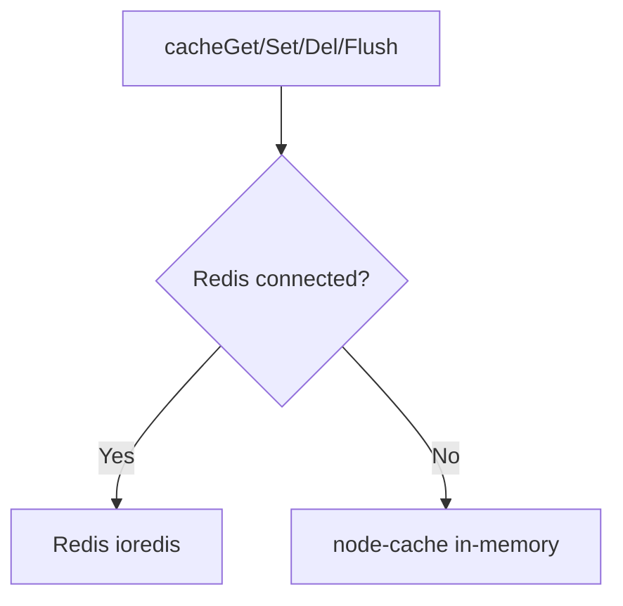
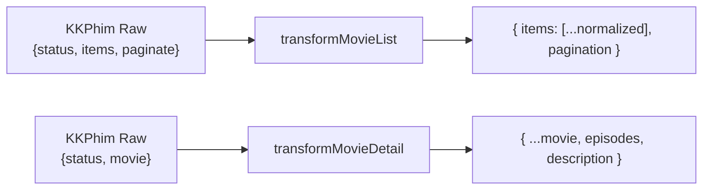
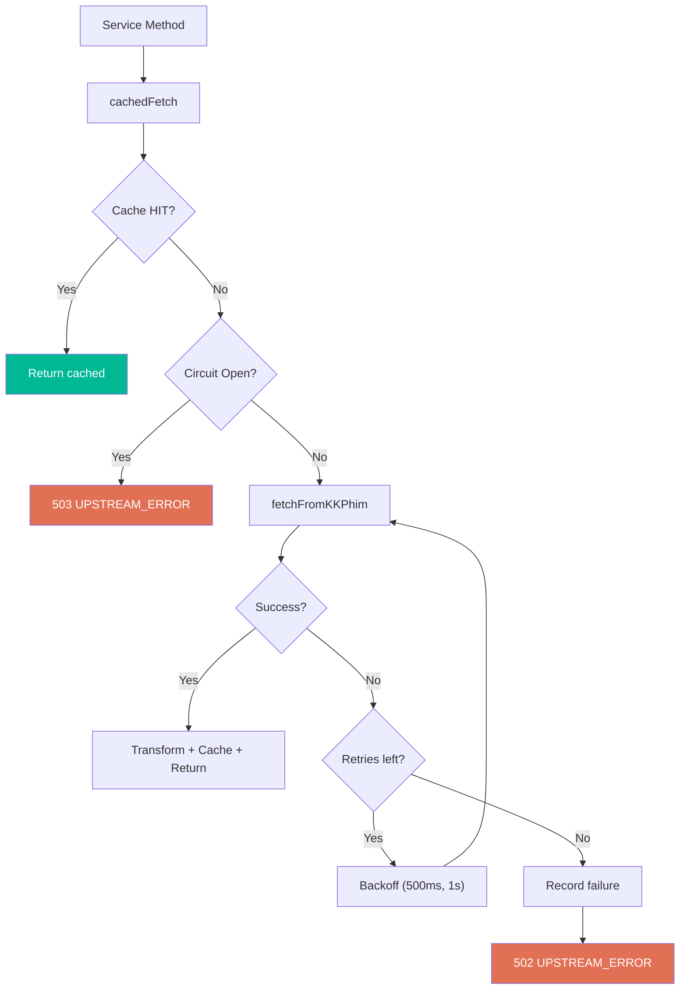
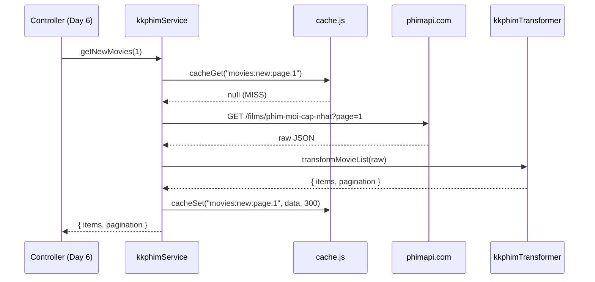

# Ngﾃ�y 5 窶・Movie Proxy + Cache Backend ﾂｷ Gi蘯｣i Thﾃｭch Code

> Gi蘯｣i thﾃｭch theo **3 features**.

---

## Feature A: Cache Helper

### `utils/cache.js`

Wrapper th盻創g nh蘯･t cho Redis + fallback node-cache:



| Function | Mﾃｴ t蘯｣ |
|:---|:---|
| `cacheGet(key)` | L蘯･y + JSON.parse. Tr蘯｣ `null` n蘯ｿu miss |
| `cacheSet(key, data, ttl)` | JSON.stringify + SET EX. Default 300s |
| `cacheDel(key)` | Xﾃｳa 1 key |
| `cacheFlush(pattern)` | Xﾃｳa keys matching pattern (`movies:new:*`) |

**T蘯｡i sao c蘯ｧn wrapper**: M盻絞 service ﾄ黛ｻ「 g盻絞 `cacheGet/cacheSet` mﾃ� khﾃｴng c蘯ｧn bi蘯ｿt ﾄ疎ng dﾃｹng Redis hay memory cache. T蘯･t c蘯｣ operations ﾄ黛ｻ「 **error-safe** (catch + log, khﾃｴng throw).

---

## Feature B: Data Transformer

### `services/kkphimTransformer.js`

Chu蘯ｩn hﾃｳa response thﾃｴ t盻ｫ KKPhim 竊・format frontend.

### Lu盻渡g Transform



### Mapping Fields

| KKPhim Field | Normalized Field | X盻ｭ lﾃｽ |
|:---|:---|:---|
| `name` | `title` | Tr盻ｱc ti蘯ｿp |
| `original_name` | `originalTitle` | Tr盻ｱc ti蘯ｿp |
| `poster_url` | `poster` | + CDN prefix |
| `thumb_url` | `thumb` | + CDN prefix |
| `category[]` | `genres[]` | Extract `.name` |
| `country[]` | `country[]` | Extract `.name` |
| `episode_total` | `totalEpisodes` | parseInt |
| `episode_current` | `currentEpisode` | Tr盻ｱc ti蘯ｿp |
| `episodes[].server_data` | `episodes[].items` | Normalize slug, embed, m3u8 |

### Image CDN

```js
function normalizeImageUrl(url) {
  if (!url) return null;
  if (url.startsWith('http')) return url;
  return `https://phimimg.com/${url}`;
}
```

---

## Feature C: KKPhim Service

### `services/kkphimService.js`

Ki蘯ｿn trﾃｺc **3 l盻孅 b蘯｣o v盻・*:



### 1. Cache-First Strategy

```js
async function cachedFetch(cacheKey, apiPath, ttl, transformer) {
  const cached = await cacheGet(cacheKey);  // Redis ho蘯ｷc memory
  if (cached) return cached;                // HIT 竊・return ngay

  const raw = await fetchFromKKPhim(apiPath);  // MISS 竊・g盻絞 API
  const data = transformer(raw);               // Transform
  cacheSet(cacheKey, data, ttl);               // Save cache (fire-and-forget)
  return data;
}
```

### 2. Retry Strategy

| L蘯ｧn | Delay | T盻貧g ch盻・|
|:---|:---|:---|
| Attempt 0 | 0ms | 0ms |
| Attempt 1 (retry 1) | 500ms | 500ms |
| Attempt 2 (retry 2) | 1000ms | 1500ms |
| 竊・Fail | recordFailure() | throw 502 |

### 3. Circuit Breaker

```
State: CLOSED 竊・[5 fails] 竊・OPEN 竊・[60s] 竊・HALF-OPEN 竊・[1 success] 竊・CLOSED
                                              笏披・ [1 fail] 竊・OPEN
```

| Config | Giﾃ｡ tr盻・|
|:---|:---|
| Threshold | 5 l蘯ｧn fail liﾃｪn ti蘯ｿp |
| Reset time | 60 giﾃ｢y |
| Half-open | Cho 1 request th盻ｭ |

### 7 Public Methods

| Method | KKPhim Path | TTL |
|:---|:---|:---|
| `getNewMovies(page)` | `/films/phim-moi-cap-nhat?page=` | 5 min |
| `getMoviesByList(slug, page)` | `/films/danh-sach/{slug}?page=` | 15 min |
| `getMovieDetail(slug)` | `/film/{slug}` | 30 min |
| `getByGenre(slug, page)` | `/films/the-loai/{slug}?page=` | 15 min |
| `getByCountry(slug, page)` | `/films/quoc-gia/{slug}?page=` | 15 min |
| `getByYear(year, page)` | `/films/nam-phat-hanh/{year}?page=` | 15 min |
| `searchMovies(keyword, page)` | `/films/search?keyword=` | 3 min |

---

## M盻訴 Liﾃｪn H盻・Gi盻ｯa 3 Feature


