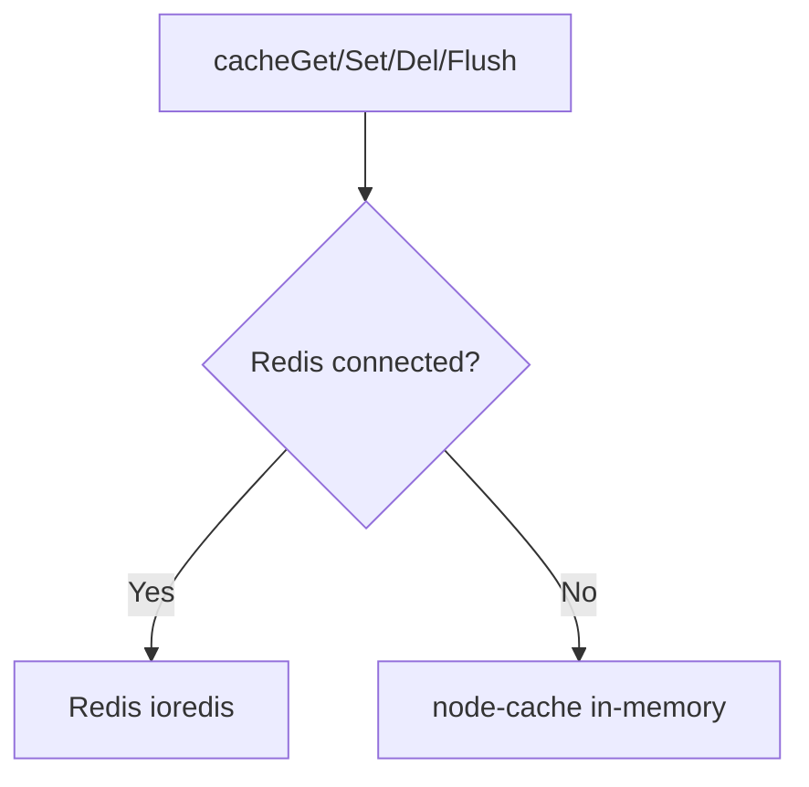
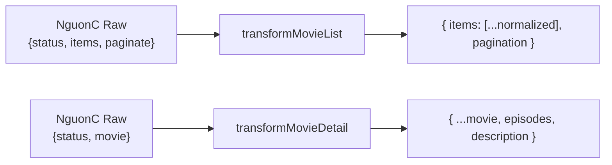

# Ngày 5 — Movie Proxy + Cache Backend · Giải Thích Code

> Giải thích theo **3 features**.

---

## Feature A: Cache Helper

### `utils/cache.js`

Wrapper thống nhất cho Redis + fallback node-cache:



| Function | Mô tả |
|:---|:---|
| `cacheGet(key)` | Lấy + JSON.parse. Trả `null` nếu miss |
| `cacheSet(key, data, ttl)` | JSON.stringify + SET EX. Default 300s |
| `cacheDel(key)` | Xóa 1 key |
| `cacheFlush(pattern)` | Xóa keys matching pattern (`movies:new:*`) |

**Tại sao cần wrapper**: Mọi service đều gọi `cacheGet/cacheSet` mà không cần biết đang dùng Redis hay memory cache. Tất cả operations đều **error-safe** (catch + log, không throw).

---

## Feature B: Data Transformer

### `services/nguoncTransformer.js`

Chuẩn hóa response thô từ NguonC → format frontend.

### Luồng Transform



### Mapping Fields

| NguonC Field | Normalized Field | Xử lý |
|:---|:---|:---|
| `name` | `title` | Trực tiếp |
| `original_name` | `originalTitle` | Trực tiếp |
| `poster_url` | `poster` | + CDN prefix |
| `thumb_url` | `thumb` | + CDN prefix |
| `category[]` | `genres[]` | Extract `.name` |
| `country[]` | `country[]` | Extract `.name` |
| `episode_total` | `totalEpisodes` | parseInt |
| `episode_current` | `currentEpisode` | Trực tiếp |
| `episodes[].server_data` | `episodes[].items` | Normalize slug, embed, m3u8 |

### Image CDN

```js
function normalizeImageUrl(url) {
  if (!url) return null;
  if (url.startsWith('http')) return url;
  return `https://phimimg.com/${url}`;
}
```

---

## Feature C: NguonC Service

### `services/nguoncService.js`

Kiến trúc **3 lớp bảo vệ**:


### 1. Cache-First Strategy

```js
async function cachedFetch(cacheKey, apiPath, ttl, transformer) {
  const cached = await cacheGet(cacheKey);  // Redis hoặc memory
  if (cached) return cached;                // HIT → return ngay

  const raw = await fetchFromNguonC(apiPath);  // MISS → gọi API
  const data = transformer(raw);               // Transform
  cacheSet(cacheKey, data, ttl);               // Save cache (fire-and-forget)
  return data;
}
```

### 2. Retry Strategy

| Lần | Delay | Tổng chờ |
|:---|:---|:---|
| Attempt 0 | 0ms | 0ms |
| Attempt 1 (retry 1) | 500ms | 500ms |
| Attempt 2 (retry 2) | 1000ms | 1500ms |
| → Fail | recordFailure() | throw 502 |

### 3. Circuit Breaker

```
State: CLOSED → [5 fails] → OPEN → [60s] → HALF-OPEN → [1 success] → CLOSED
                                              └→ [1 fail] → OPEN
```

| Config | Giá trị |
|:---|:---|
| Threshold | 5 lần fail liên tiếp |
| Reset time | 60 giây |
| Half-open | Cho 1 request thử |

### 7 Public Methods

| Method | NguonC Path | TTL |
|:---|:---|:---|
| `getNewMovies(page)` | `/films/phim-moi-cap-nhat?page=` | 5 min |
| `getMoviesByList(slug, page)` | `/films/danh-sach/{slug}?page=` | 15 min |
| `getMovieDetail(slug)` | `/film/{slug}` | 30 min |
| `getByGenre(slug, page)` | `/films/the-loai/{slug}?page=` | 15 min |
| `getByCountry(slug, page)` | `/films/quoc-gia/{slug}?page=` | 15 min |
| `getByYear(year, page)` | `/films/nam-phat-hanh/{year}?page=` | 15 min |
| `searchMovies(keyword, page)` | `/films/search?keyword=` | 3 min |

---

## Mối Liên Hệ Giữa 3 Feature


