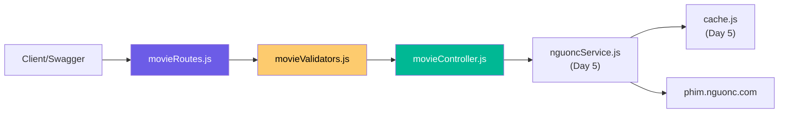
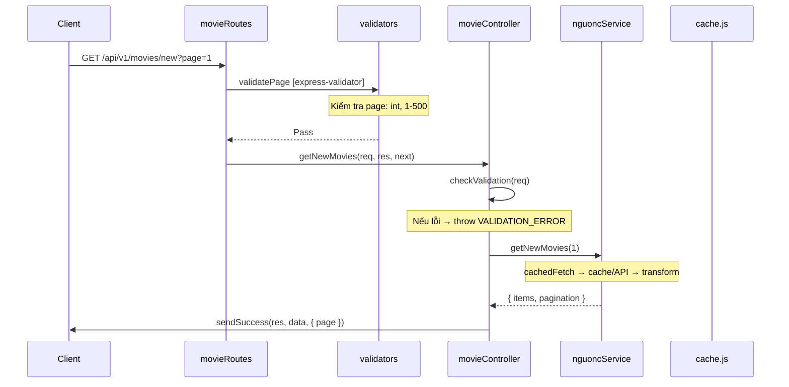
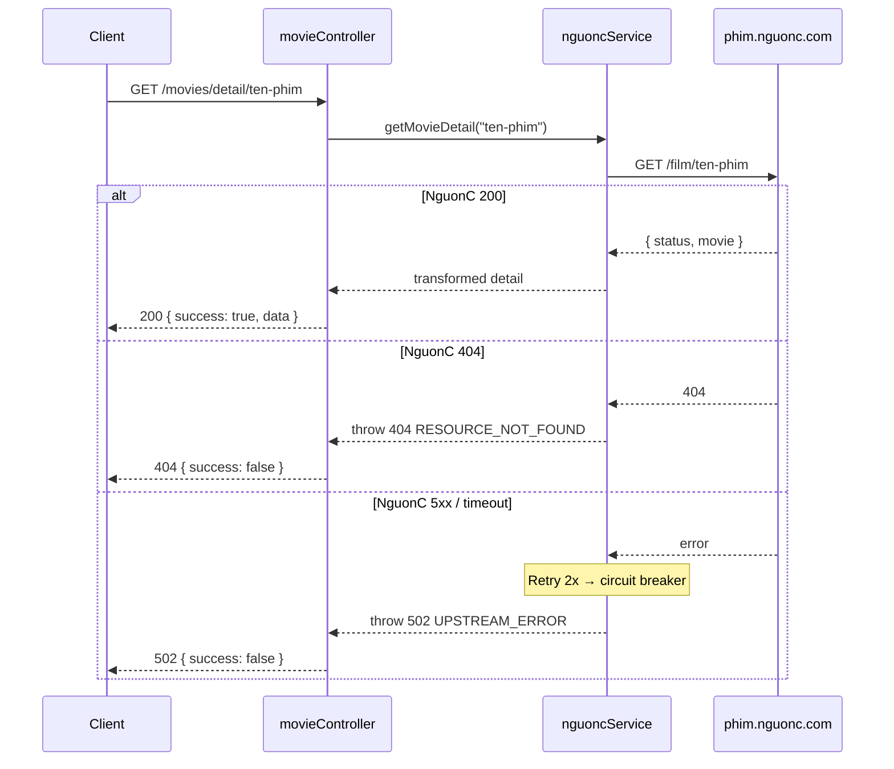

# Ngày 6 — Movie Routes Backend + Validators · Giải Thích Code

> Giải thích theo **1 feature**: Movie API layer (validators → controller → routes).

---

## Feature A: Movie API

### Kiến Trúc 3 Tier



---

### Luồng Request Chi Tiết





---

### File: `validators/movieValidators.js`

Express-validator rules, export dưới dạng middleware arrays:

| Validator | Áp dụng cho | Rule |
|:---|:---|:---|
| `validatePage` | `?page=` | Optional, int 1–500, toInt() |
| `validateSlug` | `:slug` | Required, regex `/^[a-z0-9-]+$/` |
| `validateYear` | `:year` | Int 1900 → currentYear+2, toInt() |
| `validateSearch` | `?keyword=` | Required, max 100 chars, escape() + validatePage |

---

### File: `controllers/movieController.js`

**Pattern**: `checkValidation(req)` → gọi service → `sendSuccess(res, data, meta)`

```js
// Mỗi method đều theo pattern:
async function getNewMovies(req, res, next) {
  try {
    checkValidation(req);               // 1. Validate
    const page = parseInt(req.query.page, 10) || 1;
    const data = await nguoncService.getNewMovies(page);  // 2. Business logic
    sendSuccess(res, data, { page });   // 3. Response
  } catch (error) {
    next(error);                        // 4. Error → errorHandler
  }
}
```

`checkValidation()` — kiểm tra express-validator results, nếu có lỗi → throw `AppError(400, VALIDATION_ERROR)`.

| Method | Params | Service Call |
|:---|:---|:---|
| `getNewMovies` | `?page` | `nguoncService.getNewMovies(page)` |
| `getMoviesByList` | `:slug, ?page` | `nguoncService.getMoviesByList(slug, page)` |
| `getMovieDetail` | `:slug` | `nguoncService.getMovieDetail(slug)` |
| `getByGenre` | `:slug, ?page` | `nguoncService.getByGenre(slug, page)` |
| `getByCountry` | `:slug, ?page` | `nguoncService.getByCountry(slug, page)` |
| `getByYear` | `:year, ?page` | `nguoncService.getByYear(year, page)` |
| `searchMovies` | `?keyword, ?page` | `nguoncService.searchMovies(keyword, page)` |

---

### File: `routes/v1/movieRoutes.js`

Mỗi route có 3 phần:
1. **Swagger JSDoc** (`@swagger`) — tự gen docs
2. **Validation middleware** — `[...validateSlug, ...validatePage]`
3. **Controller handler** — `movieController.getNewMovies`

```js
router.get('/new', validatePage, movieController.getNewMovies);
router.get('/list/:slug', [...validateSlug, ...validatePage], movieController.getMoviesByList);
router.get('/detail/:slug', validateSlug, movieController.getMovieDetail);
router.get('/genre/:slug', [...validateSlug, ...validatePage], movieController.getByGenre);
// ...
```

Tất cả **public** (không cần auth middleware).

---

### File: `routes/v1/index.js`

```diff
+ const movieRoutes = require('./movieRoutes');
+ router.use('/movies', movieRoutes);
```

Mount vào `/api/v1/movies/*`.

---

## Cải Tiến Error Handling (nguoncService.js)

Phân biệt **4xx** vs **5xx** từ NguonC:

| NguonC Status | Xử lý | Retry? | Circuit Breaker? |
|:---|:---|:---|:---|
| 200 | Transform → cache → return | — | Reset |
| 404 | throw `404 RESOURCE_NOT_FOUND` | ❌ | ❌ |
| 400 | throw `400 VALIDATION_ERROR` | ❌ | ❌ |
| 5xx | Retry 2x (exponential backoff) | ✅ | ✅ (sau 5 fails) |
| Timeout | Retry 2x | ✅ | ✅ |

**Tại sao**: Không nên retry/circuit-break cho lỗi client (404, 400) vì sẽ cho kết quả giống nhau.

---

## Tổng Quan Chuỗi Gọi

```
GET /api/v1/movies/detail/naruto
    │
    ├── movieRoutes.js        → route matching
    ├── validateSlug           → kiểm tra slug format
    ├── movieController        → checkValidation + gọi service
    ├── nguoncService          → cachedFetch
    │   ├── cache.js           → cacheGet("movies:detail:naruto")
    │   │   └── Redis HIT?    → return cached
    │   └── fetchFromNguonC    → GET phim.nguonc.com/api/film/naruto
    │       ├── 200            → transform → cacheSet → return
    │       ├── 404            → throw 404
    │       └── 5xx/timeout    → retry → circuit breaker → throw 502
    └── sendSuccess(res, data) → JSON response
```
