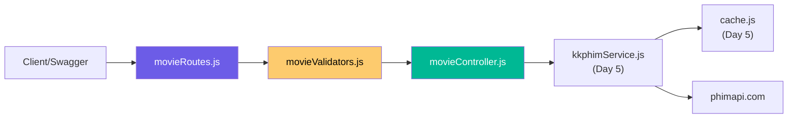
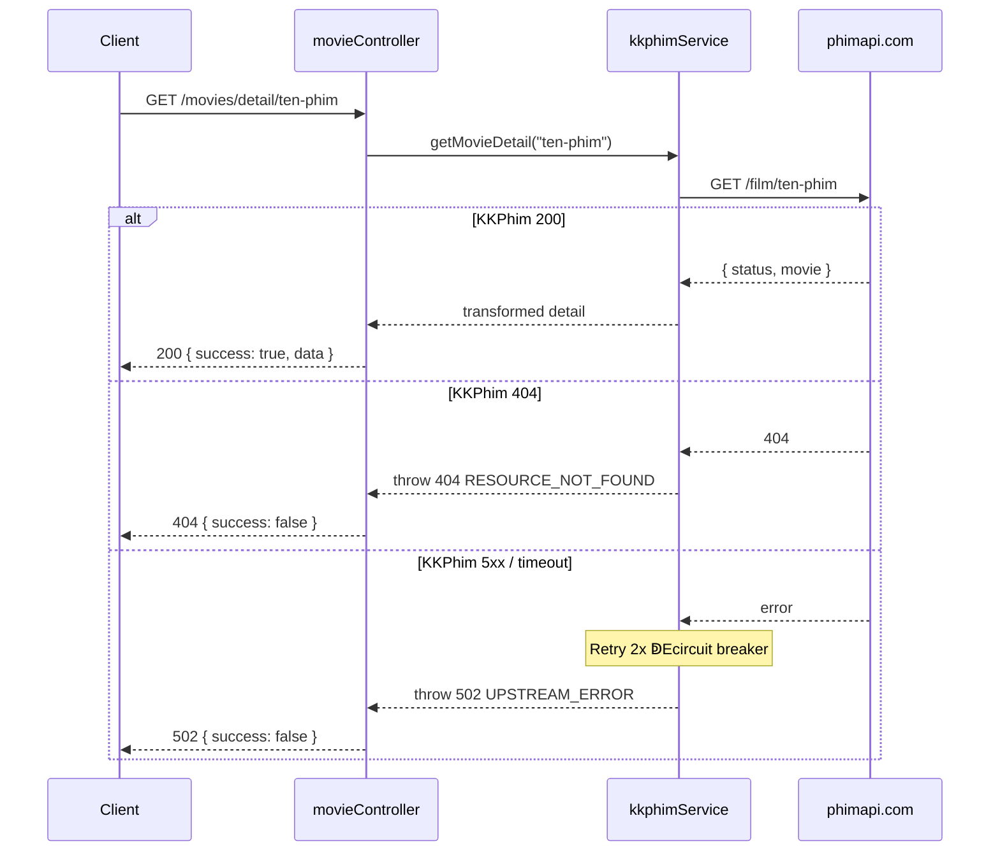

# Ngày 6  EMovie Routes Backend + Validators · Giải Thích Code

> Giải thích theo **1 feature**: Movie API layer (validators ↁEcontroller ↁEroutes).

---

## Feature A: Movie API

### Kiến Trúc 3 Tier



---

### Luồng Request Chi Tiết




---

### File: `validators/movieValidators.js`

Express-validator rules, export dưới dạng middleware arrays:

| Validator | Áp dụng cho | Rule |
|:---|:---|:---|
| `validatePage` | `?page=` | Optional, int 1 E00, toInt() |
| `validateSlug` | `:slug` | Required, regex `/^[a-z0-9-]+$/` |
| `validateYear` | `:year` | Int 1900 ↁEcurrentYear+2, toInt() |
| `validateSearch` | `?keyword=` | Required, max 100 chars, escape() + validatePage |

---

### File: `controllers/movieController.js`

**Pattern**: `checkValidation(req)` ↁEgọi service ↁE`sendSuccess(res, data, meta)`

```js
// Mỗi method đều theo pattern:
async function getNewMovies(req, res, next) {
  try {
    checkValidation(req);               // 1. Validate
    const page = parseInt(req.query.page, 10) || 1;
    const data = await kkphimService.getNewMovies(page);  // 2. Business logic
    sendSuccess(res, data, { page });   // 3. Response
  } catch (error) {
    next(error);                        // 4. Error ↁEerrorHandler
  }
}
```

`checkValidation()`  Ekiểm tra express-validator results, nếu có lỗi ↁEthrow `AppError(400, VALIDATION_ERROR)`.

| Method | Params | Service Call |
|:---|:---|:---|
| `getNewMovies` | `?page` | `kkphimService.getNewMovies(page)` |
| `getMoviesByList` | `:slug, ?page` | `kkphimService.getMoviesByList(slug, page)` |
| `getMovieDetail` | `:slug` | `kkphimService.getMovieDetail(slug)` |
| `getByGenre` | `:slug, ?page` | `kkphimService.getByGenre(slug, page)` |
| `getByCountry` | `:slug, ?page` | `kkphimService.getByCountry(slug, page)` |
| `getByYear` | `:year, ?page` | `kkphimService.getByYear(year, page)` |
| `searchMovies` | `?keyword, ?page` | `kkphimService.searchMovies(keyword, page)` |

---

### File: `routes/v1/movieRoutes.js`

Mỗi route có 3 phần:
1. **Swagger JSDoc** (`@swagger`)  Etự gen docs
2. **Validation middleware**  E`[...validateSlug, ...validatePage]`
3. **Controller handler**  E`movieController.getNewMovies`

```js
router.get('/new', validatePage, movieController.getNewMovies);
router.get('/list/:slug', [...validateSlug, ...validatePage], movieController.getMoviesByList);
router.get('/detail/:slug', validateSlug, movieController.getMovieDetail);
router.get('/genre/:slug', [...validateSlug, ...validatePage], movieController.getByGenre);
// ...
```

Tất cả **public** (không cần auth middleware).

---

### File: `routes/v1/index.js`

```diff
+ const movieRoutes = require('./movieRoutes');
+ router.use('/movies', movieRoutes);
```

Mount vào `/api/v1/movies/*`.

---

## Cải Tiến Error Handling (kkphimService.js)

Phân biệt **4xx** vs **5xx** từ KKPhim:

| KKPhim Status | Xử lý | Retry? | Circuit Breaker? |
|:---|:---|:---|:---|
| 200 | Transform ↁEcache ↁEreturn |  E| Reset |
| 404 | throw `404 RESOURCE_NOT_FOUND` | ❁E| ❁E|
| 400 | throw `400 VALIDATION_ERROR` | ❁E| ❁E|
| 5xx | Retry 2x (exponential backoff) | ✁E| ✁E(sau 5 fails) |
| Timeout | Retry 2x | ✁E| ✁E|

**Tại sao**: Không nên retry/circuit-break cho lỗi client (404, 400) vì sẽ cho kết quả giống nhau.

---

## Tổng Quan Chuỗi Gọi

```
GET /api/v1/movies/detail/naruto
    ━E    ├── movieRoutes.js        ↁEroute matching
    ├── validateSlug           ↁEkiểm tra slug format
    ├── movieController        ↁEcheckValidation + gọi service
    ├── kkphimService          ↁEcachedFetch
    ━E  ├── cache.js           ↁEcacheGet("movies:detail:naruto")
    ━E  ━E  └── Redis HIT?    ↁEreturn cached
    ━E  └── fetchFromKKPhim    ↁEGET phimapi.com/film/naruto
    ━E      ├── 200            ↁEtransform ↁEcacheSet ↁEreturn
    ━E      ├── 404            ↁEthrow 404
    ━E      └── 5xx/timeout    ↁEretry ↁEcircuit breaker ↁEthrow 502
    └── sendSuccess(res, data) ↁEJSON response
```
