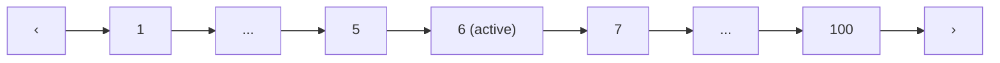
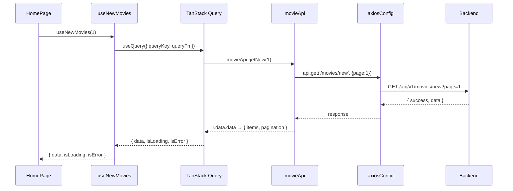

# Ngày 7 — Trang Chủ & Movie Components · Giải Thích Code

> Chia **4 features**: UI Components, Movie Components, Movie Hooks, Trang Chủ.

---

## Feature A: UI Components

### `Skeleton.jsx` — Loading placeholder

Dùng CSS class `.skeleton` (đã có từ `index.css`). 2 variants:
- `<Skeleton width height />` — thanh placeholder tùy chỉnh
- `<SkeletonCard />` — placeholder cho MovieCard (poster 2:3 + 2 dòng text)

### `Pagination.jsx` — Phân trang



Logic: hiển thị trang 1, ..., current ± 2, ..., last. Truyền `onPageChange(pageNum)`.

### `SearchBar.jsx` — Ô tìm kiếm

Form submit → `navigate('/tim-kiem?keyword=...')`. Max 100 ký tự.

---

## Feature B: Movie Components

### `MovieCard.jsx` — Card hiển thị 1 phim

```
┌─────────────────┐
│  [HD] [Vietsub]  │ ← badges
│                  │
│   poster image   │ ← aspect-ratio 2:3
│                  │
│  ▶ (hover)       │ ← play overlay
│                  │
│  [Tập 12]        │ ← episode tag
├──────────────────┤
│ Title            │
│ 2025 · Hành Động │ ← meta
└──────────────────┘
```

**Hover effects**: poster zoom 1.08x, play button appear, card lift -4px + accent border + glow shadow.

### `MovieGrid.jsx` — Grid responsive

| Screen | Columns |
|:---|:---|
| > 1280px | 5 cols |
| > 1024px | 4 cols |
| > 768px | 3 cols |
| ≤ 768px | 2 cols |

Prop `loading=true` → render `SkeletonCard` × (columns × 2).

### `MovieCarousel.jsx` — Horizontal scroll slider

```
[‹]  ┌─────┐ ┌─────┐ ┌─────┐ ┌─────┐ ┌─────┐  [›]
     │card │ │card │ │card │ │card │ │card │
     └─────┘ └─────┘ └─────┘ └─────┘ └─────┘
     ←── scroll-snap-type: x mandatory ──→
```

CSS scroll-snap, navigation arrows scroll 70% container width. Title có accent bar bên trái.

### `ErrorFallback.jsx` — Error + nút Thử lại

Hiển thị ⚠️ + message + button "Thử lại" (`onRetry` callback).

---

## Feature C: Movie Hooks (`useMovies.js`)

TanStack Query wrappers — mỗi hook tương ứng 1 API endpoint:

| Hook | API Endpoint | staleTime |
|:---|:---|:---|
| `useNewMovies(page)` | `/movies/new` | 5 min |
| `useMoviesByList(slug, page)` | `/movies/list/{slug}` | 15 min |
| `useMovieDetail(slug)` | `/movies/detail/{slug}` | 30 min |
| `useMoviesByGenre(slug, page)` | `/movies/genre/{slug}` | 15 min |
| `useMoviesByCountry(slug, page)` | `/movies/country/{slug}` | 15 min |
| `useSearchMovies(keyword, page)` | `/movies/search` | 3 min |

Tất cả dùng `placeholderData: (prev) => prev` để giữ data cũ khi chuyển trang → không flicker.

### Luồng Data



---

## Feature D: Trang Chủ (`Home.jsx`)

### Layout

```
┌──────────── Header ────────────┐
│                                │
│   🎬 Chào mừng Anime3D-Chill  │ ← hero section
│                                │
│ 🔥 Phim Mới Cập Nhật          │ ← MovieCarousel
│ [card] [card] [card] [card]... │
│                                │
│ 📺 Phim Bộ                    │ ← MovieCarousel
│ [card] [card] [card] [card]... │
│                                │
│ 🎬 Phim Lẻ                    │ ← MovieCarousel
│ [card] [card] [card] [card]... │
│                                │
│ 🎨 Hoạt Hình                  │ ← MovieGrid (5 cols)
│ [card] [card] [card] [card]... │
│                                │
│──────────── Footer ────────────│
```

4 hooks chạy **song song** (TanStack Query tự quản lý). Mỗi section:
- `isLoading` → skeleton cards
- `isError` → ErrorFallback + "Thử lại"
- Success → MovieCarousel/MovieGrid với data

---

## Fix: Vite Proxy cho Docker

```diff
server: {
+  host: true,                              // bind 0.0.0.0
   proxy: {
     '/api': {
-      target: 'http://localhost:5000',       // sai trong Docker
+      target: 'http://anime3d-server:5000', // đúng: container name
     },
   },
}
```

**Tại sao**: Trong Docker, mỗi service chạy trong container riêng. `localhost` trong container client trỏ về chính nó, không phải server container. Cần dùng tên service Docker (`anime3d-server`).
