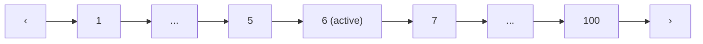
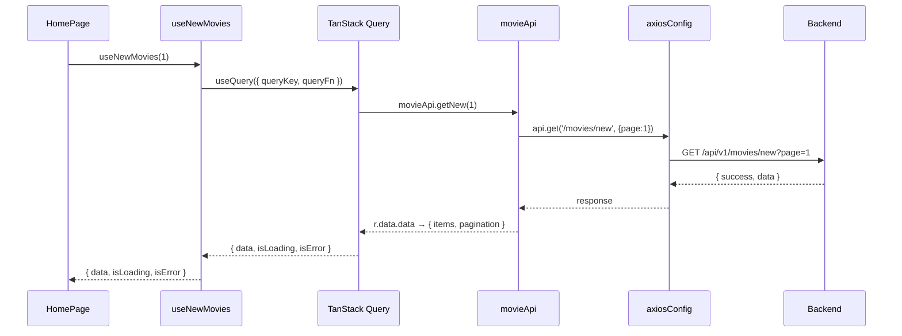
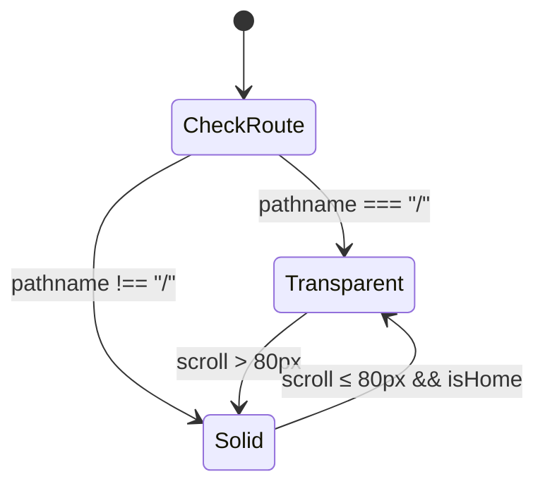

# Ngày 7 — Trang Chủ & Movie Components · Giải Thích Code

> Chia **6 features**: UI Components, Movie Components, Movie Hooks, Hero Banner, Genre Cards, Trang Chủ.

---

## Feature A: UI Components

### `Skeleton.jsx` — Loading placeholder

Dùng CSS class `.skeleton` (đã có từ `index.css`). 2 variants:
- `<Skeleton width height />` — thanh placeholder tùy chỉnh
- `<SkeletonCard />` — placeholder cho MovieCard (poster 2:3 + 2 dòng text)

### `Pagination.jsx` — Phân trang



Logic: hiển thị trang 1, ..., current ± 2, ..., last. Truyền `onPageChange(pageNum)`.

### `SearchBar.jsx` — Ô tìm kiếm

Form submit → `navigate('/tim-kiem?keyword=...')`. Max 100 ký tự.

---

## Feature B: Movie Components

### `MovieCard.jsx` — Card hiển thị 1 phim

```
┌─────────────────┐
│  [HD] [Vietsub]  │ ← badges
│                  │
│   poster image   │ ← aspect-ratio 2:3
│                  │
│  ▶ (hover)       │ ← play overlay
│                  │
│  [Tập 12]        │ ← episode tag
├──────────────────┤
│ Title            │ ← min-height 2 dòng (fix lệch card)
│ 2025 · Hành Động │ ← meta
└──────────────────┘
```

**Hover effects**: poster zoom 1.08x, play button appear, card lift -4px + accent border + glow shadow.

**Fix ảnh CDN**: Thêm `referrerPolicy="no-referrer"` vào `` để bypass hotlink protection từ `phim.nguonc.com`.

**Fix chiều cao card**: Title dùng `min-height: 2.6em` để luôn giữ chỗ cho 2 dòng — tất cả card cùng chiều cao dù title dài ngắn khác nhau.

### `MovieGrid.jsx` — Grid responsive

| Screen | Columns |
|:---|:---|
| > 1280px | 5 cols |
| > 1024px | 4 cols |
| > 768px | 3 cols |
| ≤ 768px | 2 cols |

Prop `loading=true` → render `SkeletonCard` × (columns × 2).

### `MovieCarousel.jsx` — Horizontal scroll slider

```
 🔥 Phim Mới Cập Nhật  Xem toàn bộ >           [‹] [›]
┌─────┐ ┌─────┐ ┌─────┐ ┌─────┐ ┌─────┐
│card │ │card │ │card │ │card │ │card │
└─────┘ └─────┘ └─────┘ └─────┘ └─────┘
←── scroll-snap-type: x mandatory ──→
```

CSS scroll-snap, navigation arrows scroll 70% container width.

**Props**:

| Prop | Type | Mô tả |
|:---|:---|:---|
| `title` | string | Tiêu đề section |
| `icon` | string | Emoji icon trước title (🔥, 📺, 🎬, 🎨, 💥) |
| `movies` | array | Mảng movie objects |
| `loading` | bool | Hiển thị skeleton khi loading |
| `viewAllLink` | string | URL cho link "Xem toàn bộ >" bên cạnh title |

### `ErrorFallback.jsx` — Error + nút Thử lại

Hiển thị ⚠️ + message + button "Thử lại" (`onRetry` callback).

---

## Feature C: Movie Hooks (`useMovies.js`)

TanStack Query wrappers — mỗi hook tương ứng 1 API endpoint:

| Hook | API Endpoint | staleTime |
|:---|:---|:---|
| `useNewMovies(page)` | `/movies/new` | 5 min |
| `useMoviesByList(slug, page)` | `/movies/list/{slug}` | 15 min |
| `useMovieDetail(slug)` | `/movies/detail/{slug}` | 30 min |
| `useMoviesByGenre(slug, page)` | `/movies/genre/{slug}` | 15 min |
| `useMoviesByCountry(slug, page)` | `/movies/country/{slug}` | 15 min |
| `useSearchMovies(keyword, page)` | `/movies/search` | 3 min |

Tất cả dùng `placeholderData: (prev) => prev` để giữ data cũ khi chuyển trang → không flicker.

### Luồng Data



---

## Feature D: Hero Banner (`HeroBanner.jsx`)

Full-screen hero carousel, tham khảo rophim.best/phimmoi/.

### Layout

```
┌──────────────────────────────────────────────────────┐
│  [Header transparent overlay]                        │
│                                                      │
│                                                      │
│  ┌── poster image (background, full-bleed) ────────┐ │
│  │                                                  │ │
│  │  ┌─ gradient overlay ─────────────────────────┐  │ │
│  │  │                                            │  │ │
│  │  │  Title phim                                │  │ │
│  │  │  Origin Name (accent color)                │  │ │
│  │  │  [2025] [HD] [Vietsub] [Tập 12]  ← badges │  │ │
│  │  │  Hành Động · Kinh Dị  ← genre links       │  │ │
│  │  │  Mô tả ngắn (3 dòng max)...               │  │ │
│  │  │                                            │  │ │
│  │  │  [▶ Xem Phim]  [ℹ]   ← action buttons     │  │ │
│  │  └────────────────────────────────────────────┘  │ │
│  │                          [thumb][thumb][thumb]... │ │
│  └──────────────────────────────────────────────────┘ │
│  ████████████████░░░░░░░░░░░░░  ← progress bar       │
└──────────────────────────────────────────────────────┘
```

### Tính năng

| Tính năng | Chi tiết |
|:---|:---|
| Auto-rotate | Chuyển slide mỗi 6s, reset khi click |
| Thumbnail nav | 8 thumbnails góc dưới phải, click chuyển slide |
| Progress bar | Thanh gradient accent ở bottom, animate 0→100% |
| Gradient overlay | 2 lớp: left-to-right (text readable) + bottom-to-top (fade vào page) |
| Skeleton loading | Khi `loading=true` → hiển thị skeleton placeholders |
| Responsive | 80vh → 70vh (1024px) → 60vh (768px) → 55vh (480px) |
| Image fix | `referrerPolicy="no-referrer"` bypass CDN hotlink |

### Props

```jsx
<HeroBanner
  movies={newMovies.data?.items || []}  // lấy 8 phim đầu tiên
  loading={newMovies.isLoading}
/>
```

---

## Feature E: Genre Cards (`GenreCards.jsx`)

Section "Bạn đang quan tâm gì?" — horizontal scroll thể loại.

### Layout

```
Bạn đang quan tâm gì?
┌──────────┐ ┌──────────┐ ┌──────────┐ ┌──────────┐ ┌──────────┐ ┌──────────┐
│ Hành Động│ │ Kinh Dị  │ │ Tình Cảm │ │ Hoạt Hình│ │ Viễn Tưởng│ │+15 chủ đề│
│Xem chủ đề>│Xem chủ đề>│Xem chủ đề>│Xem chủ đề>│Xem chủ đề>│          │
└──────────┘ └──────────┘ └──────────┘ └──────────┘ └──────────┘ └──────────┘
   green        pink        blue       purple      orange      glass
```

- 5 thể loại hardcode + 1 card "+N chủ đề" link đến `/the-loai`
- Mỗi card có gradient background khác nhau (CSS `nth-child`)
- Click → navigate `/the-loai/:slug`

---

## Feature F: Trang Chủ (`Home.jsx`)

### Layout (updated)

```
┌───────── Header (transparent) ─────────┐
│                                        │
│  ┌──── HeroBanner ─────────────────┐   │
│  │  poster bg + title + Xem Phim   │   │
│  │  thumbnails    progress bar     │   │
│  └─────────────────────────────────┘   │
│                                        │
│  Bạn đang quan tâm gì?                │ ← GenreCards
│  [Hành Động] [Kinh Dị] [Tình Cảm]...  │
│                                        │
│  🔥 Phim Mới Cập Nhật  Xem toàn bộ >  │ ← MovieCarousel
│  [card] [card] [card] [card] [card]    │
│                                        │
│  📺 Phim Bộ          Xem toàn bộ >     │ ← MovieCarousel
│  [card] [card] [card] [card] [card]    │
│                                        │
│  🎬 Phim Lẻ          Xem toàn bộ >     │ ← MovieCarousel
│  [card] [card] [card] [card] [card]    │
│                                        │
│  🎨 Hoạt Hình        Xem toàn bộ >     │ ← MovieCarousel
│  [card] [card] [card] [card] [card]    │
│                                        │
│  💥 Hành Động        Xem toàn bộ >     │ ← MovieCarousel
│  [card] [card] [card] [card] [card]    │
│                                        │
│──────────── Footer ────────────────────│
```

5 hooks chạy **song song** (TanStack Query tự quản lý):

| Hook | Section | viewAllLink |
|:---|:---|:---|
| `useNewMovies(1)` | HeroBanner + Phim Mới | `/phim-moi` |
| `useMoviesByList('phim-bo', 1)` | Phim Bộ | `/danh-sach/phim-bo` |
| `useMoviesByList('phim-le', 1)` | Phim Lẻ | `/danh-sach/phim-le` |
| `useMoviesByList('hoat-hinh', 1)` | Hoạt Hình | `/danh-sach/hoat-hinh` |
| `useMoviesByGenre('hanh-dong', 1)` | Hành Động | `/the-loai/hanh-dong` |

Mỗi section:
- `isLoading` → skeleton cards
- `isError` → ErrorFallback + "Thử lại"
- Success → MovieCarousel với data

---

## Feature G: Header Transparent Mode

### Cơ chế



- `useLocation()` detect homepage → set transparent
- `useEffect` + scroll listener → chuyển `header--solid` khi scroll > 80px
- Non-homepage → luôn `header--solid`

### CSS Classes

| Class | Background | Backdrop |
|:---|:---|:---|
| `.header--transparent` | `transparent` | none |
| `.header--solid` | `rgba(10,10,15, 0.85)` | `blur(12px)` |

Nav links, search input cũng thay đổi opacity/background theo state.

---

## Fix: Ảnh CDN Hotlink Protection

**Vấn đề**: Ảnh poster từ `phim.nguonc.com` bị chặn khi embed trong site (referrer header = `localhost:3000` → server từ chối).

**Giải pháp**: Thêm `referrerPolicy="no-referrer"` vào tất cả ``:

```diff
   { e.target.src = '/placeholder-poster.svg'; }}
  />
```

Áp dụng cho: `MovieCard.jsx`, `HeroBanner.jsx` (background + thumbnails).

---

## Fix: Vite Proxy cho Docker

```diff
server: {
+  host: true,                              // bind 0.0.0.0
   proxy: {
     '/api': {
-      target: 'http://localhost:5000',       // sai trong Docker
+      target: 'http://anime3d-server:5000', // đúng: container name
     },
   },
}
```

**Tại sao**: Trong Docker, mỗi service chạy trong container riêng. `localhost` trong container client trỏ về chính nó, không phải server container. Cần dùng tên service Docker (`anime3d-server`).

---

## File Map

```
client/src/
├── components/
│   ├── home/
│   │   ├── HeroBanner.jsx    ← [NEW] Hero carousel
│   │   ├── HeroBanner.css    ← [NEW]
│   │   ├── GenreCards.jsx    ← [NEW] Genre category cards
│   │   └── GenreCards.css    ← [NEW]
│   ├── movie/
│   │   ├── MovieCard.jsx     ← [MODIFIED] + referrerPolicy, min-height fix
│   │   ├── MovieCard.css     ← [MODIFIED] + min-height 2.6em title
│   │   ├── MovieCarousel.jsx ← [MODIFIED] + viewAllLink, icon props
│   │   ├── MovieCarousel.css ← [MODIFIED] + title-group layout
│   │   ├── MovieGrid.jsx
│   │   └── MovieGrid.css
│   ├── layout/
│   │   ├── Header.jsx        ← [MODIFIED] + transparent mode
│   │   ├── Header.css        ← [MODIFIED] + solid/transparent states
│   │   ├── Footer.jsx
│   │   └── AppLayout.jsx
│   ├── ui/
│   │   ├── Skeleton.jsx
│   │   ├── Pagination.jsx
│   │   └── SearchBar.jsx
│   └── common/
│       └── ErrorFallback.jsx
├── pages/
│   ├── Home.jsx              ← [MODIFIED] + HeroBanner, GenreCards, 5 sections
│   └── Home.css              ← [MODIFIED] simplified
├── hooks/
│   └── useMovies.js
└── api/
    └── movieApi.js
```
