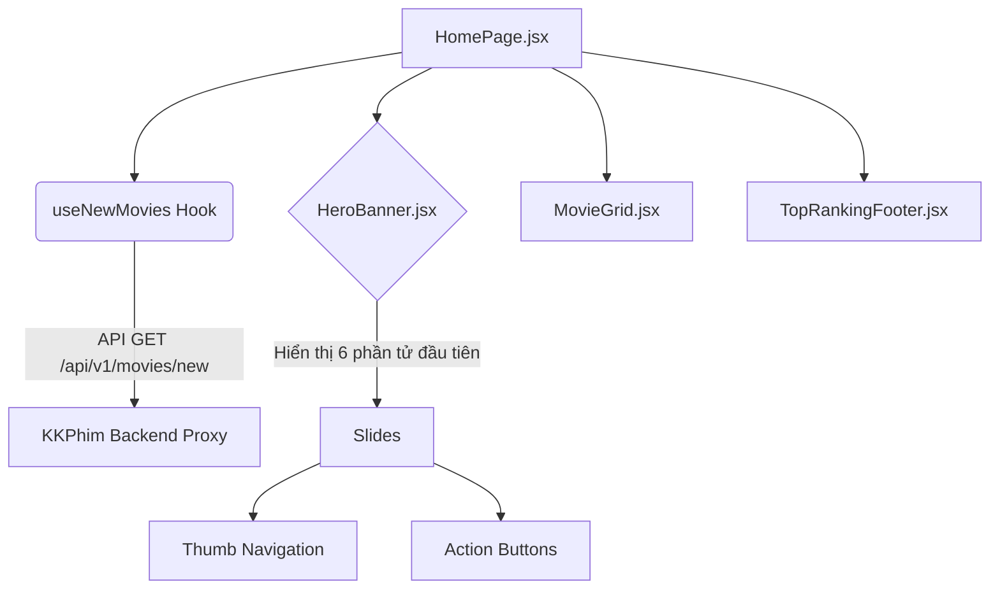

# Giải thích Code Ngày 08: Banner CSS Cao Cấp

## Kiến trúc Frontend

Sơ đồ liên kết Component Banner trên trang chủ:



## Giải Thích Từng Chức Năng Chính

### 1. File `HeroBanner.jsx`

Code xử lý logic quay vòng slide và lấy data:

- Sử dụng `useEffect` tạo khoảng `interval` (`5000ms`), mỗi 5000ms gọi lệnh chuyển index tiếp theo.
- Lấy `progress` thanh cuộn bằng `requestAnimationFrame` nhích dần theo % để fill đầy thanh indicator bên dưới.
- **Xử Lý Background**:
  ```javascript
  const bgImage = movie.thumb || movie.poster || '';
  ```
  _Tại sao đổi `thumb` thành ưu tiên số 1?_ API KKPhim trả về cả ảnh dọc (poster) và ngang (thumb). Do Banner kích cỡ rất dài (1920x800), nếu dùng `poster` thì trình duyệt sẽ phóng to gấp 4 lần để lấp khe ảnh làm chất lượng ảnh pixelated (vỡ hạt).

- **Fallback Context**: Khi list phim mới lấy ra từ API chưa có metadata `content`, cơ chế fallback content sẽ tự động tạo dòng mô tả mượt lấy `title` thế vào: _"Trải nghiệm phim {title}... chất lượng v.v"_.

### 2. File `HeroBanner.css` (Glassmorphism & Overlay)

- **Backdrop Gradient**: Để tạo độ điện ảnh cho banner, overlay làm mờ bên dưới góc trái được trộn giữa 2 dải gradient:
  ```css
  background:
    linear-gradient(90deg, rgba(0,0,0,0.88), rgba(0,0,0,0.5), transparent 100%),
    linear-gradient(to top, rgba(0,0,0,0.9), transparent 55%);
  ```
  Điều này giúp nổi rõ Header Text trong khi phía mạn phải hắt sáng của Background phim vẫn tỏ rõ mượt mà.

- **Nút "Lưu lại" (Backdrop Blur)**: Dùng `backdrop-filter: blur(12px)` + nền trắng độ mờ 10% (0.1) tạo hiệu ứng trong veo (Glassmorphism).

- **Navigation (Thumbs - Bảng điều khiển ảnh thu nhỏ)**: Tốc độ hiệu ứng scale được dùng cubic-bezier giúp hiệu ứng nổi trượt cực kỳ nịnh mắt. Chỉ thị ảnh (phần highlight vàng) sẽ scale 1.1 khi bật class `active`.

## Quyết Định Thiết Kế (Tại sao không dùng 3D WebGL / Three.js?)

- Ban đầu dự án hướng tới tích hợp banner 3D Three.js. 
- Tuy nhiên kiểm tra UX thực tế, WebGL làm nặng thời gian render đầu vào và khó đồng bộ với API Data của phim lấy tức thì. 
- Giao diện CSS hiện tại dùng Transition + Position + Animation Cubic-Bezier đã đem lại chuẩn điện ảnh (cinematic UI) mà lại rất mượt ở mức 60fps trên moị thiết thiết bị (Kể cả máy yếu). Nên Team chuyển phương án thiết kế P0 này sang High-Fidelity CSS.
