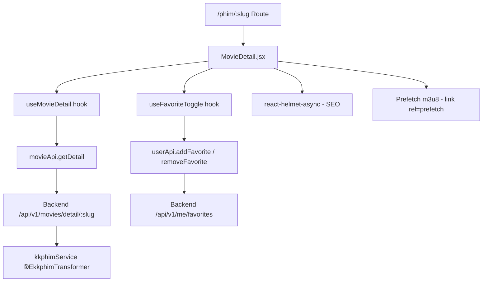

# Day 09  ETrang Chi Tiết Phim · Giải Thích Code

## Kiến Trúc Tổng Quan



## Giải Thích Từng File

### `client/src/pages/MovieDetail.jsx`

**Mục đích:** Trang chi tiết phim đầy đủ.

**Logic chính:**
1. Lấy `slug` từ URL params ↁEgọi `useMovieDetail(slug)` (TanStack Query)
2. Hiển thềEskeleton loading khi đang fetch
3. Hiển thềEerror fallback nếu API lỗi (nút Thử lại + VềEtrang chủ)
4. Render thành công ↁEHero section + Body section

**Các component con (inline):**
- `MovieDetailSkeleton`  Eloading skeleton
- `MovieDetailError`  Eerror fallback với retry

**State management:**
| State | Mục đích |
|:------|:---------|
| `selectedServer` | Index server đang chọn (mặc định 0) |
| `viewMode` | 'grid' hoặc 'list' cho danh sách tập |
| `descExpanded` | Toggle mô tả mềErộng/thu gọn |
| `selectedEp` | Slug tập đang chọn (highlight) |

**SEO:** Sử dụng `react-helmet-async` đềEset dynamic `<title>`, `<meta description>`, OG tags, canonical URL.

**Prefetch m3u8:** Khi data load, tự động tạo `<link rel="prefetch">` cho URL m3u8 tập 1 ↁEgiảm latency khi user bấm Xem Phim.

---

### `client/src/pages/MovieDetail.css`

**Mục đích:** Styling premium cho trang chi tiết.

**Kỹ thuật đáng chú ý:**
- **Hero backdrop**: Ảnh background `blur(6px) + brightness(0.35) + saturate(1.3)`, gradient overlay từ transparent ↁEsolid background
- **Title gradient**: `linear-gradient(135deg, #fff 0%, #c8c8e0 100%)` với `-webkit-background-clip: text`
- **Episode grid**: `grid-template-columns: repeat(auto-fill, minmax(56px, 1fr))`  Etự responsive theo chiều rộng
- **Scrollable episodes**: `max-height: 480px + overflow-y: auto`  Ekhông bềEtràn khi có nhiều tập
- **Responsive breakpoints**: 1024px (body single column), 768px (hero stack), 480px (buttons full width)

---

### `client/src/hooks/useMovies.js` (thêm mới)

**Thêm hook:** `useFavoriteToggle(movie)`

**Logic:**
1. Kiểm tra `isAuthenticated` từ `authStore`
2. Dùng `useMutation` (TanStack Query) cho cả add và remove
3. **Optimistic UI**: Toggle state local trước khi API respond
4. **Error handling**: 409 Conflict = đã favorite ↁEset state = true
5. Toast notifications cho success/error

---

## Quyết Định Thiết Kế

| Quyết định | Lý do |
|:-----------|:------|
| Inline description HTML (dangerouslySetInnerHTML) | KKPhim API trả vềEHTML formatted, cần hiển thềEđúng format |
| `stripHtml()` cho SEO meta | Meta description cần plain text, không HTML tags |
| Prefetch bằng `<link>` thay vì fetch() | Browser native prefetch, không block rendering, tự quản lý cache |
| Optimistic UI cho favorite | UX tốt hơn  Ekhông cần chềEAPI respond mới thay đổi UI |
| Grid/List toggle | Phim lẻ (1 tập) dùng grid, phim bềE(nhiều tập) dùng list dềEđọc hơn |
| Server selector dạng `<select>` | Đơn giản, không chiếm nhiều space, tương thích mobile |

## Mối Liên HềE
```
MovieDetail.jsx
├── useMovieDetail (hooks/useMovies.js) ↁEmovieApi.getDetail
├── useFavoriteToggle (hooks/useMovies.js) ↁEuserApi
├── authStore (store/authStore.js) ↁEcheck isAuthenticated
├── MovieDetail.css ↁEdesign system tokens (index.css)
└── react-helmet-async ↁESEO
```

**Phụ thuộc vào:**
- Day 5-6: Backend movie API (proxy + cache + transformer)
- Day 4: Frontend foundation (api layer, auth store, routing)

**Được sử dụng bởi:**
- Day 10-11: Player page sẽ navigate từ episode click
- Day 13: Favorite API (POST/DELETE)

## Lưu ÁEQuan Trọng

1. **`dangerouslySetInnerHTML`**: Dữ liệu từ KKPhim API  Eđã được server sanitize qua transformer. Nếu cần thêm bảo mật, add `DOMPurify` ềEclient.
2. **Episode navigate**: Hiện navigate đến `/phim/:slug/xem?tap=...` nhưng route chưa tồn tại (sẽ build ềEDay 10-11). User sẽ thấy 404 cho đến khi Player page được build.
3. **Favorite API**: Backend routes cho `/me/favorites` chưa đầy đủ (sẽ build ềEDay 13). Nút Yêu thích hiện sẽ báo lỗi nếu bấm khi đã login.
4. **Image `referrerPolicy="no-referrer"`**: Bắt buộc vì phimimg.com chặn hotlink nếu có referrer.
