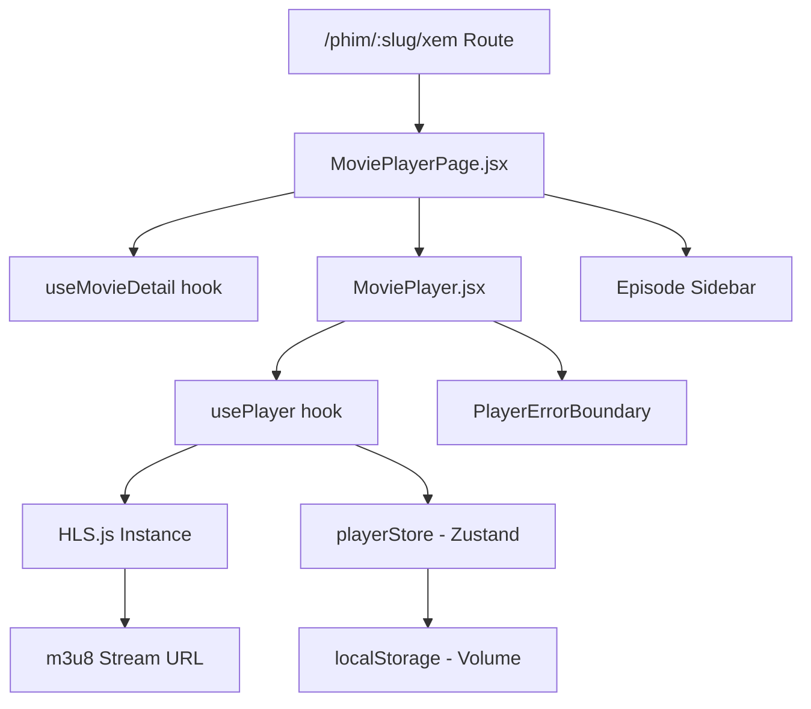

# Day 10–11 — Video Player (HLS.js) · Giải Thích Code

## Kiến Trúc Tổng Quan



## Giải Thích Từng File

### `hooks/usePlayer.js`

**Mục đích:** Core hook quản lý HLS.js lifecycle, video events, keyboard shortcuts.

**Logic chính:**
1. **HLS.js init**: Tạo instance khi `m3u8Url` thay đổi. Cleanup instance cũ.
2. **Safari fallback**: Kiểm tra `canPlayType('application/vnd.apple.mpegurl')` — dùng native HLS nếu có.
3. **Error recovery**: Network error → `startLoad()`, Media error → `recoverMediaError()`, Fatal → set error state.
4. **Video events**: play, pause, waiting, canplay, timeupdate, ended, error → sync với `playerStore`.
5. **80% trigger**: Khi `currentTime / duration >= 0.8` → gọi `onProgress80` callback (prefetch tập kế).
6. **Keyboard shortcuts**: Space/K (play), ←→ (seek ±10s), ↑↓ (volume ±5%), M (mute).

**HLS.js config:**
| Option | Giá trị | Lý do |
|:-------|:--------|:------|
| `maxBufferLength` | 30s | Đủ buffer mượt |
| `maxMaxBufferLength` | 60s | Giới hạn memory |
| `startLevel` | -1 | Auto quality selection |
| `enableWorker` | true | Offload parsing |

---

### `components/movie/MoviePlayer.jsx`

**Mục đích:** Video player UI với custom controls.

**Logic chính:**
1. **Auto-hide controls**: Hiện khi hover/move, ẩn sau 3s idle khi đang play.
2. **Progress bar click**: Tính phần trăm click position → seek đến timestamp.
3. **Volume group**: Icon + slider expand on hover.
4. **Buffered indicator**: Hiển thị phần đã buffer trên progress bar.
5. **Center play button**: Hiện khi paused + ready + no error.
6. **Error overlay**: Hiện khi có error — nút Thử lại + Đổi server.
7. **Fullscreen listener**: Lắng nghe `fullscreenchange` để sync state.

**ARIA labels:** Tất cả controls có `aria-label` cho accessibility.

---

### `components/movie/PlayerErrorBoundary.jsx`

**Mục đích:** Error boundary riêng cho player. Nếu player crash, chỉ hiện fallback UI trong player area, không crash toàn bộ app.

**Khác biệt vs ErrorBoundary chung:** Reset không reload trang, chỉ reset player component.

---

### `pages/MoviePlayerPage.jsx`

**Mục đích:** Page wrapper cho video player.

**Logic chính:**
1. **URL params**: `tap` (episode slug) + `sv` (server index) → `useSearchParams`.
2. **Episode navigation**: Click tập → update URL params → player auto-reload m3u8.
3. **Auto next**: Khi video ended → navigate đến tập kế tiếp.
4. **Server switch**: Cycle qua các server có sẵn.
5. **Prefetch**: Khi đạt 80% → tạo `<link rel="prefetch">` cho m3u8 tập kế.
6. **Cleanup**: Unmount → `resetPlayer()` xóa state.

**State management:**
| State | Nguồn | Mục đích |
|:------|:------|:---------|
| `movie` | TanStack Query | Data phim chi tiết |
| `selectedServer` | local state | Server đang chọn |
| `searchParams` | URL | Episode + server params |
| Player state | Zustand store | volume, playing, time, theater |

---

### `components/movie/MoviePlayer.css`

**Kỹ thuật CSS đáng chú ý:**
- **Controls gradient**: `linear-gradient(180deg, transparent 0%, transparent 50%, rgba(0,0,0,0.85) 100%)` — gradient chỉ ở nửa dưới
- **Progress thumb**: Chỉ hiện on hover (opacity transition)
- **Volume slider**: Width 0 → 80px on hover (width transition)
- **Theater mode**: `height: 80vh`, `border-radius: 0`
- **Buffering spinner**: Centered absolute + z-index 3

---

## Quyết Định Thiết Kế

| Quyết định | Lý do |
|:-----------|:------|
| HLS.js thay vì Video.js | Nhẹ hơn (~60KB vs ~300KB), chỉ cần HLS |
| Custom controls thay vì native | Consistent look trên mọi browser |
| URL search params cho episode | Shareable URL, back/forward hoạt động |
| Zustand thay vì local state | Volume persistence, theater mode có thể dùng ở format |
| Prefetch bằng `<link>` | Native browser prefetch, không block |
| 80% threshold cho preload | Đủ sớm để buffer tập kế, không quá sớm |

## Mối Liên Hệ

```
MoviePlayerPage.jsx
├── useMovieDetail (hooks/useMovies.js) → data phim + episodes
├── MoviePlayer.jsx
│   ├── usePlayer (hooks/usePlayer.js)
│   │   ├── HLS.js → phát m3u8
│   │   └── playerStore → state management
│   └── PlayerErrorBoundary
├── MoviePlayer.css → styling
└── react-helmet-async → SEO
```

**Phụ thuộc vào:** Day 9 (MovieDetail API), Day 5-6 (Movie routes + transformer)

**Được sử dụng bởi:** Day 12 (Watch Progress — saveProgress events)

## Lưu Ý Quan Trọng

1. **m3u8 CORS**: Nhiều nguồn phim chặn CORS → video không load. Đây là giới hạn của nguồn, không phải bug code.
2. **`referrerPolicy`**: Không set trên `<video>` vì HLS.js tự quản lý requests.
3. **Docker HMR**: File mới tạo (component mới) cần `docker compose restart client` để Vite detect.
4. **Safari fallback**: Nếu `Hls.isSupported()` = false nhưng browser hỗ trợ native HLS → set `video.src` trực tiếp.
5. **Keyboard events**: Bỏ qua khi focus vào input/textarea/select để không conflict với typing.
