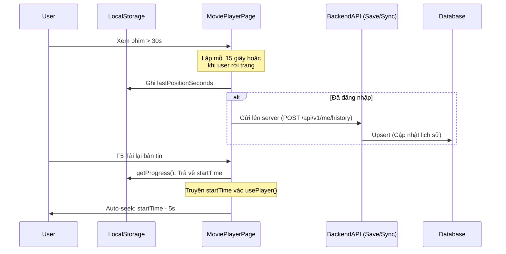

# Giải thích code Ngày 12: Watch Progress (History Sync)

## Kiến trúc tổng quan

Mô hình quá trình đồng bộ thời gian xem phim đa nền tảng:

## Giải thích từng file

### 1. `src/services/watchProgressService.js` (Frontend)
- **Mục đích**: Chịu trách nhiệm lưu tiến độ xuống bộ nhớ Local của khách (Cache First). Và nếu có Token Auth, gọi userApi đẩy history về Base Backend. 
- Lợi ích: Khách hàng ko cần đăng nhập vẫn giữ nguyên được thói quen và trải nghiệm. Khi đăng nhập thì đồng bộ 2 chiều qua `syncHistoryToServer()`.

### 2. `src/controllers/meController.js` (Backend)
- Chứa các function `saveHistory()` và `syncHistory()`.
- **`syncHistory`**: Dùng để xử lý hàng loạt lịch sử được submit bởi Web Client vào thời điểm Đăng nhập. Cơ chế so sánh `updatedAt` của client và máy chủ DB giúp triệt tiêu ghi đè Data Cũ Lên Mới bằng tham số logic `clientDate > history.watchedAt`.

### 3. `src/pages/MoviePlayerPage.jsx`
- Nhúng Logic Timer Debounce 15s trực tiếp vào Component Page thay vì trong Hook, giúp Player Component tách rời và độc lập hoàn toàn.
- Bắn props `startTime` vào `MoviePlayer` để thiết lập init offset. Mốc thời gian được lấy lên khi Mounted là mốc của tập hiện tại (đã xem bao lâu). 

### 4. `src/hooks/usePlayer.js`
- Mốc gài thời gian: Ở Event `Hls.Events.MANIFEST_PARSED`, DOM Video được ra lệnh gán `video.currentTime = startTime - 5`. Đây là sự tinh tế UX để người xem nhớ lại bối cảnh (context) cảnh xem cũ.

## Mối Liên Hệ
- Logic sẽ nối tiếp Day 13 (Tạo Giao Diện Quản Lý Lịch Sử / Yêu Thích trong Profile page).
- API `meController` phải được bảo vệ bởi middleware `protect`. 

## Lưu Ý Quan Trọng
- Lịch sử xem được khóa Primary Keys theo format `[userId, movieSlug, episode]`. Nếu user xem lại tập đó, thời gian sẽ được CẬP NHẬT đè, thay vì tạo mới. Tránh rác Database.
