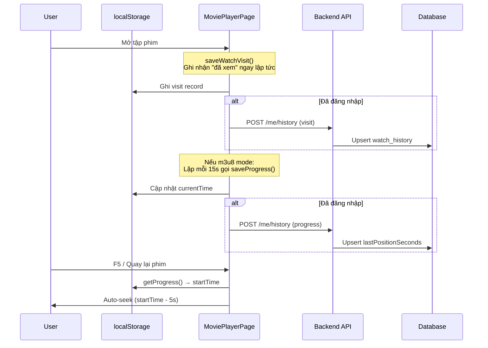
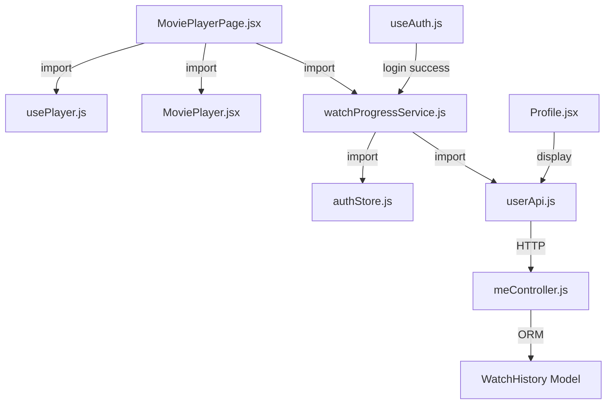

# Giải thích code Ngày 12: Watch Progress & History

## Kiến trúc tổng quan

Hệ thống lịch sử xem phim hoạt động ở **2 chế độ** (Guest & User) với cơ chế đồng bộ tự động khi đăng nhập.



## Giải thích từng file

### 1. `src/services/watchProgressService.js` (Frontend)

Chịu trách nhiệm quản lý toàn bộ logic lưu/đọc/đồng bộ tiến độ xem phim.

| Function | Mục đích | Điều kiện |
|----------|----------|-----------|
| `saveProgress()` | Lưu tiến độ xem (thời gian hiện tại) | Chỉ lưu khi `currentTime > 30s` và `duration > 0` |
| `saveWatchVisit()` | Ghi nhận "đã mở xem" (không cần track progress) | Luôn ghi, kể cả embed mode |
| `getProgress()` | Đọc tiến độ xem từ localStorage | Trả `null` nếu chưa xem |
| `syncHistoryToServer()` | Đẩy batch localStorage lên server sau khi đăng nhập | Gọi tự động sau login |

**Chiến lược lưu trữ:**
- **localStorage key**: `anime3d_watch_progress` — lưu map `{movieSlug}:{episode}` → progress data
- **Cache-first**: Luôn lưu localStorage trước, gọi API sau (nếu đã login)
- **Fallback**: Nếu API lỗi, localStorage đã lưu nên UX không bị ảnh hưởng

**Tại sao cần `saveWatchVisit`?**
- Player mặc định dùng **embed mode** (iframe) khi có `embedUrl` (đa số nguồn phim)
- Trong embed mode: `currentTime` và `duration` luôn = 0 (không đọc được cross-origin iframe)
- `saveProgress()` có guard `currentTime <= 30 → return` → **không bao giờ lưu được**
- `saveWatchVisit()` bỏ qua guard này, chỉ ghi nhận "user đã mở xem tập này"

### 2. `src/controllers/meController.js` (Backend)

| Function | Method | Endpoint | Mô tả |
|----------|--------|----------|-------|
| `saveHistory()` | POST | `/me/history` | Upsert 1 record (từ saveProgress hoặc saveWatchVisit) |
| `getHistory()` | GET | `/me/history` | Phân trang lịch sử xem (mới nhất trước) |
| `syncHistory()` | POST | `/me/history/sync` | Upsert batch từ localStorage sau khi đăng nhập |

**Cơ chế Upsert (`findOrCreate`):**
```
Tìm record theo [userId, movieSlug, episode]
├── Không tồn tại → Tạo mới với defaults
└── Đã tồn tại → Cập nhật duration, lastPositionSeconds, watchedAt
```

**`syncHistory` — Merge thông minh:**
- Client gửi `{ items: [...] }` (mảng history records)
- Server so sánh `clientDate > history.watchedAt` hoặc `lastPositionSeconds` lớn hơn
- Chỉ ghi đè nếu bản client mới hơn → tránh mất dữ liệu

### 3. `src/pages/MoviePlayerPage.jsx`

Tích hợp 3 useEffect cho watch history:

| Effect | Trigger | Chế độ |
|--------|---------|--------|
| `saveWatchVisit()` | Khi `movie.slug` hoặc `currentEp.slug` thay đổi | Cả embed & m3u8 |
| `saveProgress()` debounce 15s | Khi `currentTime` chênh ≥ 15s so với lần cuối | Chỉ m3u8 |
| `saveProgress()` cleanup | Khi unmount (đổi tập / thoát trang) | Chỉ m3u8 |

**Truyền `startTime` vào MoviePlayer:**
- Khi mount: gọi `getProgress(slug, episode)` lấy `currentTime` đã lưu
- Truyền xuống `<MoviePlayer startTime={startTime} />`
- `usePlayer.js` nhận `startTime` và seek đến `startTime - 5s` khi HLS manifest parsed

### 4. `src/hooks/usePlayer.js`

Mốc gài thời gian: Ở Event `Hls.Events.MANIFEST_PARSED`, DOM Video được gán `video.currentTime = startTime - 5`. Lùi 5 giây để người xem nhớ lại bối cảnh cảnh xem cũ.

### 5. `src/models/WatchHistory.js` (Backend)

Sequelize model với unique composite index:
```
UNIQUE KEY: (user_id, movie_slug, episode)
INDEX: (user_id, watched_at DESC)  → tối ưu query getHistory
```

## Mối Liên Hệ Giữa Các Module



## Lưu Ý Quan Trọng

- Lịch sử xem được khóa Primary Key theo format `[userId, movieSlug, episode]`. Nếu user xem lại tập đó, thời gian sẽ được **CẬP NHẬT đè**, không tạo mới → tránh rác Database.
- Embed mode chiếm đa số nguồn phim — `saveWatchVisit()` đảm bảo lịch sử luôn được ghi nhận.
- API `meController` phải được bảo vệ bởi middleware `authenticate`.
