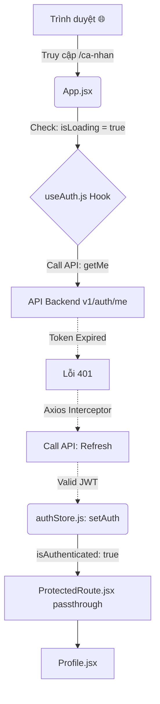

# Giải thích code Ngày 13: Giao diện Auth & Trang Cá Nhân

## Kiến trúc Frontend Auth

Sơ đồ liên kết Zustand + React Query + Component:

## Giải Thích Từng Component Chính

### 1. `src/hooks/useAuth.js`
Giao tiếp giữa State Component, State Zustand, và Axios. Cung cấp một lớp trừu tượng thân thiện cho UI. 
Đặc biệt ở `useQuery({ queryKey: ['auth', 'me'] })`, nó tự động Cache trạng thái 5 phút trên trình duyệt, có nghĩa nếu user navigate loanh quanh thì không gọi API thừa.

### 2. `src/pages/Login.jsx` (Gộp chung Register)
Tại sao dùng chung? 
- Sử dụng Hook Form State `isLoginView` bool (true/false) để render Input Username hoặc ẩn đi.
- **Glassmorphism**: Trải nghiệm UI điện ảnh. Lớp Blur Filter + Bóng Glow nằm ngang chính giữa.
- `fromPrefix`: Khi user chưa có tài khoản mà cố vào xem một phim bắt buột Auth, Hệ thống chuyển tới `/dang-nhap` kèm theo data location state trước đó. Khi Form Submit Login thành công, Web tự điều hướng đẩy họ về màn hình Phim họ đang dở dang.

### 3. `src/components/ui/ProtectedRoute.jsx`
Cổng gác cửa của UI React. 
Đợi isLoading tắt (biến còi xoay), tra bảng kiểm:
- Có Authentication: Pass xuống thẻ `<Outlet />` bên trong `App.jsx`.
- Chưa Authentication: Nhờ React-Router ném về `/dang-nhap`.
 
## Quyết Định Thiết Kế Tích Hợp
- CSS Auth Box dùng Glassmorphism nền viền xám mờ để đồng nhất với triết lý thiết kế HeroBanner trước đó.
- Không chia `LoginPage.jsx` và `RegisterPage.jsx` riêng biệt vì nó làm phình thư mục. Auth Form hiện đại đều ưu tiên Toggle Slide hoặc conditional render trên cùng một layout Auth.
