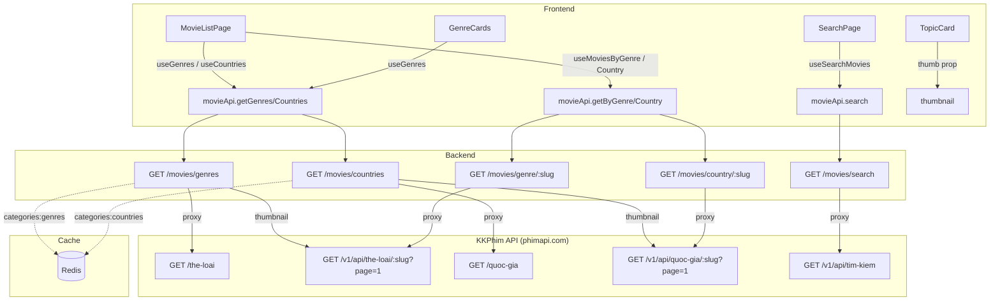
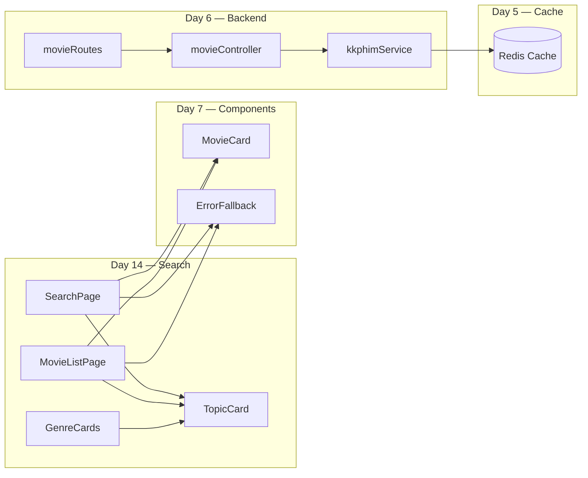

# Ngày 14 — Tìm Kiếm & Danh Sách Phim · Giải Thích Code

## Kiến Trúc Tổng Quan



---

## Giải Thích Từng File

### Backend

#### `server/src/services/kkphimService.js` — getGenres(), getCountries()

**Mục đích**: Proxy category lists từ KKPhim + fetch thumbnail cho mỗi category.

```javascript
async function getGenres() {
  // 1. Kiểm tra Redis cache (key: "categories:genres", TTL: 1 giờ)
  const cached = await cacheGet('categories:genres');
  if (cached) return cached;

  // 2. Fetch danh sách thể loại: GET /the-loai
  //    → [{_id, name, slug}, ...] (26 items)
  const rawList = await fetchFromKKPhim('/the-loai');

  // 3. Cho mỗi thể loại, fetch 1 phim để lấy thumbnail
  //    GET /v1/api/the-loai/{slug}?page=1 → lấy items[0].thumb_url
  const withThumbs = await Promise.all(
    rawList.map(async (genre) => {
      const moviesData = await fetchFromKKPhim(`/v1/api/the-loai/${genre.slug}?page=1`);
      const firstMovie = moviesData?.data?.items?.[0];
      return {
        name: genre.name,
        slug: genre.slug,
        thumb: firstMovie ? `https://phimimg.com/${firstMovie.thumb_url}` : null,
      };
    })
  );

  // 4. Cache kết quả 1 giờ
  cacheSet('categories:genres', withThumbs, 3600);
  return withThumbs;
}
```

**Lưu ý quan trọng**:
- Lần gọi đầu tiên **chậm ~3-5s** vì phải fetch 26 requests (1 cho mỗi thể loại) để lấy thumbnail
- Sau lần đầu, cache Redis sẽ serve ngay lập tức
- Nếu 1 thể loại không có phim → `thumb: null` → TopicCard hiển thị nền mặc định
- `getCountries()` hoạt động hoàn toàn tương tự nhưng dùng `/quoc-gia`

#### `server/src/controllers/movieController.js` — getGenres(), getCountries()

```javascript
// Thin controller — chỉ gọi service và trả response
async function getGenres(req, res, next) {
  try {
    const data = await kkphimService.getGenres();
    sendSuccess(res, data); // → { success: true, data: [...] }
  } catch (error) {
    next(error); // → errorHandler middleware
  }
}
```

**Không cần validation** — endpoint không nhận params.

#### `server/src/routes/v1/movieRoutes.js`

```javascript
// 2 routes mới — không cần middleware validate
router.get('/genres', movieController.getGenres);
router.get('/countries', movieController.getCountries);
```

---

### Frontend — API & Hooks

#### `client/src/api/movieApi.js`

```javascript
// 2 methods mới
getGenres:    () => api.get('/movies/genres'),
getCountries: () => api.get('/movies/countries'),
```

#### `client/src/hooks/useMovies.js` — useGenres(), useCountries()

```javascript
export function useGenres() {
  return useQuery({
    queryKey: ['categories', 'genres'],
    queryFn: () => movieApi.getGenres().then((r) => r.data.data),
    staleTime: 60 * 60 * 1000, // 1 giờ — categories ít thay đổi
  });
}
```

**Thiết kế**:
- `staleTime: 1 giờ` → React Query không refetch trong 1 giờ
- Không dùng `enabled` → fetch ngay khi component mount
- Data shared giữa tất cả components dùng cùng queryKey

---

### Frontend — Components

#### `client/src/components/ui/TopicCard.jsx`

**Mục đích**: Card hiển thị thể loại/quốc gia với background là thumbnail phim đại diện.

```jsx
<Link to={`${basePath}/${slug}`} className="topic-card">
  {/* Ảnh nền */}
  {thumb && (
    
  )}
  {/* Overlay tối cho text đọc được */}
  <div className="topic-card__overlay" />
  {/* Text */}
  <span className="topic-card__name">{name}</span>
  <span className="topic-card__link">Xem chủ đề &gt;</span>
</Link>
```

**Props**:
| Prop | Type | Mô tả |
|------|------|-------|
| `name` | string | Tên hiển thị (VD: "Hành Động") |
| `slug` | string | Slug cho URL (VD: "hanh-dong") |
| `type` | `'genre'` \| `'country'` | Quyết định base URL: `/the-loai` hoặc `/quoc-gia` |
| `thumb` | `string \| null` | URL thumbnail ảnh đại diện từ API |

**CSS**: 
- `topic-card__thumb`: absolute positioning, `object-fit: cover`, `transition: transform 0.4s` (zoom on hover)
- `topic-card__overlay`: gradient `transparent → rgba(0,0,0,0.7)` cho text readability
- Hover: card lift up 4px + shadow + image scale 1.08

#### `client/src/pages/SearchPage.jsx`

**Mục đích**: Trang tìm kiếm phim toàn diện.

**Luồng xử lý**:
```
User gõ keyword
  → useState(inputValue) cập nhật ngay
  → useEffect debounce 500ms
    → setDebouncedKeyword(trimmed)
    → setPage(1) (reset pagination)
  → useEffect sync URL
    → setSearchParams({ keyword, page })
  → useSearchMovies(debouncedKeyword, page)
    → enabled: keyword.length > 1
    → API call → render results
```

**States UI**:
| State | Điều kiện | Hiển thị |
|-------|-----------|----------|
| Chưa nhập | `!hasKeyword` | TopicCard grid gợi ý thể loại (từ `useGenres()`) |
| Loading | `isLoading` | 10 skeleton cards |
| Empty | `movies.length === 0` | Icon 🔍 + "Không tìm thấy kết quả" |
| Error | `isError` | ErrorFallback + nút "Thử lại" |
| Results | có movies | MovieCard grid + pagination |

**URL Sync**: `useSearchParams` đồng bộ hai chiều — keyword/page lưu vào URL → back/forward hoạt động → share link giữ keyword.

#### `client/src/pages/MovieListPage.jsx`

**Mục đích**: Trang dual-mode cho thể loại và quốc gia.

**Type detection**:
```javascript
function getTypeFromPath(pathname) {
  if (pathname.startsWith('/quoc-gia')) return 'country';
  return 'genre'; // mặc định
}
```

**Dual-mode logic**:
```
if (!slug) {
  // Mode 1: Hiển thị grid TopicCard
  // Dùng useGenres() hoặc useCountries() tùy type
  // Render: TopicCard grid với thumbnail
} else {
  // Mode 2: Hiển thị movie grid filtered
  // Dùng useMoviesByGenre(slug) hoặc useMoviesByCountry(slug)
  // Render: MovieCard grid + pagination
}
```

**Label resolution**: Lấy tên hiển thị từ data API
```javascript
const currentTopic = allTopics.find((t) => t.slug === slug);
const label = currentTopic?.name || slug; // fallback sang slug nếu không tìm thấy
```

#### `client/src/components/home/GenreCards.jsx`

**Mục đích**: Section "Bạn đang quan tâm gì?" trên trang chủ.

**Thay đổi từ hardcode → API**:
```javascript
// CŨ: const GENRES = [{ name: 'Hành Động', slug: 'hanh-dong' }, ...];
// MỚI:
const { data: genres = [], isLoading } = useGenres();
const displayGenres = genres.slice(0, 5);  // Hiển thị 5 đầu tiên
const remaining = genres.length - 5;       // Phần còn lại → card "+N chủ đề"
```

**Thumbnail support**: Mỗi card giờ có `` background + overlay, thay thế CSS gradient cũ.

---

## Quyết Định Thiết Kế

| Quyết định | Lý do | Alternatives cân nhắc |
|-----------|-------|----------------------|
| **Debounce 500ms** | Cân bằng responsive vs giảm API calls. < 300ms quá nhanh (nhiều request), > 1s quá chậm (UX kém) | `useDeferredValue` — nhưng không kiểm soát được delay |
| **URL sync keyword** | Share link tìm kiếm, back/forward đúng, F5 giữ kết quả | State-only — mất keyword khi reload |
| **Thumbnail từ phim đầu tiên** | Đơn giản, không cần thêm asset nào, auto cập nhật khi phim mới | Hardcode ảnh cho mỗi genre — phải maintain thủ công |
| **Cache categories 1 giờ** | Genre/country ít thay đổi, giảm load API đáng kể | Cache lâu hơn (24h) — nhưng nếu KKPhim thêm genre mới sẽ chậm cập nhật |
| **Dual-mode MovieListPage** | 1 component cho cả all-topics và filtered-movies, giảm code duplication | 2 pages riêng — nhưng logic gần giống nhau |
| **Dynamic data thay hardcode** | Tự động sync với KKPhim, không bỏ sót genre/country mới | Hardcode — đơn giản nhưng phải update code mỗi khi API thay đổi |
| **TopicCard img + overlay** | Trực quan hơn gradient, user thấy ngay phim mẫu của genre đó | Gradient colors — đẹp nhưng không cho thông tin về nội dung |

---

## Mối Liên Hệ Module



**Phụ thuộc**:
- **Day 5**: Redis cache cho `categories:genres` và `categories:countries`
- **Day 6**: Backend proxy routes (search, genre, country)
- **Day 7**: `MovieCard`, `ErrorFallback` components

**Kết nối**:
- Header SearchBar → navigate `/tim-kiem`
- HomaiPage GenreCards → link `/the-loai/:slug`
- GenreCards card "+N chủ đề" → link `/the-loai`
- TopicCard click → `/the-loai/:slug` hoặc `/quoc-gia/:slug`

---

## Lưu Ý Quan Trọng

### Performance

- **Lần gọi đầu `/movies/genres` hoặc `/movies/countries` chậm ~3-5s** vì backend phải fetch thumbnail cho mỗi category song song (26 genres × 1 request = 26 concurrent requests)
- Sau lần đầu, Redis cache serve ngay lập tức (TTL: 1 giờ)
- Frontend dùng `staleTime: 1h` → React Query cũng cache client-side

### Edge Cases

- **KKPhim API trả danh sách rỗng** → genres/countries sẽ là `[]` → UI hiện "Không tải được"
- **Một genre không có phim** → `thumb: null` → TopicCard hiển thị nền `surface-elevated` (dark grey) thay vì ảnh
- **Search keyword dưới 2 ký tự** → `useSearchMovies` có `enabled: keyword.length > 1` → không gọi API
- **Race condition debounce + URL sync** → `setPage(1)` được gọi trong debounce effect, đảm bảo reset page khi keyword mới

### Gotchas

- `referrerPolicy="no-referrer"` **bắt buộc** cho `` từ `phimimg.com` — nếu thiếu, ảnh sẽ bị 403
- `loading="lazy"` trên TopicCard thumbnail — không lazy load hết, chỉ ảnh ngoài viewport
- Pagination dùng **component `<Pagination>` thống nhất** (`src/components/ui/Pagination.jsx`) — amber gradient active state, glow effect. Trước đó `Home.css` có CSS trùng gây conflict khi navigate giữa trang, đã xóa.

---

## Ví Dụ Code — Mở Rộng

### Thêm TopicCard cho "Năm phát hành"

```jsx
// 1. Thêm API endpoint & service cho years (giống genres)
// 2. Thêm hook useYears() 
// 3. Thêm route /nam-phat-hanh trong App.jsx
// 4. Dùng MovieListPage với type='year'
```

### Tùy chỉnh số TopicCard trên GenreCards homepage

```javascript
// GenreCards.jsx
const MAX_DISPLAY = 5; // Tăng/giảm số lượng hiển thị
const displayGenres = genres.slice(0, MAX_DISPLAY);
```

### Thay đổi debounce delay

```javascript
// SearchPage.jsx
useEffect(() => {
  const timer = setTimeout(() => {
    setDebouncedKeyword(inputValue.trim());
  }, 500); // ← Thay đổi delay tại đây (ms)
  return () => clearTimeout(timer);
}, [inputValue]);
```
