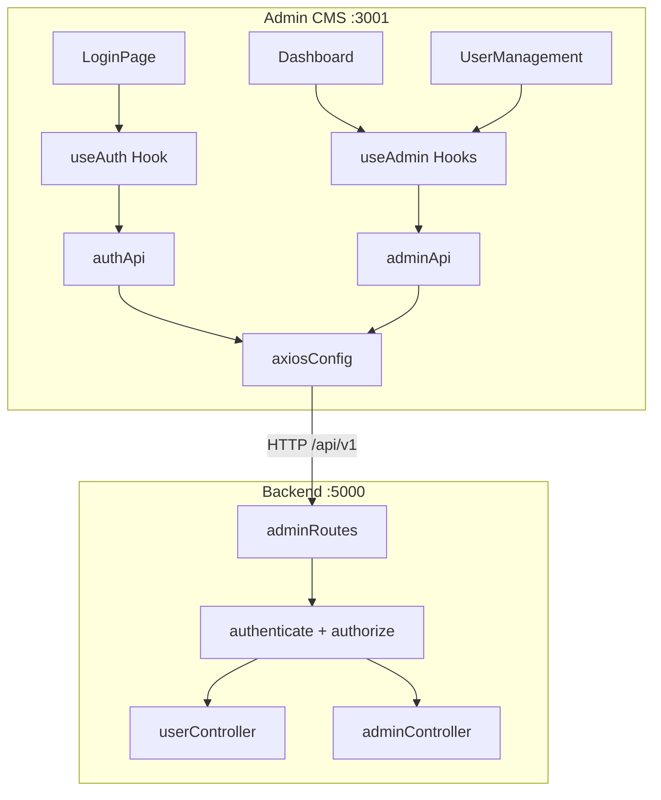

# Day 15 — Admin Dashboard: Giải Thích Code

## Kiến Trúc



**Admin CMS** là app Vite+React hoàn toàn độc lập, có hệ thống auth, store, và design riêng — không share code với client.

## Backend Files

| File | Chức năng |
|------|-----------|
| `controllers/userController.js` | CRUD users: list (phân trang + search + filter role/isActive), getById (kèm counts favorites/history), update (role/isActive), soft-delete |
| `controllers/adminController.js` | `getStats()`: parallel queries — totalUsers, newUsersThisWeek, totalFavorites, totalViews, top 5 movies (30 ngày) |
| `validators/adminValidators.js` | express-validator rules cho update, list, param ID |
| `routes/v1/adminRoutes.js` | Router-level `authenticate` + `authorize('admin')`, mount 5 endpoints |

## Admin Frontend Files (`admin/src/`)

| File | Chức năng |
|------|-----------|
| `api/axiosConfig.js` | Axios instance + auto refresh token interceptor, dùng key `adminSession` |
| `api/authApi.js` | login, refresh, logout, getMe |
| `api/adminApi.js` | getStats, getUsers, updateUser, deleteUser |
| `store/authStore.js` | Zustand: user, accessToken, isAuthenticated, isLoading |
| `hooks/useAuth.js` | TanStack Query: check me on mount, login (reject non-admin), logout |
| `hooks/useAdmin.js` | useAdminStats, useAdminUsers, useUpdateUser, useDeleteUser |
| `pages/LoginPage.jsx` | Form login — chỉ accept admin role |
| `pages/Dashboard.jsx` | 4 stat cards (glassmorphism) + top movies table + logout |
| `pages/UserManagement.jsx` | User table: search, filter role, inline edit role, toggle active, confirm delete, pagination |

## Quyết Định Thiết Kế

### Tách CMS thành app riêng
- **Lý do**: Bundle size client không bị phình, routing đơn giản, deploy độc lập, bảo mật tốt hơn (URL riêng, có thể restrict IP)
- **Trade-off**: Duplicate một số code (axiosConfig, authStore) — chấp nhận được vì admin app rất nhẹ

### CORS multi-origin
```js
// env.js
clientUrl: (process.env.CLIENT_URL || 'http://localhost:3000')
  .split(',').map(url => url.trim()).filter(Boolean)
```
`cors()` native support array of origins → không cần custom function.

### Router-level middleware
```js
router.use(authenticate, authorize('admin'));
```
Áp dụng 1 lần cho tất cả admin routes → DRY, không quên gắn middleware.

### Login reject non-admin
```js
if (user.role !== 'admin') throw new Error('Không có quyền admin');
```
Frontend reject sớm, không đợi 403 từ API → UX tốt hơn.

### Soft delete
`deletedAt = new Date()` + `isActive = false` → dữ liệu vẫn còn, dễ recover.

## Lưu Ý

1. Admin **không thể tự sửa/xóa** chính mình (`req.user.id !== id`)
2. Search dùng `Op.like` với Sequelize parameterize → an toàn SQL injection
3. Pagination max `limit = 50` — chống client request quá nhiều
4. `adminSession` key tách biệt `hasSession` (client) → không conflict
