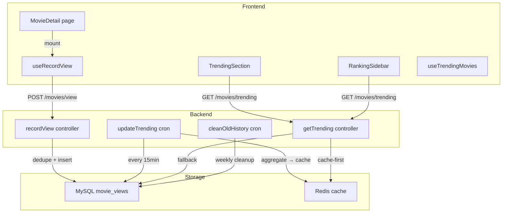

# Ngày 17 — Analytics & Trending — Giải Thích Code

> Giải thích chi tiết kiến trúc, logic, và quyết định thiết kế cho module Analytics & Trending.

---

## Kiến Trúc Tổng Quan

---

## Giải Thích Từng File

### Backend

#### `server/src/jobs/updateTrending.js`

**Mục đích**: Aggregate `movie_views` từ 7 ngày gần nhất → lưu kết quả vào Redis.

**Logic chính**:
1. Query `GROUP BY movie_slug` với `COUNT(id)` từ bảng `movie_views`
2. Filter `viewed_at >= 7 ngày trước`
3. Sort DESC by viewCount, limit 20
4. Lưu vào Redis key `movies:trending` với TTL 15 phút
5. Chạy **mỗi 15 phút** (`*/15 * * * *`) và **1 lần khi server boot**

**Tại sao aggregate thay vì count realtime?**
- Performance: aggregate 1 lần / 15 phút thay vì tính toán mỗi request
- Cache: tất cả request trong 15 phút đọc từ Redis (O(1))
- Consistency: trending không cần realtime — delay 15 phút chấp nhận được

---

#### `server/src/jobs/cleanOldHistory.js`

**Mục đích**: Dọn dữ liệu cũ để giữ database gọn.

**Logic chính**:
- Xóa `watch_history` cũ > 1 năm
- Xóa `movie_views` cũ > 90 ngày (giữ 3 tháng cho trending analytics)
- Chạy **Chủ Nhật 4:00 AM** (`0 4 * * 0`) — giờ traffic thấp nhất

---

#### `server/src/controllers/movieController.js` — `getTrending()`

**Mục đích**: Endpoint `GET /api/v1/movies/trending` — trả top phim trending.

**Logic chính**:
1. **Cache-first**: đọc `movies:trending` từ Redis
2. **Fallback**: nếu cache miss → aggregate trực tiếp từ DB (giống updateTrending)
3. **Enrich**: lấy detail (title, poster, genres) cho top 10 phim từ KKPhim API
4. Trả kết quả với `{ items, total }`

**Tại sao enrich với KKPhim API?**
- Bảng `movie_views` chỉ lưu `movie_slug` — không có title, poster
- Enrich sử dụng `kkphimService.getMovieDetail()` (đã có cache 30 phút)
- `Promise.allSettled` — không fail nếu 1 phim detail lỗi

---

#### `server/src/controllers/movieController.js` — `recordView()` (đã có từ trước)

**Mục đích**: Ghi nhận lượt xem phim vào bảng `movie_views`.

**Deduplicate logic**:
- User đã login → dedupe theo `userId + movieSlug + ngày`
- Guest → dedupe theo `sessionId + movieSlug + ngày`
- Không có cả 2 → luôn ghi (edge case hiếm)

---

#### `server/src/controllers/adminController.js` — `getStats()` (mở rộng)

**Thêm mới**:
- `totalWatchHistory`: tổng số records lịch sử xem
- `viewsPerDay`: lượt xem theo ngày (7 ngày gần) — GROUP BY DATE(viewed_at)

**Mục đích**: Cung cấp data cho biểu đồ trên Admin Dashboard.

---

### Frontend

#### `client/src/components/home/TrendingSection.jsx`

**Mục đích**: Section "PHIM THỊNH HÀNH" trên trang chủ.

**Features**:
- Fire-gradient rank badges (gold/silver/bronze cho top 3)
- View count hiển thị dạng "1.2K"
- Responsive grid 5 → 4 → 3 → 2 columns
- Play overlay on hover
- Skeleton loading state
- Tự ẩn nếu không có data (graceful degradation)

---

#### `client/src/hooks/useMovies.js` — `useTrendingMovies()`

**Logic**: TanStack Query wrapper cho `GET /movies/trending`
- `staleTime: 15 phút` — khớp với backend cache TTL
- Auto refetch khi window re-focus

---

#### `client/src/hooks/useMovies.js` — `useRecordView(slug)`

**Logic**: Fire-and-forget view tracking
- Sử dụng `useRef(hasRecorded)` để deduplicate — chỉ ghi 1 lần mỗi component mount
- Chống double-fire trong React StrictMode (development)
- Lấy `sessionId` từ `guestId.js` service
- Silent catch — analytics failure không ảnh hưởng UX

---

#### `client/src/components/home/RankingSidebar.jsx` (cập nhật)

**Thay đổi**: Đổi từ `useNewMovies` → `useTrendingMovies`
- **Ưu tiên**: trending data thật (có viewCount)
- **Fallback**: nếu trending rỗng → dùng newMovies (backward compatible)
- Hiển thị view count với icon `FiEye` khi có data

---

#### `client/src/pages/MovieDetail.jsx` (cập nhật)

**Thêm**: `useRecordView(slug)` — gọi khi component mount
- Mỗi lần user mở trang chi tiết phim → 1 view được ghi nhận
- Tự động, không cần user action

---

## Quyết Định Thiết Kế

### 1. Tại sao dùng cron job thay vì realtime aggregate?

**Lý do**: Performance. Với hàng nghìn request/phút, tính trending realtime sẽ tạo heavy DB queries. Cron 15 phút giữ data "đủ tươi" mà không ảnh hưởng performance.

### 2. Tại sao giữ 90 ngày view data thay vì tất cả?

**Lý do**: Database size management. Trending chỉ cần 7 ngày gần nhất. Giữ 90 ngày cho flexibility (nếu muốn trending tháng). Dữ liệu cũ hơn → xóa hàng tuần.

### 3. Tại sao enrich trending data tại runtime?

**Lý do**: Tiết kiệm storage. Không cần lưu movie title/poster vào `movie_views`. KKPhim API đã có cache 30 phút → enrich gần như instant. `Promise.allSettled` đảm bảo partial failure không break toàn bộ response.

### 4. Tại sao dùng `useRef` cho deduplicate trong `useRecordView`?

**Lý do**: React StrictMode chạy effects 2 lần (development). `useRef` persist qua re-renders nên chặn được double-fire. Trong production, StrictMode không active nhưng pattern vẫn đúng.

---

## Mối Liên Hệ Với Các Module Khác

| Module | Liên hệ |
|:---|:---|
| **Day 5 — Cache** | Trending dùng cùng `cacheGet/cacheSet` helper |
| **Day 12 — Watch Progress** | `movie_views` bổ sung cho `watch_history` (views ≠ watch time) |
| **Day 15 — Admin** | `getStats` mở rộng cung cấp data cho admin dashboard |
| **Day 3 — Models** | Dùng `MovieView` model đã tạo sẵn |
| **Guest Session** | `guestId.js` service cung cấp sessionId cho deduplicate |

---

## Lưu Ý Quan Trọng

1. **Trending ban đầu rỗng**: Khi deploy lần đầu, bảng `movie_views` trống → trending API trả rỗng. Frontend `TrendingSection` tự ẩn gracefully. Sau vài ngày user sử dụng → data tự populate.

2. **Redis down**: Trending vẫn hoạt động nhờ DB fallback, chỉ chậm hơn. Cron job log warning nhưng không crash.

3. **Enrich failure**: Nếu KKPhim API down, trending vẫn trả data cơ bản (slug + viewCount, thiếu title/poster). Frontend handle gracefully.
