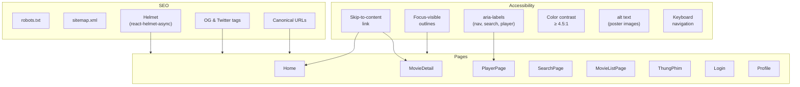

# Ngày 18 — SEO & Accessibility — Giải Thích Code

> Giải thích chi tiết các thay đổi SEO và Accessibility cho Anime3D-Chill.

---

## Kiến Trúc Tổng Quan



---

## Giải Thích Từng File

### SEO

#### `client/public/robots.txt`

**Mục đích**: Hướng dẫn search engine crawler.

**Logic chính**:
- `Allow: /` — cho phép crawl tất cả trang public
- `Disallow: /ca-nhan`, `/dang-nhap`, `/dang-ky` — block private/auth pages
- `Disallow: /api/` — block API routes
- `Sitemap` reference đến sitemap.xml
- `Crawl-delay: 1` — rate limit gentle cho crawler

---

#### `client/public/sitemap.xml`

**Mục đích**: Danh sách URL chính cho search engines.

**Logic chính**:
- Static sitemap với 6 URL chính (/, /phim-moi, /thung-phim, /tim-kiem, /the-loai, /quoc-gia)
- `changefreq` và `priority` phù hợp với mức độ update nội dung
- Trang chủ: `daily`, `priority: 1.0`
- Trang danh mục: `weekly`, `priority: 0.7`

> **Note**: Dynamic movie pages (/phim/:slug) cần server-side sitemap generation trong production. Static sitemap là MVP đủ để Google bắt đầu index structure.

---

#### Helmet Updates (tất cả pages)

**Mục đích**: SEO meta tags cho mỗi trang.

**Bảng tổng hợp**:

| Page | title | description | canonical | OG tags | Twitter | robots |
|:---|:---:|:---:|:---:|:---:|:---:|:---:|
| Home | ✅ | ✅ | ✅ | title, desc, type, url | summary_large_image | — |
| MovieDetail | ✅ | ✅ | ✅ | title, desc, image, type=video.movie | card, image | — |
| PlayerPage | ✅ | ✅ | ✅ | title, desc, image, type=video.episode | summary_large_image | — |
| SearchPage | ✅ (dynamic) | ✅ | ✅ | title, type | — | — |
| ThungPhim | ✅ (dynamic) | ✅ | ✅ | title, desc, type | — | — |
| MovieListPage | ✅ (dynamic) | ✅ | ✅ | title, desc, type | — | — |
| Login | ✅ | ✅ | ✅ | — | — | **noindex** |
| Profile | ✅ | ✅ | — | — | — | **noindex** |

**Tại sao noindex cho Login/Profile?**
- Trang auth/profile không nên xuất hiện trên Google
- User tìm trang đăng nhập sẽ qua homepage
- Tránh duplicate content issues

---

### Accessibility

#### `client/src/components/layout/AppLayout.jsx` — Skip-to-content

**Mục đích**: Cho phép keyboard users nhảy qua navigation trực tiếp đến nội dung.

**Logic chính**:
```jsx
<a href="#main-content" className="skip-to-content">
  Chuyển đến nội dung chính
</a>
<main id="main-content" tabIndex={-1}> ... </main>
```

- Link ẩn vị trí `top: -100%`, chỉ hiện khi `:focus`
- `tabIndex={-1}` trên `<main>` cho phép programmatic focus
- Là Tab stop đầu tiên khi user nhấn Tab

---

#### `client/src/index.css` — Focus Visible Styles

**Mục đích**: Hiển thị viền focus chỉ cho keyboard navigation.

**Logic chính**:
```css
/* Chỉ keyboard */
:focus-visible {
  outline: 2px solid var(--color-accent);
  outline-offset: 2px;
}

/* Ẩn cho mouse click */
:focus:not(:focus-visible) {
  outline: none;
}
```

**Tại sao `:focus-visible` thay vì `:focus`?**
- `:focus` hiển thị viền cho cả mouse click → xấu UX
- `:focus-visible` chỉ hiển thị khi browser phát hiện keyboard navigation
- Firefox, Chrome, Safari modern đều support

---

#### Color Contrast Fix

**Thay đổi**: `--color-text-muted` từ `#6c6c85` → `#8e8ea8`

**Lý do**: 
- `#6c6c85` trên `#000000` = contrast ratio ~3.5:1 (FAIL WCAG AA)
- `#8e8ea8` trên `#000000` = contrast ratio ~5.7:1 (PASS WCAG AA ≥ 4.5:1)
- Vẫn giữ visual hierarchy (muted < secondary < primary)

---

#### Header ARIA Labels

**Thêm**:
- `<nav aria-label="Điều hướng chính">` — screen reader biết đây là nav chính
- `<form role="search" aria-label="Tìm kiếm phim">` — landmark cho search
- `<input aria-label="Nhập tên phim cần tìm">` — label khi không có visible label
- `<FiSearch aria-hidden="true">` — ẩn decorative icon khỏi screen reader

---

#### Player ARIA Labels (đã có từ trước)

**Xác nhận**: Player đã có đầy đủ aria-labels:
- Play/Pause: `aria-label={isPlaying ? 'Tạm dừng' : 'Phát'}`
- Volume: `aria-label={isMuted ? 'Bật tiếng' : 'Tắt tiếng'}`
- Volume slider: `aria-label="Âm lượng"`
- Progress bar: `role="slider"` + `aria-valuenow/min/max`
- Fullscreen: `aria-label="Toàn màn hình"`
- Theater: `aria-label="Chế độ rạp"`

---

#### Alt Text (đã có từ trước)

**Xác nhận**: Tất cả poster images đã có `alt={title}`:
- `MovieCard.jsx`: `alt={title}` ✓
- `MovieDetail.jsx`: backdrop `alt=""` (decorative) ✓, poster `alt={movie.title}` ✓
- `TrendingSection.jsx`: `alt={movie.title}` ✓
- `RankingSidebar.jsx`: `alt={movie.title}` ✓
- `HeroBanner.jsx`: poster `alt={movie.title}` ✓

---

## Quyết Định Thiết Kế

### 1. Static vs Dynamic Sitemap

**Chọn**: Static sitemap cho MVP.

**Lý do**: SPA (React) không có server-side rendering. Dynamic sitemap cho movie pages cần crawler-accessible SSR hoặc API endpoint. Static sitemap cho 6 URL chính đủ để Google bắt đầu index.

**Tương lai**: Có thể thêm server-side sitemap endpoint (`GET /api/sitemap.xml`) generate từ DB movie slugs.

### 2. `:focus-visible` thay vì `:focus`

**Chọn**: `:focus-visible` + `:focus:not(:focus-visible)` fallback.

**Lý do**: Cân bằng visual UX (mouse users không thấy viền) với accessibility (keyboard users thấy rõ focus). Pattern được W3C recommend.

### 3. noindex cho auth/profile pages

**Chọn**: `<meta name="robots" content="noindex, nofollow">`.

**Lý do**: Auth pages không có giá trị SEO, có thể gây duplicate content. Google bot không cần index trang đăng nhập.

---

## Mối Liên Hệ Với Các Module Khác

| Module | Liên hệ |
|:---|:---|
| **Day 1 — Setup** | `index.html` đã có `lang="vi"`, `viewport`, `theme-color` |
| **Day 7 — Homepage** | HeroBanner, MovieCard đã có alt text |
| **Day 9 — MovieDetail** | Helmet đã có OG tags từ trước, enriched thêm twitter:card |
| **Day 10 — Player** | aria-labels đã có từ implementation ban đầu |
| **Day 17 — Trending** | TrendingSection mới đã có alt text |
| **Phase 5 — Production** | Lighthouse audit sẽ xác nhận scores ≥ 90 |

---

## Lưu Ý Quan Trọng

1. **`window.location.origin` cho canonical URLs**: Tự động adapt theo môi trường (localhost dev, vercel production). Không hardcode domain.

2. **OG image cho trang không có phim**: Home, Search, MovieList không có OG image. Có thể thêm default OG image nếu cần social sharing preview tốt hơn.

3. **Sitemap cần update thủ công**: Khi thêm page mới vào router, cần update `/public/sitemap.xml` manual. Nên xem xét auto-generate trong CI/CD pipeline.
