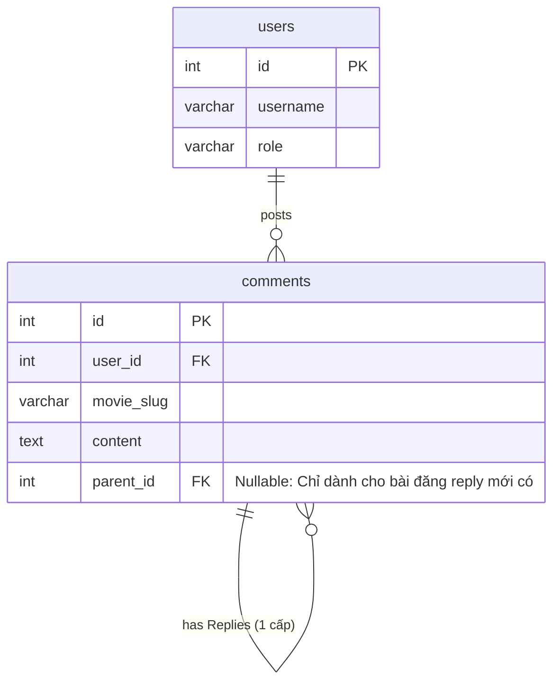
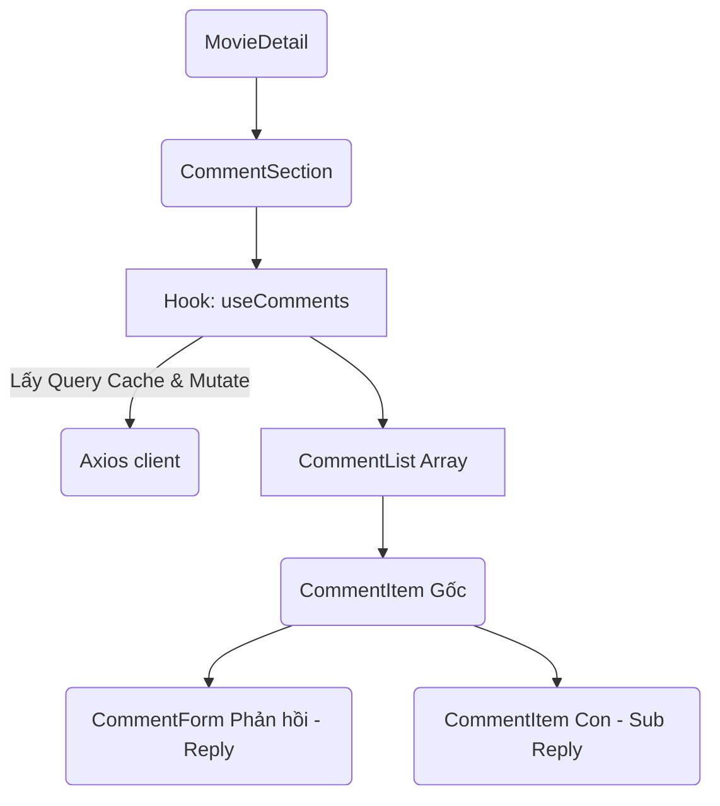

# Ngày 20.5: Tính năng Bình luận (Comments) — Kiến Trúc Code

> Tài liệu mô tả sơ đồ quan hệ Entity (Database) và Hook Logic (React). Mạng lưới quy đổi xử lý Comment đệ quy.

---

## 1. Thiết Kế Hệ Thống Đa Nhiệm (Database Layer)
Tránh vòng lặp Database quá khó khăn (ví dụ, một người reply reply của reply của reply...), Anime3D-Chill sử dụng "1 Cấp Gốc - N Cấp Con". Parent_ID được gán mặc định nếu reply trên sub-comment.

- Ta kết hợp hàm `include` trong `Sequelize.findAndCountAll` để query gộp danh sách Comment Gốc và Comment Con bằng `required: false` nhằm hạn chế 1 đống API riêng cho child-comments, bảo đảm Backend tải trọn vẹn JSON array có cả `replies: []`.

---

## 2. Giải Thích Logic Components
Từ một Controller Backend truyền Dữ Liệu theo cục, React sẽ đón như thế nào cho êm nhất?

**Sơ Đồ Flow:**

**TẠI SAO PHẢI CÓ HOOK `useComments.js` ?**
Thay vì viết một rừng call Api trong `CommentSection.jsx`, tính năng này cần:
1. Fetch liên tục `getComments` tại Route `/:movieSlug`.
2. Tạo Mutaion bằng `react-query` (`addComment`, `removeComment`) và ngay lập tức `queryClient.invalidateQueries(...)` để Refresh dòng chữ/UI mới nhất mà không phải Reload trang phiền não.
3. Catch lỗi Network, Toast Errors chung theo quy chuẩn Redux/Zustand Action.

**Nút Bảo Mật `isAuthenticated`**
- Toàn bộ Component `CommentForm` sẽ gọi `useAuthStore().isAuthenticated`. Nhanh chóng chặn đứng Guest từ gốc hiển thị form. Khác với Youtube là bật Dialog - ở đây form sẽ bọc `
` mời gọi User đăng nhập tạo CTA mạnh.

---

## 3. Lưu Ý Dự Án Tương Lai
1. Soft Delete trên Comment: Controller `destroy` sẽ gán cờ `deleted_at`. Nếu một Root-Comment bị Delete cứng, toàn bộ bảng `replies` sẽ bốc hơi (Cascade Delete trong model `index.js`).
2. API Rate Limit `2 mins/5 cmts` đã hook trực tiếp bên trong `commentRoutes.js`, không nên chỉnh quá thấp tránh trải nghiệm người dùng giảm.
